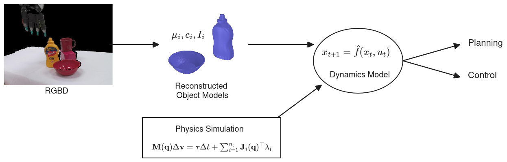
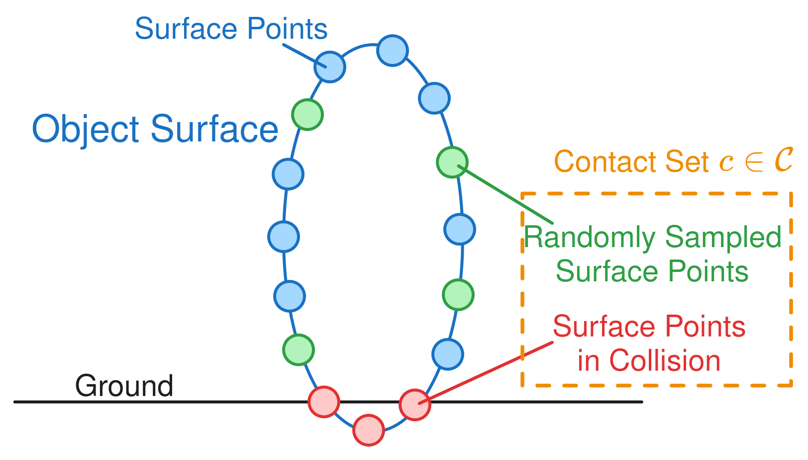
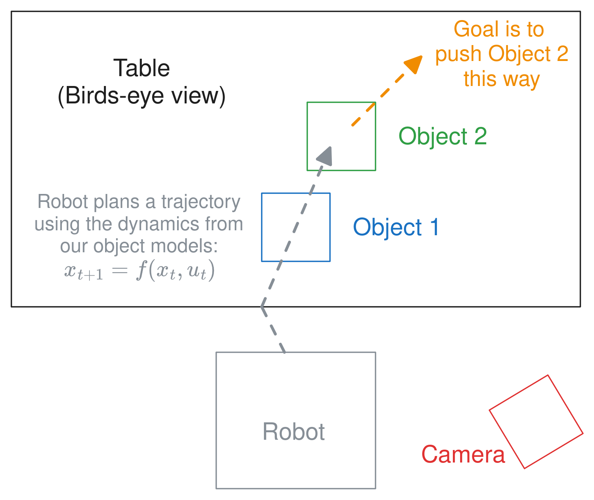
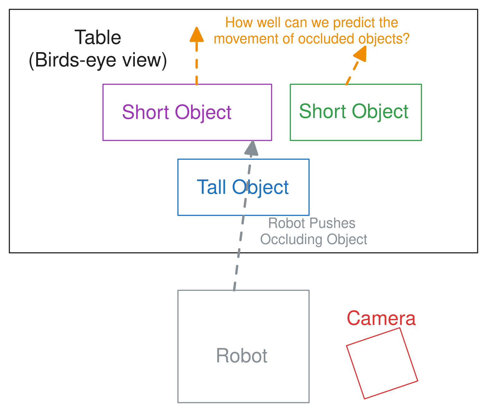

## 1 Introduction/Motivation

The high level aspiration is to take observations of a scene, then infer object models, which can then be combined with a physics simulator to create a *dynamics model* that we can use for planning, control, or policy learning. Here is a picture of the idea:

**Note:** *There is a 2025 RSS paper, [@ning2025prompting], that uses digital twins in an MPC-like manner by prompting a VLA, which is somewhat similar to the outlined pipeline above.*

In this proposed project, we will focus on how to do the *reconstruction* part. In order for the above setup to work, we need object models that are *physically* similar to the real-world observed objects. We also will argue that, especially with multi-object scenes, occlusion makes the reconstruction problem *underdetermined*; there could be multiple valid reconstructions for the same observation. Here is an example of what I am talking about:

The insight proposed in this project is to reason probabilistically about contact points in order to enforce a stability prior that allows inferring a distribution over possible reconstructionss. The claim is that this will make our reconstructions more physically stable, along with having the capability to generate multiple feasible (and stable) reconstructions. We can use a stability prior (assuming a static scene) because most scenes a robot will come across will be stable at the outset.

To put it simply, the proposal is **A method for multi-object reconstruction of a static/stable scene that probabilistically reasons about contact.** We then want to show that we can use this, in tandem with physics simulation, to plan through dynamics for simple pushing tasks.

## 2 Related Work

### 2.1 Physical Priors

- "Vysics: Object Reconstruction Under Occlusion by Fusing Vision and Contact-Rich Physics" [@bianchini2025vysics]
- "PhyRecon: Physically Plausible Neural Scene Reconstruction" [@ni2024phyrecon]
    - Takes *very long* (multiple hours)
- "Amodal 3D Reconstruction for Robotic Manipulation via Stability and Connectivity" [@agnew2021amodal]
- "Inferring 3D Shapes of Unknown Rigid Objects in Clutter Through Inverse Physics Reasoning" [@song2018inferring]
    - Strictly assumes shapes are *convex* as far as I can tell

**Note:** *none of these methods recover diverse reconstructions of multi-object scenes*

### 2.2 Diverse Reconstructions 

Pretty much all reconstruction with diffusion fits into this category. But the papers I have seen that really make *diversity* the focus are the following:

- "Diverse Plausible Shape Completions from Ambiguous Depth Images" [@saund2021diverse]
- "Diverse Shape Completion via Style Modulated Generative Adversarial Networks" [@khademi2023diverse]

Of course, there are most likely a bunch of similar papers. Probabilistic methods such as my undergraduate work ([@wright2024vprism] and [@wright2024robust]) are also probably worth mentioning.

**Note:** *these methods don't reason about contact.*

## 3 Proposed Method

### 3.1 Dealing with Contact Points Probabilistically

We would phrase the problem as a Bayesian inference problem. Letting $m$ be our objects model, $o$ be the camera observation, $F_\text{net} = 0$ denote a static scene, and assuming independence:

$$ P(m | o, F_\text{net} = 0) \propto P(o | m) P(F_\text{net} = 0 | m) P(m)$$

Here, the emphasis will be on $P(F_\text{net} = 0 | m)$. Specifically, we would make the conceptual change to reason about potential contact point sets $c \in \mathcal C$ with:
$$ P(F_\text{net} = 0 | m) = \int_{c \in \mathcal{C}} P(F_\text{net} = 0 | c) P(c | m) dcc $$ 
$$ = \mathbb E_{c \sim P(c | m)} \left[ P(F_\text{net} = 0 | c) \right] $$
In many probabilistic methods, we need to be able to compute $\ln P(x)$ for optimization/inference reasons. Our approach can be to adopt the following procedure:

1. Sample $c \sim P(c | m)$: *probably use a heuristic*
2. Evaluate $\ln P(F_\text{net} | c)$: *maybe borrow loss formulation from ContactNets [@pfrommer2021contactnets]*

The next two subsections outline a way to do both of these things

### 3.2 Sampling Potential Contact Points

We need to think about two different contact relations: (1) object to ground plane; (2) object to object. For both of these, it is pretty easy to query that a surface point is in collision/interpenetrating either a plane or object reconstruction. Because we know that points in penetration will *necessarily* be in contact, when sampling a potential contact set $c$, we can just automatically include them. Then, we could simply randomly sample a few surface points on the object and add them to $c$. Here is a picture that shows a simplified version of what I am talking about:

In order to do this, we would need to run marching cubes to extract the surface mesh if we are using an implicit shape, but this shouldn't be too hard.

*Disjoint objects:* One problem that I forsee running into is that objects will be disconnected; a single object will be reconstructed by a set of disjoint meshes. In this case, I wonder if we can simply label each disjoint mesh as a different object and try to "pull" them towards each other by penalizing a lack of contact/stability. This might not be optimal, so we could also try to regularize convexity, like [@bianchini2025vysics], as part of the prior. We also could try to enforce some other connectivity prior—such as penalizing the distance in between disconnected components or regularizing the function in some mathematical way.

### 3.3 ContactNets Loss Under Static Scene

The proposed idea here is, in a hand-waving manner, simply say $\ln P(F_\text{net} | c)$ is equal to a version of the ContactNets loss. Because we are assuming a static scene, we can make some slight simplifications to the original formulation for the ContactNets loss to:
$$ l_1 = \|\sum_i \mathbf{J}_i^\top \lambda_i + \mathbf{F}_\text{grav}\|^2 $$
$$ l_2 = \sum_i \phi_i^2 \| \lambda_i \|^2 $$
$$ l_3 = \sum_i \min (0, \phi_i)^2 $$
$$ L = \min_\lambda l_1 + l_2 + l_3$$
We can also do the same trick, where we select $\lambda_i$ by solving a quadratic program subject to Coloumb friction.

**Note:** *Making this differentiate back to an implicit function would require differentiating through our marching cubes from 3.2. We could adopt the math from [@remelli2020meshsdf] to do that pretty easily.*

### 3.4 The Object Model & Training

There are multiple ways that we could do this, but let me sketch out one potential way.

For the geometry, we would use a small neural network like BundleSDF [@wen2023bundlesdf], but instead of an SDF, we could do an *occupancy network*, taking after [@mescheder2019occupancy]. In order to make it probabilistic, we could, instead of a single network, do a *Bayesian ensemble* of some sort. There are a few techniques for this, but here is one: [@d2021stein]. Each "particle" or member of the ensemble would represent one *scene-wide* reconstruction because we want to capture the joint distribution—we are specifically not assuming independence between object reconstructions. We could then simply borrow the negative sampling from [@wright2024vprism] and use negative log likelihood and regularization as the likelihood and prior.

We would also need to worry about parameters such as center of mass, friction, moment of inertia, etc. I think we could figure out something pretty simple for that (i.e. hardcoding a friction value and using a heuristic to calculate center of mass and moment of inertia from the object mesh).

**Note:** *We might want to consider adding in some sort of learned prior from pre-existing mesh datasets or something, but that would add to the complexity and would likely be non-trivial.*

## 4 Potential Experiments

### 4.1 Pushing I: Reasoning about Contact

We could do a pushing experiment, where we use the dynamics model from our object models/reconstructions. Here is a diagram I made of a potential setup:

The idea is that the robot would need to push a certain object into another object, and would use reasoning about contact to figure out how. We would measure success by how close the final configuration is to the goal or "task success". The thing we would be showing here is that **reasoning about the contact/physics allows better performance on a robotics task**.

This setup is slightly inspired by experiments from [@agnew2021amodal]. In their setup, they used MPPI through contact.

### 4.2 Pushing II: Demonstrating Diversity

We could do another pushing experiment.

We would try to test that **probabilisitic framing provides diversity that has better "coverage" over dynamics**. So we could maybe try to measure the closest particle in the distribution to the true behavior compared to a deterministic approach. We would need to be measuring pose change probably.

## 5 My Thoughts

Well, I don't think the pitch is perfect, but hopefully there is something promising here. I think if things work and we can have results in the two experiments, it is definitely enough for a paper. I definitely think there is diminishing returns for me to keep fleshing it out without getting some external feedback, so I'll probably just leave things here.

## References

## Appendix: Other Stuff

**Foundation model (still) struggle with occlusion:** I took the method from [@wu2025amodal3r] and ran it on the image I took of my kitchen:

