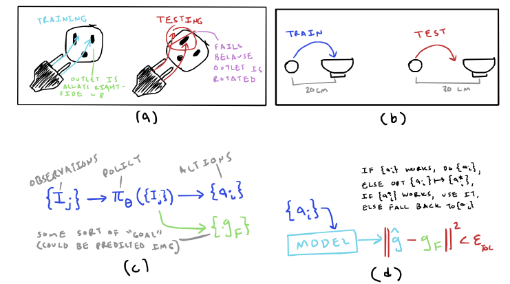

## 1 Last Meeting Recap

Last meeting, we kind of just talked about vague, longer-term research directions. The two broad directions that seemed worth me looking into were:

1. Digital Twins
2. Fusing Learning-based approaches with Model-based ones

In this write-up, I try to mention a handful of papers relevant to each of these directions, and outline a potential project and my preliminary thoughts regarding the direction.

## 2 Digital Twins

A very interesting trend in robotics goes by the name *digital twins* (I have also seen the term real2sim commonly used). The idea is to infer physical models of the world, ready for simulation, with only your robot and some cameras. Doing this well would be huge—you could leverage these models for more diverse simulation data or as a model for MPC. 

Informally, the task is to take some sorts of observations about either one or more objects and/or an environment, then try to build a simulatable model of it. Recently, it seems like everyone is using learning-based approaches as the motivation and using Gaussian Splatting (3DGS [@kerbl20233d] or 2DGS) of some form during the creation of these models. There is a recent paper from Russ Tedrake's group, [@pfaff2025_scalable_real2sim], that proposes a pipeline for constructing a digital twin of one object at a time by using 3DGS, where a robot with pick up an object and show different sides to a camera, then they estimate the physics parameters by having the robot move the object around. Obviously, this approach is motived more by the need for more robot data and not online control, because it requires a lot of the robot interacting with the object before the model is complete/useable. The digital twin trend has this bias towards being motivated by learning-based approaches, which is even more apparent in the term *digital cousin* [@dai2024acdc], which is basically performing domain randomization on the digital twin; A digital cousin is much less useful for MPC than it is for RL. Another thing indicative in the first paper is that there are sort of two different parts to building a digital twin of an object: (1) reconstructing its geometry and (2) inferring its physics parameters. 

Last week, I mentioned [@li2025pin], which infers physics parameters via differentiable simulation. Inferring parameters such as inertia and friction are not new, in fact, [@9325054] is a 2021 paper from Tucker Herman's group where friction and inertia are inferred via the robot interacting with the object. That one doesn't use differentiable simulation, but there are some differentiable physics simulation papers that use system identification as their motivation, such as [@gradsim]. While we are on the topic of physics simulation, a paper from Ken Goldberg's group, [@yu2025real2render2realscalingrobotdata], builds simulated robot data by *ignoring* physics altogether (they make a simplifying assumption that a grasped object is fixed to the gripper) Besides this though, it is pretty obvious that for accurate digital twins, physics is important. 

Critically, however, none of the papers mentioned before use any sort of physics-understanding to guide *reconstruction*. 3D reconstruction of objects *without* physics has been explored a lot, from NeRFs [@mildenhall2021nerf], splatting (cited previously), other implicit functions [@park2019deepsdf; @van2020learning; @mescheder2019occupancy], my own work [@wright2024robust], diffusion/flow-based approaches [@xiang2025structured], and many others that I won't list, but there are only a handful of papers using physics to guide reconstruction. This is pretty important for digital twins in my opinion, though. One of the earliest papers I am aware of that makes this argument is [@agnew2021amodal], where they do completely learned reconstructions, trained with some heuristic loss terms for physical stability, then during experiments use MPPI in simulation to plan interactions with the objects—the control approach. There are other papers that do reconstruction with an understanding of physics, including Vysics [@bianchini2025vysics] and others [@ni2024phyrecon; @song2018inferring; @zheng2013beyond; @abou-chakra2024physically; @zhu2025one]. Some of these papers, such as [@zhu2025one] and [@abou-chakra2024physically] (which is used in its follow-up work of [@abou2025real]). I should also mention PhysTwin [@jiang2025phystwin], which uses spring-damper physics to simulate digital twins of deformable objects. 

**My Assessment:**

1. A lot of current papers make the case of digital twins for learning-based policies, but it is important to consider digital twins as useful for both learning-based policies and model-based control methods.
2. Because of (1), there is little talk of uncertainty/diversity within the current digital twins work
3. I think that my [proposed project](../2025-06-11_project_pitch) would fit nicely into the literature
4. Gaussian splatting is all the rage, as is differentiable rendering more broadly—I wonder if there are creative uses for this in planning/control (perhaps you could define a classifier over images $c_\theta: [0, 1]^{H \times W \times 3} \rightarrow [0, 1]$ that determines whether a goal is satisfied and use this on top of differentiable rendering as an objective in an optimization problem).

## 3 Fusion of Large-data Learning and Model-based Approaches

The current field of robotics seems very bullish on leveraging large amounts of data to solve robotics, but data alone won't be the solution (that's my opinion at least, but there is kind of an ongoing debate in the field [@amato2025data]). Reinforcement learning seems to be cool again. Imitation learning, specifically behavior cloning (BC) has seen lots of excitement in diffusion policies [@chi2023diffusion] (and their LBMs [@barreiros2025careful]) as well as large pretrained VLAs, from RT-2 [@rt22023arxiv] to the more recent pi0 [@black2024pi_0]. In contrast to model-based approaches, these fully learned methods can incorporate large amounts of training data—of course, we never seem to have enough of that. Fully learned approaches have produced some cool demos, but they lack some of the benefits of model-based approaches, like understandability and high robustness within the range of the model, even with very little previous data. A promising question is whether one can *fuse* model-based approaches with fully learned approaches in order to make each more generalizable and robust. Here, I want to examine this though, specific to planning/control in manipulation.

Last time, there were two things that were clearly mentioned as examples of this fusion:

1. Warm-starting MPC or trajectory optimization with a learning-based approach
2. Guiding learned-policies with model-based priors

I talk about each briefly here, as well as some other stuff later:

*Warm-starting MPC with a learned approach:* There has been work, such as [@klauvco2019machine], which tries to learn a good initialization for MPC in specifically quadratic costs. I didn't really do a deep dive into this topic.

*Guiding learned-policies with model-based priors:* Last time, I mentioned [@li2024language], which guides diffusion policies to avoid collisions. Notably, they realize that they have to do this predictive step during the extra loss in the diffusion process so that they don't penalize the super noisy trajectory too much. There is also a paper for UAVs, [@kondo2024cgd], that takes a diffusion-based method and hacks in a way to add novel collision avoidance. There is also a new method on Arxiv called TamedPUMA [@bakker2025tamedpuma] that does imitation learning, but produces a geometric fabric [@van2022geometric]; I don't really understand the math behind fabrics (they borrow from differentiable geometry and second-order dynamical systems I think), but I believe they are very composable, so you can easily add in collision avoidance or other hand-crafted fabrics into the output motion policies. It is also perhaps worth noting that there exists work such as [@chandra2025diwa], which learns a "world-model" in order to fine-tune a diffusion policy in an RL-esque approach; there seem to be a few methods that use some sort of RL-related technique to fine-tune learned policies from BC ([@ren2024diffusion] seems to be a well-cited example). There is also a more recent paper, [@wagenmaker2025steering], which apparently steers the diffusion process with RL rewards (I say "apparently" because I basically only read the abstract). While RL is often seen as an alternative to model-based methods, it should be noted that most real implementations of RL still technically rely on a model—your simulator. 

My two cents here is that it seems that the only examples of *guiding a learned policy* that aren't basically running some sort of RL are focused on collision avoidance—of course, it is very likely there exists such work, but I just didn't come across it in my limited readings. I wonder if there are other things beside collision avoidance where a model-based approach could be useful (more on that later).

*Other stuff (my latest rambling thought process):* I've never actually trained a BC or imitation learning (IL) policy, but it seems that such approaches usually come with limitations, often suffering under *distributional shift* [@zare2024survey; @ross2010efficient]. I think this is a big problem, and I actually wrote [a short essay / blog post](https://thoughts.herbiewright.com/posts/robustness_and_robotics/) about it over the summer (like with most writing, I am sure I will look back and cringe at the blog post in a year or so). But I think distributional shift is going to be inevitable on any policy that wants to be deployed in the real, (mostly) unstructured world—even for large VLAs. I also think there is potential for model-based approaches to help bake in a certain level of invariance to some distributional shifts. Importantly, if you could find a way to use model-base approaches to help overcome distributional shift, you can make the case for it by inducing your own distributional shift on purpose and show robustness—thus totally sidestepping the worry of a bigger VLA coming out that does the thing because you are making a more specific claim about distributional shift. 

Imitation learning isn't the only method with limitations, though. Model-based approaches aren't built for when the model is *wrong*—I think you mentioned models being wrong in our previous meeting. Ideally, a fusion of learning and model-based approaches would get the best of both worlds.

**Here are some ideas I had that might be terrible or maybe okay:**

*Idea 1:* Maybe there are instances where a learned BC policy experiences some sort of distributional shift where it might know what the goal is supposed to look like, but is too biased from its training data to get there (see image below (a) and (b) for possible examples). One could imagine adjusting a learned policy to also produce some representation of its local goal (image (c)), then use that to potentially come up with a better plan when distribution shift occurs

I am actually very not confident that this would work at all, but maybe there is some version that would, in which case, I think we could tell a compelling story. This proposed idea is also somewhat related to [@balim2025model] perhaps.

*Idea 2:* This one is less well-formed, but I wonder if the following setup is ever interesting: say I have a collection of inferred dynamics models, each capable of generating a motion plan or trajectory that is optimal *assuming the specific model is correct*. Is there any interesting problem formulation of determining which model is the one you should use. I guess I am thinking that maybe you have a set of wildly different models (rigid-body physics simulator with inferred properties, inferred FEM spring/damper deformable simulator, completely learning-based model, etc.) and in some domains one will do a better job than the others, but you want to be robust to all the domains. This setup is similar to something known as *multiple model predictive control* I think, but I have not looked into it. Could this potentially be something interesting to think about?

## 4 Other Logistical Stuff

1. About a week or so ago, we (me and some co-authors) got a revise and resubmit back from our RA-L paper (updated version of [BRRP](https://herb-wright.github.io/brrp/)). I have been working on that recently, although it is not that much overhead (most of the rebuttal points just come down to explanation and writing). We have a few weeks to get that resubmitted, which shouldn't be too much of a problem. Here is the new fig 1 that is pretty cool:

2. I signed up for the neural scene representations class Tue/Thur \@3:30. The paper list seems fairly relevant to robotic perception. 

## References

