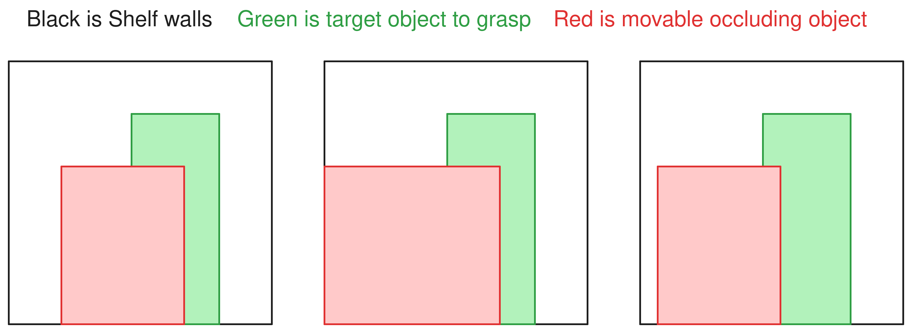
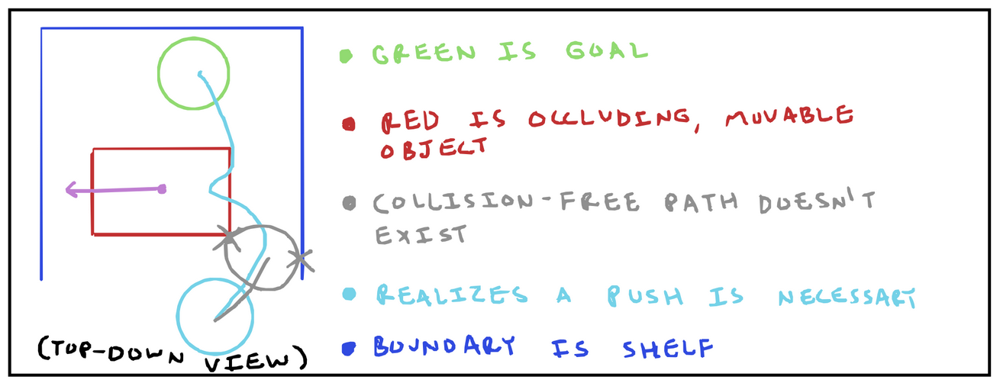

## 1 Last Time

Last meeting, I wrote a little document with some partially-formed ideas. There were a few things I wrote down in my notes, with the main one being to think of *motivating examples* for some of the things I was thinking about. Here, I hope to introduce and analyze a motivating example problem in order to guide my thinking. Of course, I may have gone down a slight rabbit-hole instead of thinking about multiple things.

## 2 Motivating Example

### 2.1 Introduction to the Problem

I want to consider the following toy problem: the robot is tasked with retrieving an object in a shelf, that is behind an occluding object. Here is a low-quality figure I made of some variations on this problem (I may revisit even more complicated variations later on):

I think this is a sufficiently complex problem that would be directly relevant to tasks a home robot may need to perform.

The first thing to note is that in the first couple instances, retrieving the green object may require interacting with the red object first, whereas in the last instance that may not be necessary. Secondly, while a simple push/sweep to the side may work in the first scenario, that same push would not be available in the middle scenario because it is snug with the shelf wall—a more complicated push or pull action would be required, like maybe an action that rotates the red object. Finally, the thing I want to key in on is that figuring out what to do (if and how to push) relies on understanding the particular geometry and dynamics of the scene. While this is a planning problem, inferring the dynamics from robot sensors—a perception problem—is critical for that planning. Later, I will also talk about trying to use wrap the pushing into an MPC method at a lower level than a high-level planner.

### 2.2 Existing Work 

Pushing in order to grasp has been studied in the robotics literature. In [@dogar2011framework], a 2011 paper building off of [@dogar2010push], a framework for *push-grasping* is introduced. The idea in the paper is that you may need to perform some sort of non-prehensile manipulation to make grasping easier. The framework works by first planning a grasp of the target object, allowing for penetration into occluding objects, then it determines which objects are penetrated, and moves them out of the way. Thus, a two-step process of (1) determining *if* you have to push things and (2) determining *how* to push things. A similar two-step process is seen in [@li2024adapter], where they study retrieving an object from a shelf where the objects are perhaps touching and arranged side-to-side (think of grabbing a book from a bookshelf). If they realize the target object cannot be grasped in the current configuration, they push the objects to the side of it in to make room—a more simplified *if*-then-*how* pattern. It should also be noted that reinforcement learning has been applied to learn polices for push-grasp synergy ([@zeng2018learning] is the earliest work I could find, but [@zhong2024dual] and [@wang2025learning] are a more recent examples). A learning from demonstration approach has also been applied to push-grasping in [@kiatos2022learning].

A big focus in a few of the push grasping papers, starting from the original work [@dogar2010push], is being robust to uncertainty. A very recent work, [@ren2025collision], from RA-L September 2025 uses compliant robot motions to add robustness to uncertainty, using the idea of a *manipulation funnel*, all pertaining to planning for grasping occluded objects.

More broadly, there is also work on rearranging clutter to make picking a target object easier/possible beyond just push-grasping. [@stilman2007manipulation] is a well-cited early example of such work. More recently, [@ren2024neural] leverages supervised deep learning to predict which object to move and where such that the target object is graspable (the *how* part). There is also a whole *navigation among movable obstacles* (NAMO) [@stilman2005navigation] line of work which is related. There are other works I could mention, but I think this is a diverse-enough overview of the relevant literature.

There are a few threads I want to pull between all these mentioned papers and the simplified example I am looking at:

1. Being able to intuit the specific dynamics of the scene are necessary for solving the problem; either you use a classical method, which directly reasons about the geometry and plans pushes through some simplified dynamics that result in a better future grasp, or you use a learning-based solution that implicitly understands how to push. 
2. There is this *if*-then-*how* structure to all of these methods; for example, the RL approaches will determine *if* a push should occur before a grasp evaluating something like the $Q$ function for both pushing and grasping and using that to determine which action to take, then the learned policy executes the action based on its RL training through simulation dynamics.
3. Occlusion creates uncertainty, which creates a need for robustness during grasping.

In the next section, I want to talk about what I think are some interesting lines of though regarding my simplified problem, while keeping in mind the existing literature surrounding it.

## 3 Paper Idea I: Sampling-based MPC for Non-prehensile Manipulation Discovery

### 3.1 The Idea

When grasping objects from clutter in confined spaces, humans sometimes use non-prehensile actions to make the target object accessible. Humans can do these actions "on-the-fly" and largely without thinking. In robotics, it is usually the higher-level planner's responsibility to determine if an action like pushing needs to be done before an object can be grasped, but I think it would be cool if many of such actions could be handled by lower-level planner/controller, similar to how humans can act instinctively. In this idea, the goal would be to show that sampling-based MPC can "discover" that it needs to push other objects around in order to get the target object—without baking pushing-then-grasping into the *planner* like the methods I mentioned in the previous section. This would prevent replanning and allow for reactive clutter rearrangement. Here is a simplified image of something similar to what I am thinking, following along my simplified example in the previous section.

Another argument that might be worth making is something like this: while imitation learning has seen recent successes, it requires examples of certain behavior to execute it. It would be awesome if, equipped with only a *dynamics model*, we could have algorithms and controllers that could discover new ways of reaching goals by simply reasoning or searching intelligently through the dynamics and embracing contact. 

Roughly, the idea would be to do the following procedure in the setup from section 2 (shelf with clutter):

1. Infer dynamics (system identification)
2. Pick a grasp pose or goal
3. Use sampling-based MPC to take the arm to the goal (where it realizes whether it should push the occluding object or not)

The contributions could be (a) the use of sampling-based motion planning to reason about pushing to grasp in a cluttered shelf; (b) a novel way of sampling to make the MPC better; and/or any number of other things. We could also do experiments doing contact-rich stuff in the shelf, like grabbing a book on a bookshelf.

### 3.2 Some Relevant Literature

Sampling-based MPC is pretty popular. Mujoco MPC's predictive sampling [@howell2022predictive] falls into this category, as well as MPPI [@williams2018information]. It also seems to be pretty fairly capable of many robotic manipulation subtasks. Sampling-based MPC has been used to manipulate articulated objects [@rizzi2023robust], as part of a method for pushing through clutter [@weeda2025pushing], and is highly parallelizable [@pezzato2025sampling]. One idea that comes up a lot is that sampling-based MPC, such as MPPI are very sensitive to the *sampling distribution* used to generate samples (you see a similar argument in the DIAL-MPC paper [@xue2025full]). There are a few papers that propose adjustments to the sampling distribution to improve MPPI, Biased-MPPI [@trevisan2024biased] is an example, in which they show mathematically that by simply biasing an adjusted cost towards a desired sampling distribution, you can allow arbitrary non-Gaussian sampling distributions under the information-theoretic framing of MPPI. In Biased-MPPI, they specifically propose incorporating ancillary controllers into the sampling. Honestly, there is a lot of work on MPPI in recent years, too much for me to list. These methods are also related in some ways to SV-MPC [@lambert2021stein].

### 3.3 Thoughts

If I think about what it might take to make this work I think the following may come up:

**Better sampling:** I actually think it is an interesting problem to think about how to define a more diverse sampling distribution if you have access to the dynamics function. Ideally, you would want to have samples that are diverse in the state space instead of just control space. One could imagine that if the function was close-to-affine we could think about information from the partial Jacobian of $x_{t+1} = f(x_t, u_t)$, which would be $\nabla_u f(x, u)$. However, contact modes make this more difficult. Perhaps there is a smarter way to sample $u$'s so that we get diverse states, even when contact may occur?

*(I would like to actually take some time to think about this maybe. There are a lot of papers that try to explore better, such as [@khandate2023sampling] which draws inspiration from RRT and explores along constraint manifolds for in-hand manipulation. In the setting where contact is sometimes made and sometimes not, the problem seems harder)*

**Safety constraints / cost function design:** We may want to think about what should be part of the cost function. Maybe we want some sort of term that says: *you can push objects, but don't tip them over*. Maybe there should also be some thought to the cost for the goal; do we select one grasp orientation and go to that, or have multiple and go to the one that is easiest to reach? I think these are solvable problems that might just be a "get there when we get there" sort of thing. If we wanted to really try to be trendy, we could prompt a VLM for what safety constraints should there be, which is what I believe ReKep [@huang2025rekep] kind of does. I don't completely know how I feel about that though.

## 4 Paper Idea II: Robust Imitation Learning with Dynamics-informed Basis Trajectories

**Note:** *This one is much less thought out because I did not evenly distribute my time between the two ideas*

Imitation learning (IL) has shown to be promising at many complex manipulation tasks, but vanilla IL is known to be very sensitive to *distributional-shift* [@zare2024survey]. In order to make IL viable, it needs increased robustness. In many other learning problems, robustness has been improved by using inductive biases such as adding in domain-specific invariances like convolutions or using better feature engineering. This has motivated the search for encoding stronger inductive biases into IL to make it more robust to these. One of the main bits of structure in robotics problems comes from physics and 3D geometry. In this idea, I propose giving imitation learning policies information about the dynamics of the system to learn from. My idea is to first infer a dynamics model of the environment, then, along with the normal input, feed in a collection of *basis trajectories* into the futuer and their predicted observations:
$$ \{(\tau_1, o_1), ..., (\tau_k, o_1)\} $$
Where $\tau_i$ is a sequence of actions through the inferred dynamics model, and $o_i$ is the corresponding predicted observation. In order for this to work, we would need a dynamics model that can produce the right kind of observations (probably images). Then, if we are confident that we generated enough of and a high enough quality of basis trajectories, we could also have the robot take an action near the convex hull of these trajectories. Obviously, we would probably be using a transformer here. Maybe we would even have something like (I'm being a bit sloppy here):
$$ \hat \tau = \text{softmax}(Q_{\theta_1}(o_{1:k}, \tau_{1:k})) \tau_{1:k} + \epsilon_{\theta_2}(o_{1:k}, \tau_{1:k}) $$
Where $\tau_{1:k}$ and $o_{1:k}$ denote stacking all of the basis trajectories or predicted observations on a new tensor dimension and $Q_{\theta_1}, \epsilon_{\theta_2}$ are learnable functions. I hope that makes sense to me in the morning, I kind of just spitballed that there like 5 minutes ago this evening.

The idea is that we would be giving the robot dynamics information to work with when it is selecting its next actions. The real fun part of this is kind of related to the previous paper idea: how do we generate the basis trajectories? I think it would be dope if there was some way to generate a real representative set just based off of access to the dynamics function and a bit of understanding of the physics. You would want the set to not just be diverse in action space, but in resulting final state space.

We would show that by inducing various distribution shifts (different objects, different shelf, etc.), we would be more robust than a naive approach.

**Relevant Literature:** So, I didn't really do a literature review on this one, but I know there are papers out there that exist. Here are some relevant papers that I have at least read the abstract of and glanced at a figure or two: [@balim2025model; @chandra2025diwa; @demoss2023ditto; @liu2023dynamics; @hu2022model]. These approaches often make many implicit or explicit nods to RL and/or human imagination. 

**Thought:** *I realize that perhaps both of these paper ideas are simply shifting their contribution to the problem of effective diverse sampling through a dynamics model that involves potentially making or not making contact. A more defined version of the problem is how to sample joint angle action sequences through a dynamics model with different potential contact modes such that we have a large diversity of resulting states.*

## 5 Some Other (Semi-)Random Ideas

**Thing 1:** Last time, I mentioned an idea where a behavior cloning or imitation learning policy would "fall back" to MPC or something when it's predicted actions didn't seem to work in a dynamics model of the scene. I think that the shelf example could potentially be a motivating example if you only have examples of 2 of the three modes in the first image, then during inference you give it the third one, it might not know what to do.

**Thing 2:** In my proposed first project, the dynamics model produced will actually be probabilistic, thus there will be uncertainty. Is there an interesting direction of thinking about how uncertain dynamics affect sampling-based MPC, and how one could improve the sampling-based MPC by thinking about uncertainty in dynamics?

**Thing 3:** Here are some real life videos I took of me doing some manipulation stuff (perhaps these could motivate other motivating examples):

{width=30%}
{width=30%}
{width=30%}

**Thing 4:** This is the third consecutive weekly meeting and corresponding write-up (the other two are [here](../2025-08-29_posa_meeting/) and [here](../2025-09-05/)). I am wondering if I could get some feedback on my thinking/style, such as whether I should think more about fewer ideas? Whether I am being too pie-in-the-sky? Should I try to include more mathematical statements? etc. Obviously, these write-ups are a little different from the style I would do if I was actively working on a project, but I figure the time before I have a computer or desk in the lab might be a good time to refine my ability to think about and generate project ideas slightly outside of areas where I am most comfortable in.

## References

