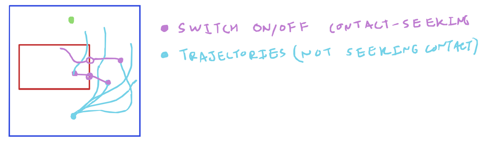

## 1 Last Time

We talked about contact. Specifically, we talked about this motivating example of reaching a goal behind a movable object. I had the following sketches:

{width=49%}
{width=49%}

The idea I had last time was to use a sampling-based MPC strategy to "discover" that the occluding object needs to be pushed out of the way. I talked about whether there might be a way to do better sampling, and we also talked about contact modes and contact mode search. This week, I have a few half-baked thoughts regarding this problem, specifically with sampling better for MPPI-like algorithms in contact-possible situations, but I was not very organized and so it is not super cohesive.

## 2 The Setup

### 2.1 Toy Problem Motivation

I took an evening to make a poorly-coded simulation of a similar setup to the toy problem from yesterday. Here is a gif I made of MPPI [@williams2018information] trying to do the thing:


I used force controls on the sphere, a cost function that mostly just penalizes distance to the goal (I also tried one that penalizes collision as well, but it didn't solve the harder task of the big block still). I used a horizon of 50 steps with 20 samples. I tried increasing both of these values to 100, but the big block problem was still not solved. It is very possible that better tuning of all the hyperparameters might result in better performance.

Perhaps this could serve as motivation for better sampling for sampling-based MPC (recall that [@trevisan2024biased] gave justification for pretty much arbitrary sampling distributions for MPPI). The rest of this write-up has a pretty strong MPPI bent, so yeah...

### 2.2 Notation

Consider an optimal control problem with some inequality constraints:
$$ \min_{u_{0:T}} \sum_t c(x_t, u_t) + c_f (x_T) =: J(U) $$
$$ \text{s.t. } \; x_{t+1} = f(x_t, u_t), \; \; \; g(x_t, u_t) \leq 0 $$
For reference, MPPI defines a procedure where you sample Gaussian $\{u_t^{(i)} \}$ and then reweight the samples to find an optimal control sequence following:
$$ u^*_t = \frac{\sum_i \exp(-J(U^{(i)}) / \lambda) u^{(i)}_t}{\sum_i \exp(-J(U^{(i)}) / \lambda)} $$
The justification comes from some math that shows a lower bound (from "free energy" or something) on what looks like an expected cost becomes an equality with the proposed reweighting. Also for reference, here is some pseudocode:
```python
def MPPI(old_u, sigma, f, x0, J):
    u_samples = old_u + sigma * gaussian()
    x_samples[:, 0] = x0
    for t in range(1, T):
        x_samples[:, t] = f(x_samples[:, t-1], u_samples[:, t-1])
    costs = J(x_samples, u_samples)
    u = reweight(costs, u_samples)  # according to equation above
    return u
```

### 2.3 How is Contact Usually Handled?

Like we talked about last time, there are things called *contact modes*, which are different configurations of things being in contact (i.e. not-in-contact, sticking, sliding). These seem to be typically determined by which constraints (i.e. friction cone, no-penetration) are currently active. This, alongside an MPC objective, can be phrased in the form of a mixed-integer program. The space of contact modes is quite large, and so there is interest in efficiently searching through them. In order to *search* through different contact modes, some methods employ Monte-Carlo tree search [@zhu2023efficient] or diffusion-informed (like informed by a trained diffusion model) search [@kumar2025diffusion].


## 3 Some Half-Baked Ideas

In the classic formulation of MPPI, noisy $u^{(i)}_t$ are all sampled before ever rolling them forward. In this section, I instead think along the lines of how one could adopt the MPPI algorithm by choosing how to sample $u^{(i)}_t$ after rolling out the dynamics to $x^{(i)}_t$. This changes the `MPPI` pseudocode above, where `u_samples` would be computed for each timestep in the for-loop. In this section, I examine some half-baked ideas on what you could do with this version of MPPI.

### 3.1 RRT-inspired Contact Seeking

I know we have discussed [@pang2023global] before, but I don't think we ever talked about the RRT part. They adopt RRT to plan through contact, but instead of only the normal expansion in RRT (where you pick a random point, find the nearest in your tree, and just iteratively move towards it), they propose occasionally sampling a contact point and going towards that to incentivize contact. I wonder if you could have a similar setup in MPPI where sometimes, instead of just Gaussian actions centered at the previous best trajectory, you pick actions that take you towards a point of contact? Maybe here is some pseudocode:

```py
def MPPI_contact(old_u, sigma, f, x0, J, p_switch):
    u_samples = old_u + sigma * gaussian()
    contact_seek_state = [0, ..., 0] # 1 means seek contact
    x_samples[:, 0] = x0
    for t in range(1, T):
        contact_seek_state = flip_with_prob(contact_seek_state, p_switch) # randomly flip
        u_samples[contact_seek_state] = action_to_go_towards_contact( # the i that satisfy it
            x_samples[contact_seek_state]
        )
        x_samples[:, t] = f(x_samples[:, t-1], u_samples[:, t-1]) # roll forward
    costs = J(x_samples, u_samples)
    u = reweight(costs, u_samples)  # according to equation above
    return u
```

Here is a sketch of what the behavior might look like. The rollouts with sometimes flip and start seeking contact:



### 3.2 Smoothing Rollout Controls via Momentum

The idea here is to add some momentum to the sampled control rollout noise so that it encourages more exploration through the state space. Perhaps the motivation here is something like Hamilton Monte-Carlo method (HMC).

In [@xue2025full], they relate MPPI to diffusion (I haven't read [@li2025unifying], but from the abstract, it seems to suggest that the connection from MPPI to diffusion is pretty deep). Diffusion can be viewed as performing stochastic gradient langevin dynamics (SGLD). SGLD is a way of *sampling* from a distribution via a random walk. Of course in these settings, the analysis is for viewing the update of MPPI as a single denoising step on the whole trajectory, whereas my idea in this section views each timestep of the rollout control sequence sampling as a *forward* diffusion-like process.

*Smoothing*, in terms of MPPI has also been explored. I believe this is the motivation for the works (I know at least 2) that use *splines* for MPPI control sequences [@bhardwaj2022storm; @hess2024sampling]. There is also probably other stuff out there.


### 3.3 Dealing with Constraints during the Rollout

It is possible that we might have some constraints that we want to be satisfied through while we take actions. I feel like the few papers I have seen deal with equality constraints are usually dealt with by moving tangent to the constraint (i.e. linearize the constraint and restrict yourself to moving in the direction that satisfies the constraint ($\perp \nabla h(x)$)), then they "snap" back to the constraint to remove accumulating errors from the approximation. For example, both [@khandate2023sampling] and CSVTO [@power2024constrained] seem to follow this pattern. As a side note, [@kumar2025diffusion] uses CSVTO and an A* search through contact modes (as well as diffusion). Perhaps a similar approach could be taken while sampling control inputs $u^{(i)}_t$ for sampling-based MPC? (I'm sure someone has done this, but I didn't take the time to really do a search).

One could also imagine inequality constraints arising for a variety of reasons, i.e. collision constraints. I wonder if one could adopt a *resampling* technique, where, during MPC if you find a trajectory that violates a collision constraint, you delete it and replace it with a copy of a random other rollout that satisfies all the other constraints. I also made a brief sketch of this one (resampling for inequality constraints):


### 3.4 A Random-Walk Perspective of MPPI Rollouts

What if we phrased MPPI rollouts as a random walk through some dynamics? Like, doesn't the distribution of MPPI samples kind of create a trajectory that follows the following stochastic differential equation (SDE):
$$ dx_t = f(x_t, \mu_t + \sigma_t d W_t) $$
Where $W_t$ is a [Wiener process](https://en.wikipedia.org/wiki/Wiener_process). We could consider a simple system, where we have acceleration control of a point mass with no external forces. We could write this out as a couple of stochastic differential equations:
$$ dx_t = v_t dt, \; \; dv_t = \mu_t dt + \sigma_t d W_t $$
I wonder if this is a framing that could yield anything. For example, one can use the above SDE to analyze the variance of $x_t$ (I believe in the above case, the variance is $\mathcal O(t^3)$, but don't quote me on that). Is there any use to this way of thinking about MPPI?

I have no idea if this is something that has been done or anything similar.

## References


