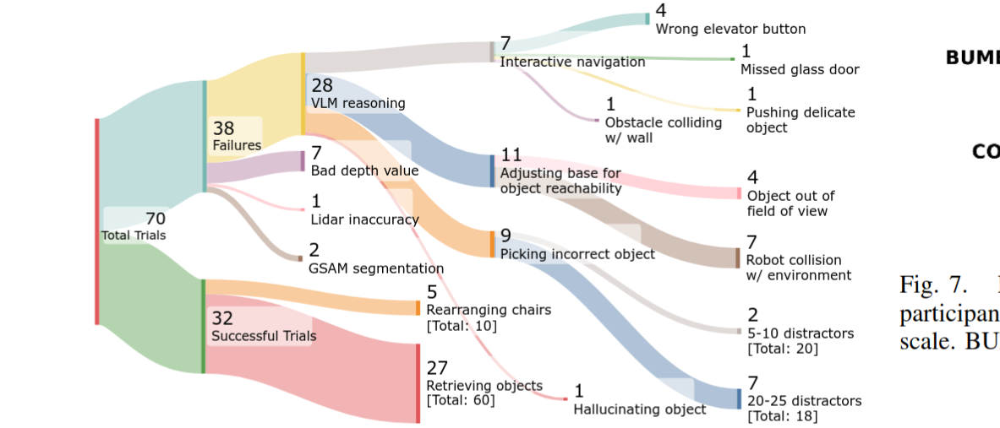
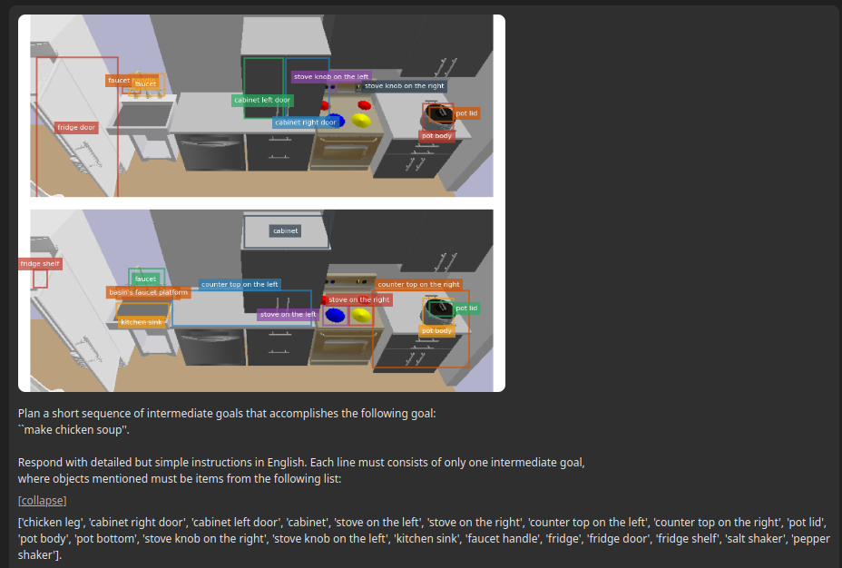
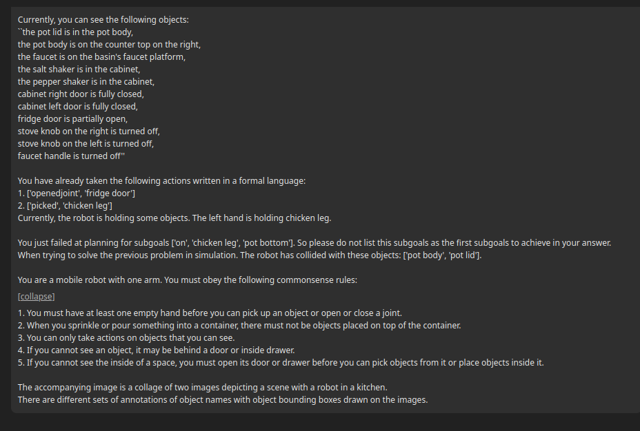
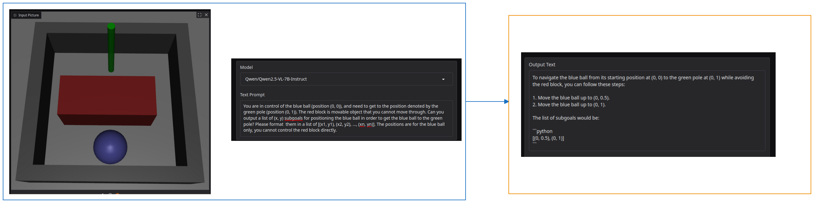

## 1 Last Time

Last time, we talked about a lot of things.

## 2 VLMs for Planning

### 2.1 Some Relevant Papers

VLMs have been used for planning (and related things) in a few papers. One fairly well-cited Deepmind paper used a VLM in tandem with a learned policy to generalize to objects not in the policy's training distribution [@stoneopen]. A 2025 ICRA paper [@zhi2025closed] proposes using a feedback loop where if failure of the plan is detected, they reprompt the VLM. This is done *after* the failed execution has already taken place. Also in ICRA was the BUMBLE [@shah2025bumble] paper, where a VLM takes the place of a planner. They prompt the VLM for multiple things and have a way of maintaining a "memory" that they divide into short and long term and put in the context window when prompting. They also use a *skill library*. Another paper that leverages VLMs that is well cited that I may have mentioned before is Rekep [@huang2025rekep], where a VLM proposes keypoint-based subgoals and constraints in python code, which are then used for a constrained optimization solver. They have a prompt for the VLM that is over a page long and kind of feels like cheating. I have also mentioned [@athalye2024pixels] before, where a VLM outputs predicates. TAMP meets VLMs in [@kumar2024open] as well (but I didn't really read it). Perhaps the most similar idea to what you mentioned last meeting is [@yang2025guiding], which I talk about in the next subsection. Another one that explores using VLMs for replanning is [@pchelintsev2025lera]. Some other uses of VLMs in robotics can be seen in [@patel2025real] and [@zhao2024vlmpc] among others.

**Side Note:** *here is the failure breakdown for the BUMBLE paper, which I feel like is quintessential "big VLM do everything" paper:*

*The things I noticed include: the wide range of different failures, how the VLM reasoning failed in 28 of the trials, and that the end reasons with 7 trials each were (robot collision, having too many detractors, and bad depth values)*.

### 2.2 VLM Prompting with Failure

Here are some screenshots from the [project page](https://zt-yang.github.io/vlm-tamp-robot/) of [@yang2025guiding], where they reprompt a VLM when the PDDL/Motion planning solver fails:

{width=49%}
{width=49%}

They tell the VLM that it failed, the (discrete) sub-goals that didn't work, as well as a set of objects that had collisions with the robot. The experiments kind of showed this re-prompting to be successful.

### 2.4 Side Note

I tried to run a slightly harder version of the previous dummy environment to a VLM and it kind of sucked. I don't think this is necessarily what will always happen, but I think it is indicative of how it matters what you prompt and ask the VLM to do specifically for performance. Here is the image of the result:

Clearly, that will not work. Also, I know that this is possible because I threw together some hacky keyboard control and I was able to solve it, although it does take quite a bit of wiggling.

## 3 Cluttered Shelves

### 3.1 Some Relevant Papers

I have [previously done an overview of similar papers to this task](../2025-09-12/#existing-work). Here I simply mention a couple more papers to be aware of. I think [@wang2022efficient] is indicative of the simplifications common in papers doing manipulation in cluttered shelfs, from what I have seen. Specifically, they (1) assume all objects are cylinders and (2) ignore non-prehensile manipulation such as pushes. Of course, in link in the first paragraph, I overview literature that makes use of non-prehensile manipulation in clutter. Of course there is work that doesn't use these assumptions, such as [@saxena2023planning]. Recently, FetchBot [@liufetchbot] is a sim2real RL method for fetching objects in clutter, but they seem to (a) use a suction-cup gripper, and (b) be "afraid" of contact (they try to avoid contact with other objects).

### 3.2 My Thoughts

I think that manipulation in a cluttered shelf is cool. I think at some point I want to do a project with it. I think after my [first project](../2025-06-11_project_pitch/) is in a reasonable place, there might be room for something like this: See a cluttered scene $\rightarrow$ infer a dynamics model on-the-fly $\rightarrow$ use some combo of planning+control to do manipulation. I think there such a setup, if done right, would be publishable. Of course, there are also some other cool things to think about with a cluttered shelf setup, such as:

- What happens when you don't see the object you are looking for, but there is a chance it may be there, just fully occluded
- What happens if you can get to a grasp pose, but can't "pull" the object out collision-free
- etc.

## 4 Other Thoughts

- Object-centric planning
- Washing the dishes

## References

