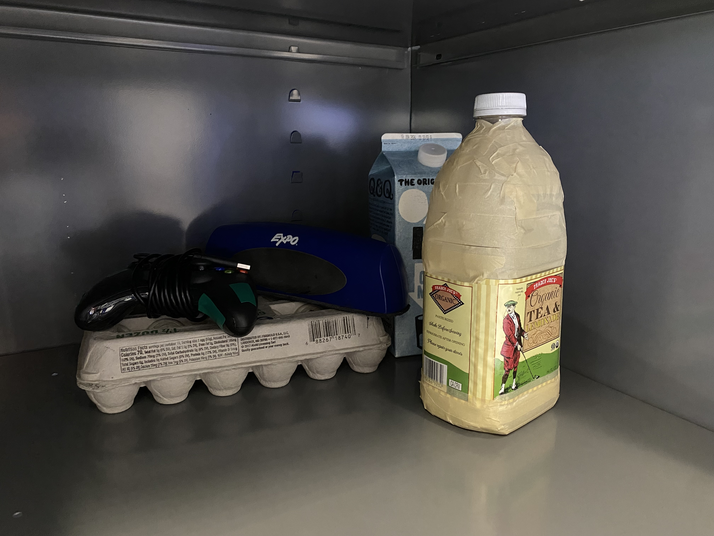
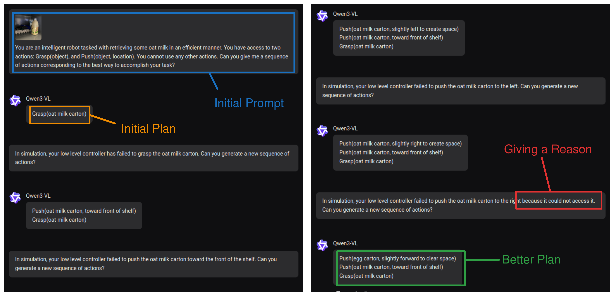
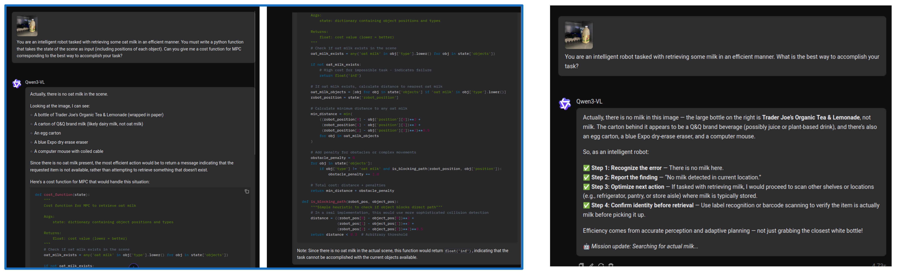
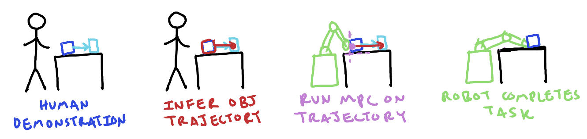
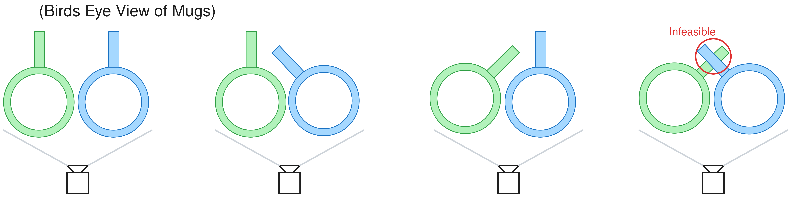

## 1 Last Time

Last meeting, like most meetings, we (I?) were (was?) slightly all over the place. There was, however, one concrete thing you wanted me to do:

1. Take a picture of a cluttered shelf and prompt a VLM with it.

So, I did that ([Section 2](#vlm-things)). I mention some crackpot/other ideas in [Section 3](#other-stuff) because that is fun. I also have a bit on reconstruction and diversity in [Section 4](#diversity-in-3d-reconstruction) (more related to my original proposed project).

## 2 VLM Things

### 2.1 Messing Around

So here is the photo of a cluttered shelf I threw together. It is not a very natural setup, but it contains enough complexity for our purposes I think:

I think this image of my convo with Qwen 3 is tentative evidence that feedback can improve VLM plans (of course there is also evidence for this in other people's papers):

In the image the VLM is reprompted after initial plan saying the low level controller was infeasible, and only figures out to use a different object after being given a reason for the failure.

Another perspective, is that the above example is kind of contrived. After all, it seems the VLM doesn't recognize the milk is milk in the photo when prompted for other outputs:

Perhaps I am overfitting to this example. Also, there is a very small search space of "actions" to take in the first example, and one could easily imagine random search finding the solution. Of course, maybe the VLM is really just speeding up random search by searching more intelligently—I could buy that.

### 2.2 Can VLMs Reason Well Enough?

There is mixed evidence on VLMs being good reasoners. On one hand, they seem to be able to reason well enough to see significantly improved results in many papers, including but not limited to BUMBLE [@shah2025bumble] (which we discussed last meeting) and COME [@zhi2025closed]. Of course, in the BUMBLE paper, the VLM was clearly not perfect:

![Some figures from BUMBLE [@shah2025bumble]](image-1.png)

Recently, I have (partially) read PAC Bench [@gundawar2025pac], which argues that VLMs still struggle with *complex affordances* and understanding *physical constraints*. This seems to also align with [@chow2025physbench]. I think this perspective is also corroborated from a few of the VLM works I cited in [last week's write-up](../2025-09-26#some-relevant-papers). I even feel like many VLM papers just have a sort of "hacky" feel to them. It should also be noted that if VLMs simply cannot perform some function that is necessary to robotics, then current VLAs are likely also out of luck, as they usually use a VLM backbone.

### 2.3 Looking for the "Project Pitch"

I thought maybe I would try to write what I would think the "pitch" would be for this project. Previously, I expressed concern that having a VLM be prompted upon failure is not novel, but there seemed to be a thought that relating *control* to the VLM in a novel way might add novelty. My opinion is that we could get some novelty by combining (a) VLM planning, (b) "digital twin" (sysID for ML people), and (c) controller feedback. The only paper I know of that combines "digital twins" with VLM planning is [@ning2025prompting], which simply uses a VLM to *evaluate* sampled actions, instead of using a VLM to generate and update "actions" based on feedback from a controller. I can even imagine a fairly flashy paper pitch that looks something like this:

- **Title:** Model Predictive Imagination for Robust VLM-based Planning
- **Motivation:** VLMs are a promising tool for planning in robotics, but they still fragile and frequently get things wrong. There is a need for helping VLM-based planners understand the physical world and plan accordingly—something that model-based controllers can help with.
- **Method:** Basically, observe a scene and both create a "digital twin" (which can be updated as time goes on), and prompt a VLM for a high level plan. Then pass that plan and model to a controller, which tries to solve it. If it can, the robot executes it, but if it can't, you reprompt the VLM in an intelligent manner (I am thinking maybe you could even have the VLM try to qualitatively describe what went wrong from the images). Then you repeat until you figure out how to solve the problem.
- **Experiments:** Grasping in confined, cluttered places might be a good use case, but it might be worth brainstorming others.

**Question:** *What do we think about this pitch?*

## 3 Other Stuff

### 3.1 Don't fear contact.

- Most methods for grasping in clutter explicitly avoid making contact with non-target objects—humans aren't *afraid of contact* in this way.
- This shrinks the region of possible solutions for motion planning to a grasp configuration.
- What if we could instead say "don't make bad contact, but it's okay to make some contact"
- Understanding/encoding this would require understanding of the dynamics.
- Could you have motion planning RRT to a grasp pose that is "unafraid of contact", but is only afraid of "bad contact"?
    - The pipeline could be something like (observe scene) $\rightarrow$ (reconstruct scene) $\rightarrow$ (generate possible grasps) $\rightarrow$ (determine what is "bad" contact) $\rightarrow$ (run contact allowing RRT).
    - Maybe RRT is to random/dumb to do this well/convincingly and would require some sort of hack.

### 3.2 Active Learning Trajectory Optimization for Reconstruction

- Next best view selection or next best contact selection is constrained by how you can move and based on where you are, which naively picking a frame doesn't account for
- Can we phrase active learning as trajectory optimization? 
- Problem: temporal correlation
- I haven't thought too much about this, but I saw that the reading group paper was [@SathyanarayanH-RSS-25], which casts active learning as trajectory optimization, but they seem to make a Gaussian assumption, which shouldn't hold in the case of object reconstruction, so some different formulation is likely necessary.

### 3.3 Contact Reasoning

<!-- Scaffolding:

- Given an objects shape and desired motion, find contacts that are both kinematically feasible and robustly result in the desired motion. -->

Last time, I asked how a *C3+(some other stuff)* approach (such as [@Venkatesh2025]) might decide how to make contacts for a push, specifically when reasoning about *how many* contacts, which would be nice for pushing more *robustly*. I haven't looked at any robust MPC works/formulations, so this is definitely shooting from the hip, but here is where my mind is at:

Consider a standard MPC loss in these sorts of settings:

$$ L(u_{0:n-1}, x_{0:n}) = \sum_{k=0}^{n-1} \left(x_k^\top Q_k x_k + u_k^\top R_k u_k\right) + x_n^\top Q_n x_n $$

One could imagine that the dynamics have some uncertainty—maybe we don't exactly know the center of mass. We would want something that kind of looks like:

$$ \mathbb E_{x_{0:n}} \left[ L(u_{0:n-1}, x_{0:n}) \right] = \mathbb E_{x_{0:n}} \left[\sum_{k=0}^{n-1} \left(x_k^\top Q_k x_k + u_k^\top R_k u_k\right) + x_n^\top Q_n x_n\right] $$

But, this doesn't really fit with our QP, because the $x_k$'s are decision variables, so we could imagine approximating this with a few ($m$) samples:

$$ \frac{1}{m} \sum_{i=1}^m \left[\sum_{k=0}^{n-1} \left({x_k^{(i)}}^\top Q_k x_k^{(i)} + u_k^\top R_k u_k\right) + {x_n^{(i)}}^\top Q_n x_n^{(i)}\right] $$

Then we could include all of our $x^{(i)}_k$ as decision variables. I am imagining $m$ is pretty small, so that this would be computationally feasible. I don't exactly love this formulation, but this would allow us to express our MPC formulation as an expectation under some uncertainty.

**Note:** *Our samples are from our distribution of uncertainty about center of mass, say, so that the dynamics for each $x^{(i)}_{1:n}$ is deterministic because it is conditioned on our sample.*

The next thing would be to think about how to sample better. I think this can be thought of as a nonconvex optimization problem; we want to find a configuration that is capable of locally producing a benefitial wrench on the object, subject to the configuration being "reachable". We can think about the contact points and forces that would produce this wrench and try to enforce that they be kinematically feasible.

**Problem:** find contacts $x_1, ..., x_p$ and forces $\lambda_1, ..., \lambda_p$ subject to $\{(x_i, \lambda_i)\}$ is kinematically feasible, $\{(x_i, \lambda_i)\}$ produces a desireable wrench, and $\{x_i\}$ is on surface of object.

On another note, I think it would be cool if one could use this sort of setup to "track" an object-centric trajectory. The demo would be that you take a video of you doing something with an object, and then the robot would be able to reproduce the object trajectory, even though it has different kinematics than you. This is not completely new (for example a similar thing appears in the real2sim2real pipeline of [@yu2025real2render2real]), but I think if you combine this with uncertainty and the stuff above, it could be cool. Here is an image:

It does change the problem mid-trajectory, because you can't necessarily stop making contact, so you need to find some reasonable contacts beforehand (kinematically).

On a relevant note, I do have a question that I can't really intuit in my brain after reading [@Venkatesh2025]:

**Question:** *Would a linearized MPC policy like C3 be able to recognize how to make a "grasp" sort of configuration in order to lift something?*

I wonder if something along the lines of this subsection would make for an okay class project for MEAM 5170.

## 4 Diversity in 3D Reconstruction

When I originally pitched [this idea](../2025-06-11_project_pitch/), it was decided that it would be made better if I could leverage priors from large datasets of mesh assets. I think that just this combined with the diversity aspect is something that needs to be figured out. Recall this image from the project pitch:

I think the things one needs to think about in order to correctly get diversity is both:

1. diverse "scales" or having reconstructions with significantly differently sized bounding boxes
2. diverse geometries within a scale/bounding box.

After talking with Minghan, I think I can use multiple runs of the Amodal3R [@wu2025amodal3r] method, which uses to TRELLIS [@xiang2025structured], to *seed* the optimization that would include stability prior. Because TRELLIS is a flow-based model, it should be able to get the 2 in my above list, but to get the 1, I think I will have to vary the bounding box size.

Also after talking with Minghan, I think it might be good to come up with some more motivating examples of diversity mattering for dynamics. I think having a shelf of mugs could be one. Consider trying to push some mugs around, where the handles are occluded, you need to reason about a distribution that is nontrivial:

It should also be noted that depending on which above setup is true, the pushing dynamics will be different. 

## References
