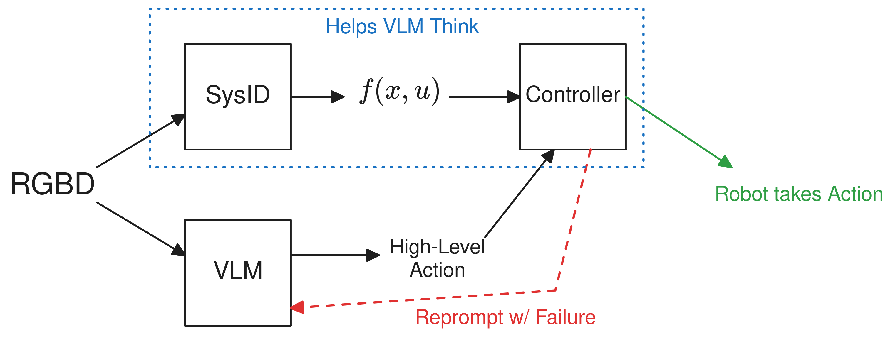
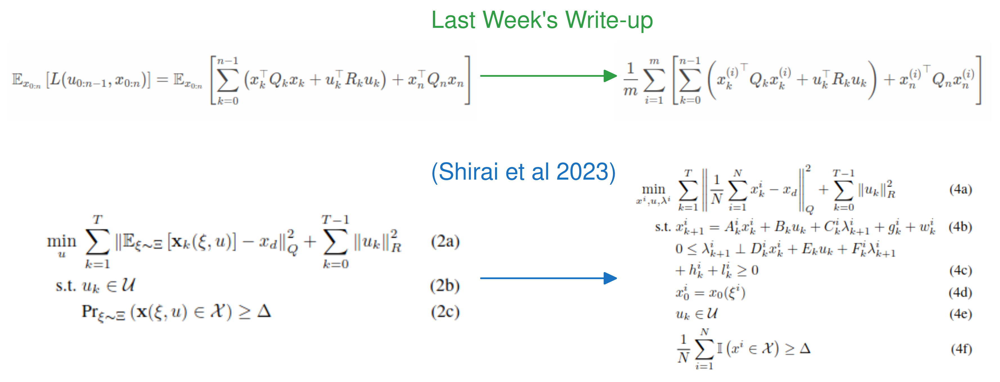
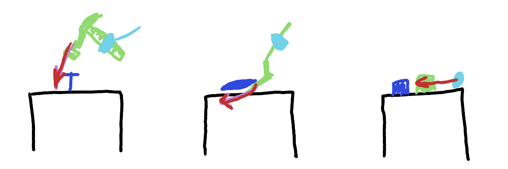
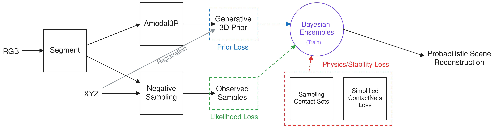

<!-- TODO: go through and add more visuals / math -->

## 1 Last Time

Last meeting, we spent at least a little bit of time on four different ideas:

1. VLM + world model + feedback from control
2. RRT that allows a bit of contact
3. Active learning for next best view—specifically over trajectories with correlated observations
4. Robust contacts + learning from a single video demonstration

This week, I want to mainly focus on 1 and 4 (we resolved to keep 2 in the back pocket), and also have a bit written about my original project idea, which I hope to work on when my computer arrives. There were a few particular things that were resolved for me to do, which can be summarized as:

- Try out VLM that generates image for goal
- Come up with better demos/method for the learning from single video demonstration idea

Unfortunately, I ran out of Huggingface GPU hours before I could even generate one image response, and my laptop can't run any of the models locally, so I couldn't do the first point. But anyways, this is the write-up for this week, and it is mostly just more discussion and refinement of my past project ideas.

## 2 VLM Stuff

We have talked about this VLM idea for a few meetings. In this section, I'm perhaps just trying to make things a bit clearer. Recall that this was my proposed pitch (from last week's write-up):

> - **Title:** Model Predictive Imagination for Robust VLM-based Planning
> - **Motivation:** VLMs are a promising tool for planning in robotics, but they still fragile and frequently get things wrong. There is a need for helping VLM-based planners understand the physical world and plan accordingly—something that model-based controllers can help with.
> - **Method:** Basically, observe a scene and both create a "digital twin" (which can be updated as time goes on), and prompt a VLM for a high level plan. Then pass that plan and model to a controller, which tries to solve it. If it can, the robot executes it, but if it can't, you reprompt the VLM in an intelligent manner (I am thinking maybe you could even have the VLM try to qualitatively describe what went wrong from the images). Then you repeat until you figure out how to solve the problem.
> - **Experiments:** Grasping in confined, cluttered places might be a good use case, but it might be worth brainstorming others.

I mentioned in the previous section that I wasn't able to get an example of generating an image for the goal. I think maybe there is also a lesson there—image generation takes longer than text generation, which probably matters for robotics, where speed matters a bit. I think it is more common in the literature to ask VLMs to output high-level TAMP-like actions, but this also might be a result of VLMs that generate images being newer than those that output text. However, I do think that thinking about how to translate from whatever format the VLM output is in to the format for the controller's input is something that requires thought. There are simple input/output formats where the translation is trivial, but for example maybe it would be cool if the VLM could do natural language corrections to the low-level controller, instead of just selecting a different high-level action—an idea loosely inspired by [@shi2024yell] and similar works. This would require some thought to make sure our controller can handle such corrections. Maybe that could be some sort of follow-up work as well. Another question is what is the right way to annotate the input images to the VLM. I have seen various ways of doing it, but usually it comes down to detecting the objects, then labelling them in the images input into the VLM. 

I also think this might be a useful skeleton figure of what the pipeline for this project might look like:

How to detect and handle failure would also have to be decided—for example, we could use a VLM to detect when the controller does an undesireable action and thus detect failure. We could also leverage the VLM to describe the failure (which has also been done before in [@pchelintsev2025lera]).

<!-- https://witnesschain.com/blogs/open-source-vlms-2025 -->

**Some more papers:** Zhao et al [@zhao2025seeing] uses VLMs to estimate uncertainty and uses a belief state planner to plan (uses MOLMO+SAM for object detection/segmentation, and then GPT-4o for predicate evaluation). ManipGen [@dalal2025local] is more of a RL paper, but they use a VLM for determining high level actions for longer-horizon planning (I feel like tasks such as placing an object in a drawer is not *that* long horizon really). FailSafe [@lin2025failsafe] was put on Arxiv about a week ago, and it uses VLMs to try to recover from failure states.

**EDIT:** *I just came across [@wu2025foresight], which is pretty similar to our idea here, as they use VLM to rank actions with predicted outcomes from a world model, but I don't think they have the same reprompting setup we do.*

**On the experiments:** I think we talked about picking in clutter, where you might need to push things out of the way. I also think that it might be good to have more than just that example in mind for this idea. Perhaps we could try seeing if the VLM can reason about when things are on top of each other; like if the goal is to pick up a plate, but there is a bowl on top, it needs to remove the bowl, then grab the plate.

## 3 Robust Contact & Learning From a Single Video Demonstration

Last time I had [a section](../2025-10-03#contact-reasoning) that was kind of a mish-mash of a bunch of different ideas and was not very coherent. In this section, I try to *split* my previous ideas into two (hopefully) more clear ideas.

### 3.1 Robust Contact

Robust pushing has been studied in the literature before. Obviously *robust control* is a thing. *Convergent Planning* [@johnson2016convergent] by Johnson et al was brought up in a previous meeting, where they use contraction analysis of dynamics to attempt to find robust trajectories. In a more recent paper, Jankowski et al [@jankowski2025robust] considers the variance and mean of belief states during rollouts. They combine their analysis on variance, with their previous work [@jankowski2023vp] and the idea of a *contact prior* to do sampling-based trajectory optimization. They also cite this *The Unstable Queen* article [@rodriguez2021unstable], which argues for the utility of tactile sensing for robotics in unstructured environments. Of course, looking at variance is not new; Shirai et al [@shirai2023covariance] have a highly relevant paper where they have a similar formulation to [the equations from my last write-up](../2025-10-03#contact-reasoning):

Of course, there is perhaps a difference where the expectation is, and they include a chance constraint, but it is a similar idea. Perhaps those are relevant differences to think about, but perhaps not.

**Question:** *Are the two formulations for robust MPC loss conceptually different enough to warrant thinking about?*

Here is the pitch at a high level:

- **Potential Title:** *Robust MPC with Probabilistic Real2Sim for Pushing in Clutter*
- **Motivation:** Most MPC formulations require an accurate model of the environment, and usually assume that there is little-to-no uncertainty regarding these dynamics. In the real world, however, uncertainty abounds—you can never know the exact intertial or frictional properties of objects just by looking at them. While some work has studied robust control and robust pushing, they are often either overly cautious, make very limiting assumptions, and/or have only been tested on toy simulation problems. This leaves room for leveraging perception methods to provide uncertainty, which is incorporated into robust low-level control in an efficient manner for real-world execution.
- **Method:** Given a scene and a goal, create uncertainty-aware object models and run robust CI-MPC similar to [@shirai2023covariance] iteratively. We may need to have a better heuristic for sampling than what is used in tandem with C3 in the lab currently. Also, once the push/manipulation is underway, we can also hopefully update our object models with information about the movements (sysID) to better inform future MPC predictions. 
- **Experiments:** Pushing under occlusion, clutter, etc. where we don't have defined object models beforehand, and are seeing the objects for the first time online. We would want to compare against formulations that don't worry about uncertainty, so maybe it would be worth having some sort of "failure states" for the objects.

I feel that in order for this to be a legitimate project, there needs to be around three *concrete* contributions. I also think that there are maybe some unsolved things regarding the above high-level formulation. For one, I think that because the MPC is going to be local, we will need to be pretty good at sampling initial robot configurations to begin contact from—which feels like a fun non-convex optimization problem over the robot kinematics. Like if we have some sort of loss $L$ measuring how good a configuration is based on the kinematics $\phi$, we could imagine trying to sample from a distribution like:
$$ p(q) \propto \exp\left( -L(\phi(q)) \right) $$
The connection to optimization would of course be that:
$$ \text{argmax}_q \ln p(q) = \text{argmin}_q L(\phi(q)). $$
This is kind of shifting the difficulty of the problem, though, because I don't know how to formulate a good $L$ given a configuration of objects—maybe you could use MPC cost, but that is expensive to compute.

### 3.2 Learning from a Single Video Demonstration

I mentioned [@dong2025joint] last time, where they argue for an *object-centric* approach to learning from demonstration. They seem to only consider actions where the person grasps, then does some simple movement with the grasped object. Their pipeline seems to be to solve a big optimization problem with respect to (a) quality of grasp pose; (b) object/end-effector trajectory matching demonstrations; and (c) safety of the kinematics. I think this is a reasonable approach, but it ignores non-prehensile manipulation, or reasoning about contact and multiple object trajectories. I, however, am a big fan of only extracting the object trajectories, because this really is as kinematically-agnostic as you can get. This is something that a lot of other work trying to do learning from human demonstrations doesn't quite do, such as [@bahety2025safemimic], which tries to use the human grasp pose, and [@yang2025physics], which does retargeting. There are some other relevant papers such as *You Only Demonstrate Once* [@wen2022you], which takes a single (object-centric) demonstration and tries to generalize to objects in the same class, however they also only focus on a single object and don't seem to include non-prehensile manipulation. A more recent paper, *You Only Teach Once* [@zhou2025you] also seems relevant, but I haven't gotten around to reading it.

Here is the pitch at a high level:

- **Potential Title:** *Learning Contact-rich Manipulation from a Single Human Demonstration*
- **Motivation:** Imitation learning has seen a lot of success recently, but modern methods for imitation learning often assume/require that the data is collected from the same robot physically that it is deployed on. This means that such methods cannot leverage the internet-scale of video data of human demonstrations effectively. While some work has looked at imitation learning from human videos, they either assume the robot can effectively mimic the actual actions of the human, or that tasks only consist of grasping and then assuming the grasped object stays fixed to the gripper. This leaves room for a method that, from a single human video, is capable of replicating the effects of contact-rich human actions—grasping or non-prehensile—even if the kinematics are very different.
- **Method:** *(I think this is suboptimal and should be changed)* We can phrase the problem as trying to control the objects to match their target trajectories. Perhaps we want to distinguish grasping and non-prehensile actions via semantically classifying the demonstrations. Our method would (1) compute the estimated object/s trajectory/ies from video; (2) solve opt problem to find initial configuration for robot to begin manipulation; (3) control/solve for robot actions that would track the trajectory/ies with *feedback*. We would want to leverage a dynamics/contact model in order to convert from object movements through contact back to robot actions in joint space.
- **Experiments:** I can identify 3 things we could show in a demo: (i) tool use like a hammer or unscrewing something; (ii) flipping a (toy) pancake with a spatula; (iii) pushing multiple objects aside at the same time (sweeping motion). I think these would make for cool demos.

Phrasing the problem as trying to run a controller over object pose trajectories with respect to robot actions would allow feedback to help, say, adjust your grip pose when the grasped object shifts during tool use, which might be cool.

Last time, thinking of examples of what would be good demos for this sort of project is what we left off on last meeting. I mentioned them in the above pitch, but here are the ones that I think might be cool:

- Tool use: hammering in a nail, unscrewing a big nut with a wrench
- Flipping a toy pancake with a spatula; you have to reason about both the spatula trajectory, the pancake trajectory, and the sliding and sticking during the action.
- Pushing multiple objects to the side in a sweeping motion. I think this would be a good showcase of non-prehensile manipulation with multiple objects

Here is a simple sketch I made of the actions:

**Question:** *I think that this idea is cool but needs more refinement than the other ones in this write-up. What are your thoughts are about how to make this into a good idea?*

## 4 Revisiting the Original Project

### 4.1 The High Level Overview

I originally pitched this idea over the summer, and a more detailed write-up can be found in my [original pitch](../2025-06-11_project_pitch). I also added a tiny bit more thought in [a section last week](../2025-10-03#diversity-in-3d-reconstruction). Here is a succinct version of the pitch:

- **(Potential) Title:** *Diverse and Physically Stable Bayesian World Models for Manipulation*
- **Motivation:** The ability to convert partial observations of a scene into reasonable estimates for the scene's dynamics is incredibly useful in robotics. In the case of robotic manipulation, this usually means reconstructing the geometry of each object in the scene along with some physics parameters. The reconstructions ought to be physically stable and capture the diversity/uncertainty from occlusion. Such diverse, physically stable reconstructions from a single RGBD image can be used downstream by controllers for robotic manipulation.
- **Method:** We can do Bayesian reconstruction using a BundleSDF-like [@wen2023bundlesdf] ensemble. Use Amodal3R [@wu2025amodal3r] with some modulation as a prior, simplified probabilisitic ContactNets [@pfrommer2021contactnets] loss for physical stability. Then use likelihood from observation similar to the negative sampling in [@wright2024v].
- **Experiments:** We can perform simple pushing tasks to verify that our model is *accurate* via multi-object pushing, and *diverse* via pushing with some occlusion that creates multiple different possible outcomes from the same push.

Here is an image I made detailing the method visually:

### 4.2 The First Steps

There are a few things that need to be done for the project. I think the first steps would look something like the following:

1. Getting Amodal3R+registration running (Minghan probably already has this, but I will want it working for me)
    1. Create a few example images
    2. Get Amodal3R running on new GPU
    3. Get registration working
    4. Get Amodal3R working with randomized bounding boxes
2. Training a Bayesian ensemble implicit neural model with Amodal3R and depth supervision
    1. Negative sampling
    2. Bayesian ensemble
3. Code contact points loss
    1. Sampling contact points
    2. Differential marching cubes (similar to [@remelli2020meshsdf])
    3. Simplified contact nets loss
4. Putting it all together
5. ...

I am kind of waiting until I have my computer before I start doing this, which should be on **Monday**!

## 5 Some High Level Thoughts

At a high level, I have 4 separate project ideas in this write-up. I think they all share similar themes, but are also fairly diverse. They range from incorporating world models into VLMs that plan, to real2sim object reconstruction (perception), to robust control, to learning from demonstration. I think it kind of reflects what I want to do for my PhD: bounce around a bit, but be thinking about uncertainty and robustness in tandem with what everyone else in robotics is thinking about. There are still some things absent from these ideas that I would love to dip into at some point including:

- Deformable objects
- Robustly handling transparent objects, deformable objects, articulated objects, fluids all together
- Analyzing distributional shift in learning-based robotics methods

These three I just mentioned also fit into the concept of robustness. I also don't want to stray too far from some fun math.

## References

