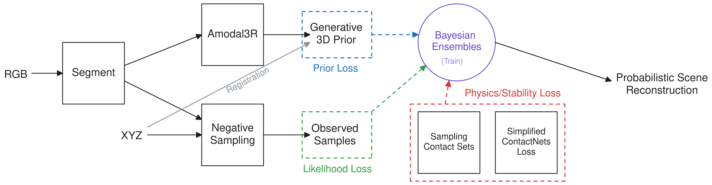

## 1 Last Time

Last time, we discussed a few different ideas; namely the VLM idea we have been talking about and some robust MPC stuff. This time, because my computer came, I didn't have any time to do any deep dives, as much of my time was spent setting up my new computer. However, now that I do have my computer, I want to start working on my original idea I pitched over the summer.

## 2 Towards my First Project Idea

### 2.1 The Pitch

Last time I had a high-level overview of the pitch:

> - **(Potential) Title:** *Diverse and Physically Stable Bayesian World Models for Manipulation*
> - **Motivation:** The ability to convert partial observations of a scene into reasonable estimates for the scene's dynamics is incredibly useful in robotics. In the case of robotic manipulation, this usually means reconstructing the geometry of each object in the scene along with some physics parameters. The reconstructions ought to be physically stable and capture the diversity/uncertainty from occlusion. Such diverse, physically stable reconstructions from a single RGBD image can be used downstream by controllers for robotic manipulation.
> - **Method:** We can do Bayesian reconstruction using a BundleSDF-like [@wen2023bundlesdf] ensemble. Use Amodal3R [@wu2025amodal3r] with some modulation as a prior, simplified probabilisitic ContactNets [@pfrommer2021contactnets] loss for physical stability. Then use likelihood from observation similar to the negative sampling in [@wright2024v].
> - **Experiments:** We can perform simple pushing tasks to verify that our model is *accurate* via multi-object pushing, and *diverse* via pushing with some occlusion that creates multiple different possible outcomes from the same push.

The key idea is to combine physical stability with diverse, probabilistic object reconstructions. There were two motivating examples I have for it:


Then, I also had a figure for the proposed method:



The mathematical formulation of things can be found in depth in my [original pitch](../2025-06-11_project_pitch).

### 2.2 Initial Steps

The first step, in my estimation, is to get Amodal3R [@wu2025amodal3r] working on my new computer. There is [a github repo](https://github.com/Sm0kyWu/Amodal3R) for it, which I have cloned, but I did not have time to actually get around to resolving all the dependency things to try it out.

## 3 Brainstorming a MEAM 5170 Project


## 4 OpenAI API Keys

This section just has some info from when I briefly looked into OpenAI API keys. Here are some of the popular OpenAI models and their pricing:

| Model      | Input $/1M Token | Output $/1M Tokens |
| ---------- | ---------------: | -----------------: |
| GPT-5      |             1.25 |              10.00 |
| GPT-5 pro  |            15.00 |             120.00 |
| GPT-5 nano |             0.05 |               0.40 |
| GPT-4o     |             2.50 |              10.00 |

It should be noted that the token prices are for *text* tokens, and images would likely have different pricing. There seems to be [decent docs](https://platform.openai.com/docs/quickstart/build-your-application) on connecting to the API via python. I made an API key and tried to call the OpenAI API and got the following response:

```json
{
  "error": {
    "message": "You exceeded your current quota, please check your plan and billing details. For more information on this error, read the docs: https://platform.openai.com/docs/guides/error-codes/api-errors.",
    "type": "insufficient_quota",
    "param": null,
    "code": "insufficient_quota"
  }
}
```

But you can easily add payment methods and set usage limits in their dashboard:


## 5 Other News

- 

## References

