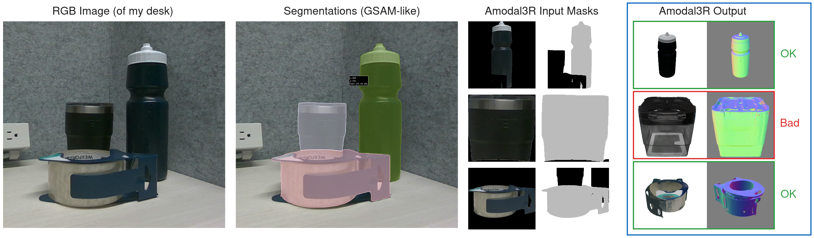
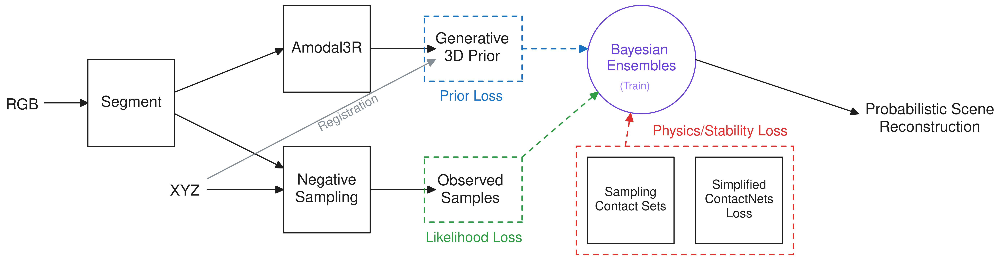
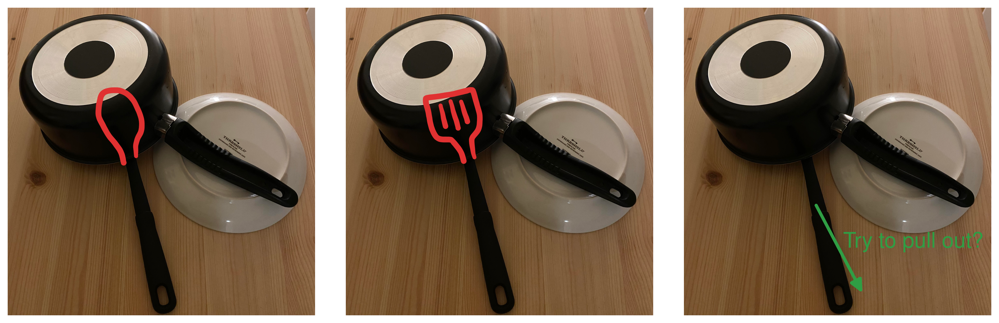
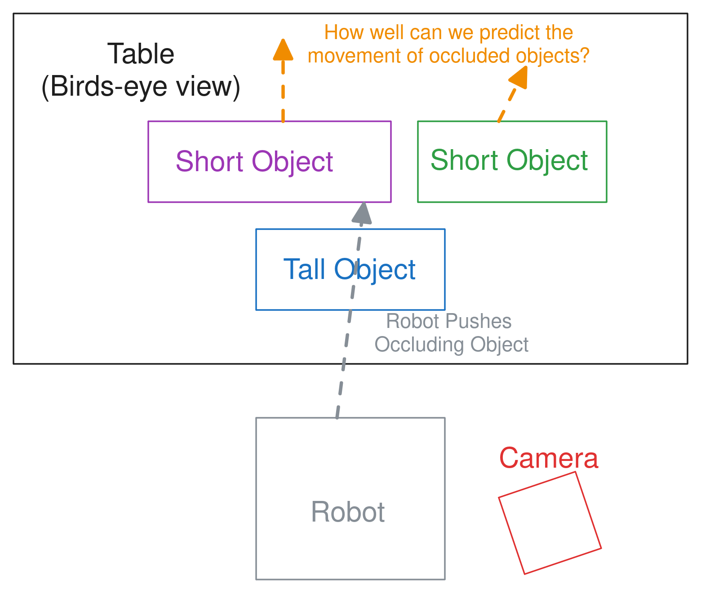

## 1 Last Time

We spent most of the meeting talking about the diverse, physically-grounded reconstruction project. There were two main things that seemed to need to be ironed out:

1. How to actually get the diversity you want in the pretrained prior (hack it with large model; train your own; etc.)
2. Whether/What experiments to do to really make the case (we discussed a few; basically if we do experiments they should feel real, so it justifies the cost of the method)

In this write-up I start trying to make the method happen, and have preliminary "reconstructions" with Amodal3R, then I revisit the project pitch and clarify the potential experiments, after that, I have a word on what could potentially be my MEAM 5170 final project, before some other random notes.

## 2 Getting Amodal3R Running

In this section, I detail getting Amodal3R [@wu2025amodal3r] working! I started by getting the demo image that they have with the repo to run through their inference pipeline. Here is the reconstruction I got from that demo (I am visualizing the `.ply` file output by the method):

It actually ended up being quite a process because my cuda version (13.0) was not supported by many of the dependencies, so I had to throw the project into a docker container with a lower cuda version (12.8), and mess with versions to make things work out. I also took an image with one of the depth cameras, and ran it through a segmentation pipeline (described below), and finally fed it to Amodal3R. Here are the results from that:

There are also GIFs produced by Amodal3R:

{width=32%}
{width=32%}
{width=32%}

I think Amodal3R is decent at producing meshes, but it is certainly not perfect, as it totally failed with my tumbler. However, I think that it can be *good enough* for the purposes of this project—it also motivates still including the observed points as supervision during the optimization-based reconstruction in my proposed full method pipeline (see picture in next subsection).

**Segmentation pipeline:** My segmentation pipeline is basically Grounded SAM, but with newer models. I take MM-Grounding-DINO [@zhao2024open] and feed the outputs into SAM2 [@ravi2024sam]. I use the prompt, "object that can be picked up with one hand". The whole segmentation process takes <1s complete. The scene I gave it was not a particularly difficult one, but I found the performance to be pretty good.

In total I have the following working:

- Amodal3R inference demo in docker container
- A pipeline similar to Grounded SAM [@ren2024grounded], but with newer models, crappily coded in a big python file
- My computer setup so that I can get a lab depth camera to run in ROS

The next step is to put everything together (right now, they all just use various file systems and don't talk) and have a way to (1) take in an image; (2) Run segmentation/processing; (3) Query Amodal3R for reconstructions. I think I want to use ROS to make all of these work, because Amodal3R is in a docker container for me currently due to CUDA version conflicts. I also need to get registration setup. I am thinking FoundationPose [@wen2024foundationpose] could do that, but perhaps even simpler would be RANSAC with FPFH, which is what I have done previously [@wright2024robust]; it is slow but works well enough. The other thing to do is start randomizing the bounding boxes.

## 3 The Project Pitch Revisited

### 3.1 Overview

- **Potential Title:** *Diverse and Physically Stable Bayesian World Models for Manipulation*
- **Motivation:** Understanding the dynamics of a scene is crucial for many robotic manipulation tasks and algorithms. In the real world, given a new scene, we cannot assume a complete understanding of the dynamics, and must infer them from incomplete observation. In many robotics tasks, a dynamics model can be formed by reconstructing the geometry of all relevant objects and inferring their physical properties. Most work that does this tends to be deterministic, which fails to capture the distributional nature of reconstructions under occlusion, or does not reason about the physical behavior of the reconstructions when simulated. This project proposes bridging the gap, and creating physically stable, diverse multi-object reconstructions that can be used as a world model.
- **Method:** We can optimize for object shape by using a Bayesian ensemble (maybe [@d2021stein]) of BundleSDF-like [@wen2023bundlesdf] models, and defining a loss function with three parts: (i) alignment with a data-driven prior via Amodal3R [@wu2025amodal3r]; (ii) alignment with the observed depth image; (iii) a stability loss inspired by ContactNets [@pfrommer2021contactnets]. We can then estimate physics parameters (friction, mass, etc) in a more heuristic way. Here is a figure I made previously detailing the method: 

The experiments were a big topic in the previous meeting, and have their own dedicated subsection. There are still some specifics regarding the method that deserve being outlined. For one, I was thinking we could do bounding box randomization + Amodal3R for diverse generations. This seemed to be slightly controversial in the last meeting, as it likely doesn't give the *true* distribution of shapes that you want. One could also imagine training a new model from scratch to really care about diversity, but that might constitute its own project. There are also other details regarding the stability loss that are answered in my [previous pitch](../2025-06-11_project_pitch/) of this project. I think that dealing with disjoint objects might be a problem as well.

### 3.2 Potential Experiments

We spent a lot of time last meeting discussing potential experiments for the proposed project. There seemed to be this dichotomy of the work being a computer vision paper vs a robotics paper. Basically, we either do no robot experiments or we do robot experiments that feel *real*. The desirata for experiments are the following:

- Motivate needing *diverse* reconstructions
- Motivate the *physically stable* part
- Robotic experiments that showcase something *useful* and *"real"*.

This section is meant to detail a few potential *robotic* experiments that have been discussed previously, as well as some thoughts on some other ones.

**Tub of Dishes:** *(diversity, physical accuracy, real)* We discussed trying to determine if you could pull out an object from a tub of dishes. I think in this setup, our method will always be *more conservative* than approaches that are (a) deterministic or (b) don't reason about physics. I don't exactly know if that is a useful thing to show—I'm sure you could make an argument about safety. Perhaps we could actually try to plan a pull that works, and show that robustly planning pulling out an occluded spatula/spoon is successful more often (doesn't knock things over). This would, of course, be open-loop, which may make the argument weaker. Here is an image I made of a potential setup:

**Mug Hanging:** *(diversity, real)* Mug hanging is not new, Simeonov et al [@simeonov2023shelving] is a 2023 paper that does it in sim. Diversity could be useful with mug-hanging; you could have a mug, where you cannot determine where the handle is, and plan a robust trajectory to hang the mug that takes into account the variation. A deterministic reconstruction would likely fail in this situation.

**Simple Pushing I:** *(physical accuracy)* I originally proposed a pushing experiment meant to verify that we can predict shape accurately. The setup was basically to plan a push of object 1 into object 2 in order to get object 2 to it's desired location.

**Simple Pushing II:** *(diversity, physical accuracy)* Another pushing experiment I posed was a simple, contrived setup, where there is a big box in front occluding two boxes in such a way that it is uncertain where one box stops and the other one starts. Then you would have a predefined push and show that you can capture a distribution that "covers" the possible effects of the push. I made this image previously:

**Other Ideas:**

- Grasping occluded regions of objects
- Pushing occluded objects in the occluded areas
- Planning pushes that result in the widest difference of outcomes in order to gather information

## 4 Thinking about MEAM 5170 Final Project

I think I want to do a final project related to robust/stochastic control. I think there are two ways I could go:

1. Try to use off-the-shelf models or learn something to predict uncertainty over a parameter like friction, center of mass, shape, etc. Then do the simple sampling-based LCP formulation I have had in the past
2. Do some sort of optimization tricks to make things work, such as consensus, etc.

I could also do some sort of feedback thing similar to [@shirai2023covariance].

## 5 Other Stuff

### 5.1 A Note on the VLM Idea

AHA [@duan2024aha] is another VLM for failure detection & reasoning paper in robotics. AHA is a new VLM they introduce, tailor-made for robotics. One of the downstream robotics things they do in the experiments is to plug it into PRoC3S [@pmlr-v270-curtis25a], and use it to evaluate TAMP plans that have been rolled out in a simulator as well as to evalute natural language goal satisfaction. Here it is in their own words (talking about incorporating AHA into PRoC3S):

> We incorporated a VLM into this pipeline in two ways: (1) we prompt the VLM with visualizations of failed plan executions within the simulator, ask it to return an explanation for the failure, and feed this back to PRoC3S’ LLM during the LMP feedback stage, (2) after PRoC3S returns a valid plan, we provide a visualization of this to the VLM and ask it to return whether this plan truly achieves the natural language goal, with replanning triggered if not

This seems to be pretty similar to our proposed idea, but perhaps using a controller instead of a TAMP planner adds some novelty. They (AHA) also only evaluate this functionality in simulation, which I think significantly separates it from our idea. The actual PRoC3S paper doesn't actually do any of this, and is using an LLM to help define CCSPs.

Basically the takeaway is that I believe the novelty from the VLM idea we have discussed probably comes from the **sysID** and **low-level controller** parts, rather than the VLM stuff. 

**Note:** *I am leading (or already led) the reading group on the 24th, where I chose FOREWARN [@wu2025foresight] as the paper, which we discussed a bit a couple meetings ago.*

## References

