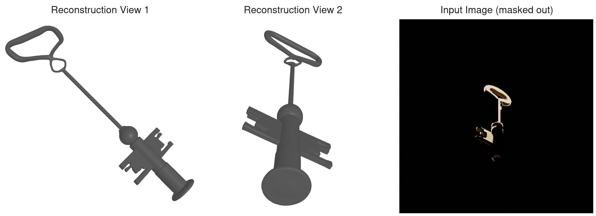

## 1 Last Time

We spent most of the meeting talking about the diverse, physically-grounded reconstruction project. There were two main things that seemed to need to be ironed out:

1. How to actually get the diversity you want in the pretrained prior (hack it with large model; train your own; etc.)
2. Whether/What experiments to do to really make the case (we discussed a few; basically if we do experiments they should feel real, so it justifies the cost of the method)

In this write-up I start trying to make the method happen, and have preliminary "reconstructions" with Amodal3R, then I revisit the project pitch and clarify the potential experiments, finally, I have a word on what could potentially be my MEAM 5170 final project.

## 2 Getting Amodal3R Running

In this section, I detail getting Amodal3R [@wu2025amodal3r] working! I started by getting the demo image that they have with the repo to run through their inference pipeline. Here is the reconstruction I got from that demo (I am visualizing the `.ply` file output by the method):

It actually ended up being quite a process because my cuda version (13.0) was not supported by many of the dependencies, so I had to throw the project into a docker container with a lower cuda version (12.8), and mess with versions to make things work out.

## 3 The Project Pitch Revisited

### 3.1 Overview

### 3.2 Potential Experiments

We spent a lot of time last meeting discussing potential experiments for the proposed project. There seemed to be this dichotomy of the work being a computer vision paper vs a robotics paper. Basically, we either do no robot experiments or we do robot experiments that feel *real*. The desirata for experiments are the following:

- Motivate needing *diverse* reconstructions
- Motivate the *physically stable* part
- Robotic experiments that showcase something *useful*

This section is meant to detail a few potential *robotic* experiments that have been discussed previously.

**Tub of Dishes:**

**Mug Hanging:**

**Simple Pushing I:**

**Simple Pushing II:**

## 4 Thinking about MEAM 5170 Final Project

## References

