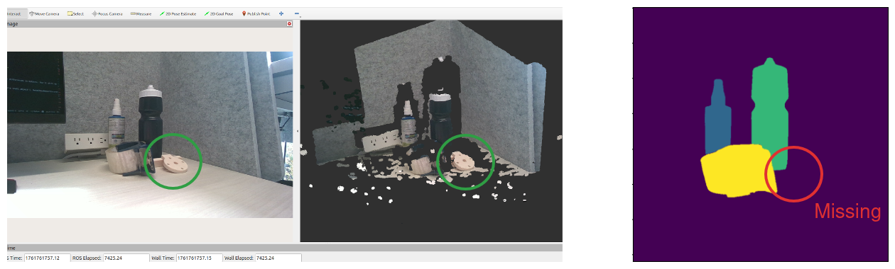
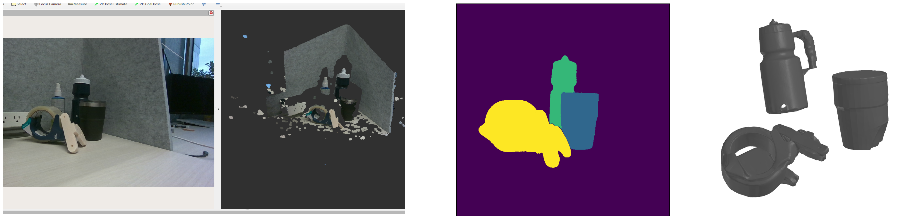

## 1 Last Time

Last time, we talked a bit about the Amodal3R and the progress on my first project, among other things. As far as the project goes, I got Amodal3R to run locally, and setup a segmentation pipeline. I also asked about what my final project should be in MEAM 5170. The things on my todo list this week were:

1. Put the different pieces together to have an image → segmentation → Amodal3R pipeline
2. Try to register the different meshes to the point cloud from a depth camera

In this write-up I do the first of those things as well as talk a bit about my project pitch I gave in MEAM 5170. Happy Halloween 🎃.

## 2 Amodal3R Pipeline

### 2.1 Putting the Pieces Together

I have been trying to put things together better. I now have a file that in one shot reads an image from the ros topic for the camera, segments it, then runs it through Amodal3R [@wu2025amodal3r], *with each object in parallel*. Here is a new example scene that I did, highlighting that it can sometimes fail to detect weird objects:

I detail the segmentation process in the previous writeup. This scene, when ran through Amodal3R produces the following reconstructions:

### 2.2 Failure Examples

It should be noted that it is possible for Amodal3R to mess up on the objects. Take for example, this reconstruction of the water bottle, where occlusion and other factors caused Amodal3R to mess up:

You can also get segmentation failures that result in degredation in reconstruction quality. Here is an example where failing to correctly segment the weird camera mount causes problems for the reconstruction of objects:

It should also be noted that in the above image, the dry erase fluid was not detected at all. Also, Amodal3R took about **14.8 seconds** to generate the meshes for the above scene.

### 2.3 Next Steps: Registration!

Obviously, the next step is to do registration. We talked about how registration is not exactly "solved", but I think we can have something work okay-enough for our purposes. PushAnything, and other projects in the lab, have used FoundationPose. I have used RANSAC with FPFH before in my most recent paper (which I submitted the camera-ready version of this week). Here is an figure I made for a write-up during my undergrad with that registration:

It's not perfect, but *maybe* good enough. What makes this particular registration problem hard is that the objects are only partially visible, the point cloud and segmentation is potentially noisy, the registration is global

## 3 Discussing my MEAM 5170 Final Project

I pitched my project this last week, here is the slide I had for it:

I wanted to maybe discuss a few things surrounding it. I wanted to see if I could express the whole pipeline a bit more mathematically to develop a better understanding of it. Basically, my starting point here is that we can define a cost for a policy, $\pi: \mathcal X \rightarrow \mathcal U$, (local to a starting state) with an MPC cost:
$$ C(\pi; x_0) = x_F^\top Q_F x_F \sum_t x_t^\top Q_t x_t + \pi(x_t)^\top R_t \pi(x_t) $$
Please note that I am changing notation from my slide. Where we also enforce that $x_{t+1} = f(x_t, \pi (x_t))$ holds for each $t$. We can parameterize our dynamics by our model parameters, $\xi$ (friction, shape, mass, etc.):
$$x_{t+1} = f(x_t, \pi (x_t); \xi)$$
In our case, we assume some uncertainty about these parameters, yielding a stochastic policy optimization problem:
$$ \pi^\star = \text{arg}\min_\pi \mathbb E_{p(\xi|o)} \left[C(\pi; x_0, \xi)\right] $$
Where $C$ is now also parameterized by $\xi$, and $p(\xi | o)$ is our belief about the model parameters $\xi$ given our previous observations $o$.

**Question:** *Would the above policy optimization problem be considered robust control or stochastic control?*

In order to solve the above equation, we are going to do a few tricks. The first thing is to realize that our $p(\zeta | o)$ will be changing frequently as we observe more and update our belief, thus, we really only want to solve the policy locally, because we will resolve it again soon anyways. This is why our cost is only relative to $x_0$. In pursuit of this, we can also solve for locally linear policies during our horizon:
$$ \pi(x_t) \approx \pi(\bar x_t) + \nabla_{\bar x_t} \pi(\bar x_t) (x_t - \bar x_t) = v_t + K_t x_t $$
where we can optimize for our parameters $v_t^*, K_t^*$. We can also linearize and encode dynamics/contact as constraints, yielding an LCP. Anyways, that was all pretty standard, but I am just trying to mathemetize/justify what is going on.

<!-- He asked if there are any examples of when it is necessary to have uncertainty -->

<!-- Could this potentially be a paper? Workshop? What experiments would make it convincing? Can we analyze and understand what the method is doing? -->

## References

