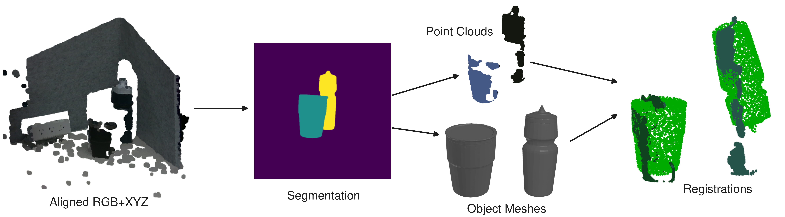
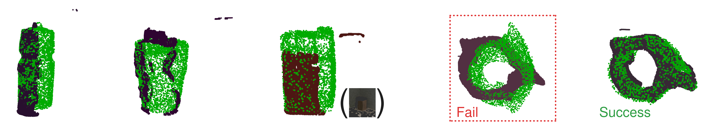
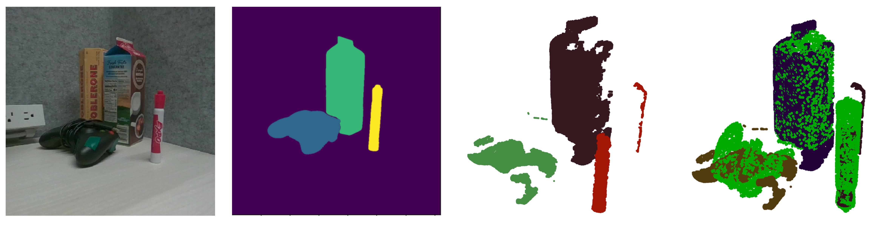
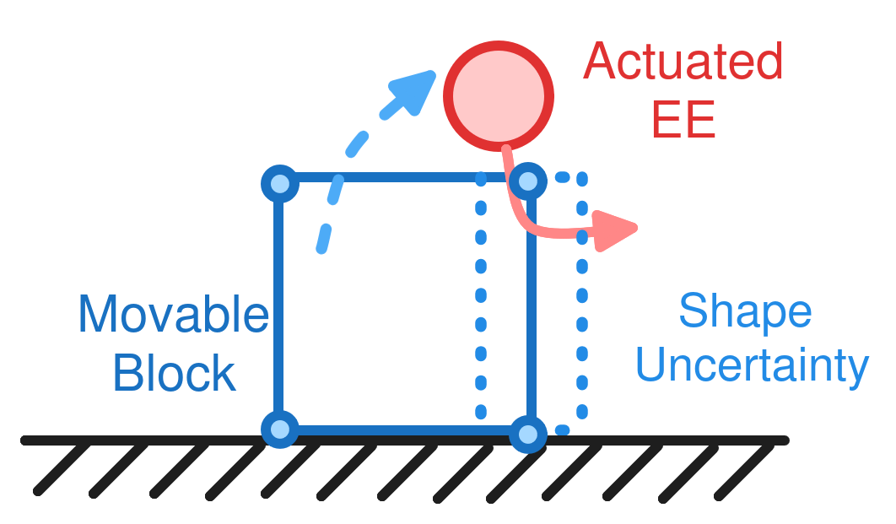

## 1 Last Time

Last time, we talked a bit about the pipeline I have set up that runs Amodal3R [@wu2025amodal3r]. This time, I have some initial registration results.

## 2 Towards Registration

I tried to do an initial registration pipeline with RANSAC, and the results are a bit shakey. Here is a visual:

I decided I needed to add some ICP after the registration, so I did, and then tried to register a bunch of single-object scenes. Here are the results of that:

It should be noted that it is still not perfect, but tends to do okay. Now, the next test is to see if it can do a complex scene again. Here are those results:

It should be noted that in all of the three cases above, the water bottle's orientation was flipped. However, I think the shape is still fairly reasonable.

**The Pipeline:** Right now, how the above works is to first calculate the FPFH features [@rusu2009fast] for downsampled versions of the source and target point cloud (target point cloud is 4096 sampled points on Amodal3R's mesh). Then, RANSAC is used to find an approximate global registration. Following this, ICP refines the registration. In order to recover scale, I do a linear scan of many different scales and take the one with the most inliers. Things like distance threshold, etc. are hyperparameters that require minor tuning. I am using open3d to do all of this stuff.

Here is some more runs of the pipeline for good measure:

Another one:

**Note:** *in the above registration, ICP with the marker totally failed, meaning I had to resort to using the ransac version instead.*

Obviously it is still not perfect, and errors in earlier parts of the pipeline can cause problems later. I think there are a few things that could be the culprit here:

- Inaccurate depth
- Bad registration pipeline
- Scale chunking isn't great

I think these get at the core of what makes this particular problem difficult; noisy depth, slighlty inaccurate shape, and unknown scale. I feel like there are a few things to try out here:

- Using color information ← I am not doing this right now
- Trying out something like FoundationPose [@wen2024foundationpose]
- Be smarter about scale.
- Leverage the fact that the generated reconstruction may have an "up" direction or similar
- We could also optimize for pose further during reconstruction

**Question:** *Do you think I should try out FoundationPose?*

## 3 Towards my MEAM 5170 Class project

Last time we talked about my MEAM 5170 project. There were a few things we discussed, including the pitch and potential experiments. Here is a cartoon of one of the experiments I proposed:

The idea is that uncertainty in the shape could cause an initial attempt to fail. We also thought about sliding a block at a constant velocity, an also discussed how we would want something that feels real.

## References

