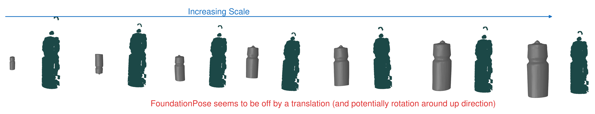
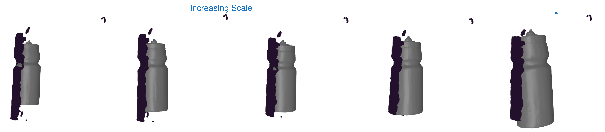
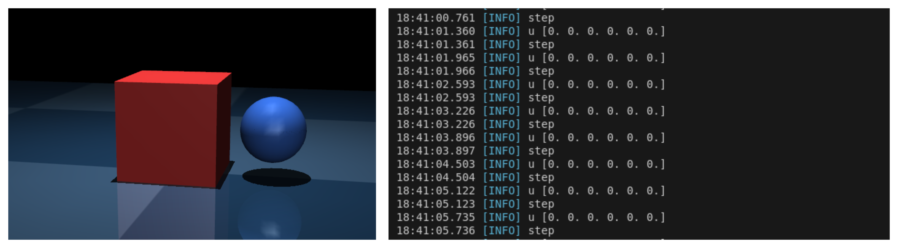

## 1 Last Time

Last time, our meeting was in the middle of the week, so there wasn't too much to talk about. I had some initial registration results that were *okay*, but this week I wanted to try out some things to see if I could do better. What I actually have this week is basically a bunch of bugs.

## 2 More Registration Results

I have gotten foundation pose to work and it seems to be slightly off. Here is an image I made of what was going on:

Fortunately, I was able to figure out that I was using the wrong camera intrinsics matrix, after calculating the right one, the registration results look much more promising:

Now there is still the question: *what is the best way to determine the right scale?*

## 3 Progress on Class Project

*No need to read this section, just putting it here to track progress for myself mostly*

Right now I have a bug with C3. I am trying to get it to work with mujoco MJX, so that I can parallelize it in the future. However, currently, my controller is outputting all zeros, so I have some debugging to do.

## 4 Some Papers to Note

- [@wu2025you] "steers" a VLA by having it generate multiple action sequences, rolling them out in sim, and using a VLM to select the best.
- [@guzman2022bayesian] Uses Bayesian optimization to fit controller hyperparameters and (potentially incorrect) model parameters in order to maximize reward against the true model parameters. This is potentially related to ideas around the usefulness of robust control.

## References

