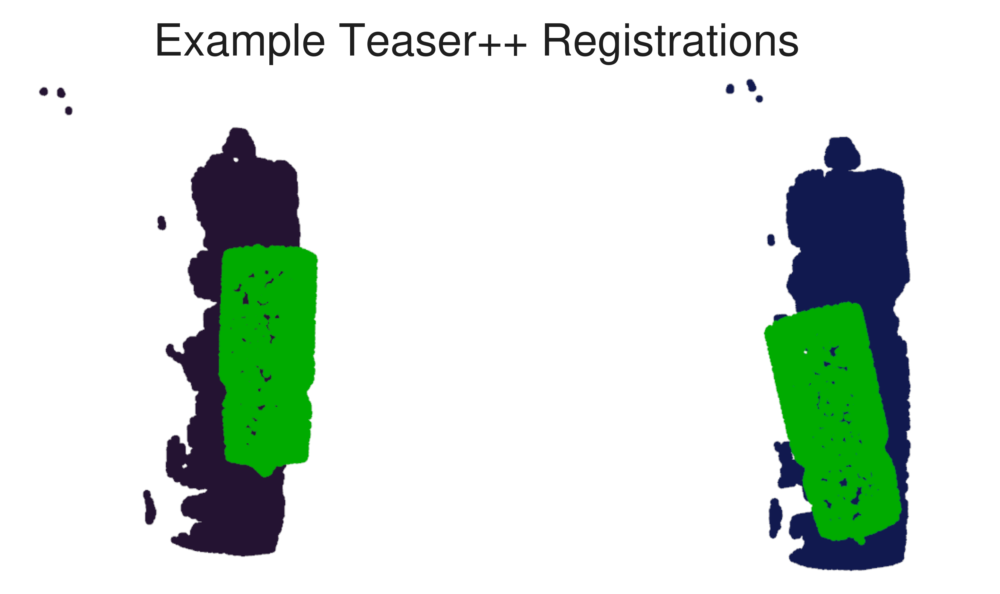
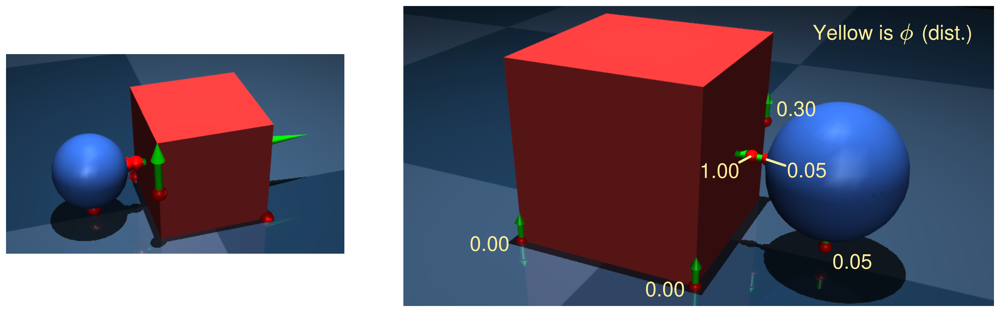
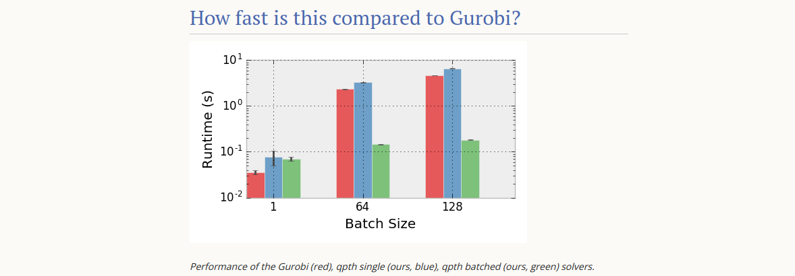

## 1 Last Time

Last time, we talked about a few things, but mostly about how to solve the sample-based CI-MPC problem more efficiently. The thing in this write-up that I am most excited for is the follow-up on this discussion, the culmination of which is in [section 3.2](#with-feedback-gains-and-c3)

## 2 Registration Update

Because parallelizing FoundationPose [@wen2024foundationpose] might get pretty expensive, I figured I would try using Teaser++ [@yang2020teaser], but it didn't do as well as I hoped. Here are a couple example registrations of a water bottle:

Basically, I think maybe going the FoundationPose route might be the best for now.

*Currently, I am kind of putting this project on the back-burner, as my class project feels more pressing.*

## 3 ADMM for Robust Contact-Implicit Control

Previously, ADMM [@boyd2011distributed] has been applied for contact-implicit control in C3 [@aydinoglu2024consensus]. In this section, I go over a formulation for applying ADMM in the sampling-based robust control setting.

### 3.1 No Feedback

This section contains a simple formulation of ADMM consensus for sharing control input across samples. Consider the robust control problem over uncertain model parameters $\xi$:
$$ \text{arg}\min_u \mathbb E_{\xi} \left[ C_\xi(u_{[T]}) \right], $$
where $C_\xi(u_{[T]}) = \sum_t C_t (x_t, u_t; \xi)$, with each $C_t$ being convex and quadratic in $x_t, u_t$, and $x_t$ is determined by rolling forward dynamics from $x_0$ with control inputs $u_t$ and simulator parameters $\xi$. We are specifically concerned with the case where this is a probabilistic version of the contact-implicit control problem formulated as follows:
$$ \text{arg}\min_{u, x, \lambda} \;\; \sum_t x_t^\top Q x_t + u_t^\top R u_t $$
$$ \text{s.t. }\;\; x_{t+1} = A x_t + B u_t + D \lambda_t + d $$
$$  0 \leq \lambda_t \perp E x_t + F \lambda_t + G u_t + c \geq 0 $$
We want to consider the problem where we approximate this control problem with a set of samples over unknown parameters $\xi$, giving us the following:
$$ \text{arg}\min_{u, x^{(i)}, \lambda^{(i)}} \;\; \sum_{i, t} {x_t^{(i)}}^\top Q x_t^{(i)} + {u_t}^\top R u_t $$
$$ \text{s.t. }\;\; x_{t+1}^{(i)} = A^{(i)} x_t^{(i)} + B u_t + D^{(i)} \lambda_t^{(i)} + d^{(i)} $$
$$ 0 \leq \lambda_t^{(i)} \perp E^{(i)} x_t^{(i)} + F^{(i)} \lambda_t^{(i)} + G^{(i)} u_t + c \geq 0. $$
This optimization problem is potentially prohibitively expensive. We can speed it up by using ADMM on an alternate formulation:
$$ \text{arg}\min_{v, u^{(i)}, x^{(i)}, \lambda^{(i)}} \;\; \sum_{i, t} {x_t^{(i)}}^\top Q x_t^{(i)} + {u_t^{(i)}}^\top R u_t^{(i)} $$
$$ \text{s.t. }\;\; x_{t+1}^{(i)} = A^{(i)} x_t^{(i)} + B u_t^{(i)} + D^{(i)} \lambda_t^{(i)} + d^{(i)} $$
$$ 0 \leq \lambda_t^{(i)} \perp E^{(i)} x_t^{(i)} + F^{(i)} \lambda_t^{(i)} + G^{(i)} u_t^{(i)} + c \geq 0. $$
$$ v = u^{(i)}, $$
where we have introduced new decision variables and corresponding constraints. However, this means each sample is pretty much decoupled from each other except for that last constraint. We can also consider the augmented Lagrangian of the above problem, where we do the same trick as C3 of lifting all other constraints into the objective (with $z = [u, x, \lambda]$ (each sample)):
$$ \mathcal L_\rho (z, v, y) = c(z) + \mathcal I_\mathcal{D}(z) + \mathcal I_\mathcal{H}(z) + \sum_i \left[{y^{(i)}}^\top (u^{(i)} - v)  + \rho \|u^{(i)} - v\|^2 \right] $$
or if we want the scaled version of the augmented Lagrangian:
$$ \mathcal L_\rho (z, v, y) = c(z) + \mathcal I_\mathcal{D}(z) + \mathcal I_\mathcal{H}(z) + \sum_i \rho \left[\|w^{(i)} + u^{(i)} - v \|^2  - \|w^{(i)}\|^2 \right] $$
It should be noted that only the last term (the squared term) depends on $v$. Thus, we can consider doing a ADMM algorithm like so:

**Repeat:** (Initialize $v, w$)

1. $z = \text{arg}\min_z \mathcal L_\rho (z, v, w)$  *// for the first run, ignore the $v$ terms in objective*
2. $v = \text{arg}\min_v \mathcal L_\rho (z, v, w)$
3. $w^{(i)}_{k+1} = w^{(i)}_k + u^{(i)} - v$

**End**

It should be noted that 1. above is simply an augmented version of the original contact-implicit problem, solved per sample, and that 2. is simply a very easy least-squares problem. We can use batched C3 for 1. and quickly solve 2. analytically, which has the following form:
$$ \text{arg}\min_v \mathcal L_\rho (z, v, w) = \text{arg}\min_v \sum_i \|w^{(i)} + u^{(i)} - v \|^2  $$
$$ = \frac{1}{n} \sum_i u_i + \frac{1}{n}\sum_i w_i $$

### 3.2 With Feedback Gains and C3+

That's all well and good, but what we really want is to incorporate our robust control ideas into C3+ [@bui2025push] and add in some *feedback* control for our actions. We consider the following optimization problem, where we include feedback terms:

**Original Optimization Problem:** We are going to assume $c(x, u)$ is the quadratic objective above, averaged over samples.
$$ \min_{x, u, \lambda, K, v}  c(x, u) + \alpha \|K\|^2 $$
$$ \text{s.t. }\;\; x_{t+1}^{(i)} = A^{(i)} x_t^{(i)} + B u_t + D^{(i)} \lambda_t^{(i)} + d^{(i)} $$
$$ 0 \leq \lambda_t^{(i)} \perp E^{(i)} x_t^{(i)} + F^{(i)} \lambda_t^{(i)} + G^{(i)} u_t + c \geq 0. $$
$$ u_k^{(i)} = K_k x_k^{(i)} + v_k $$
Note that we have added a regularization/penalty on the gain $K$. In C3+, from [@bui2025push], a new variable, $\eta$, is introduced. Using the same trick, we have the optimization problem:
$$ \min_{x, u, \lambda, K, v, \eta}  c(x, u) + \alpha \|K\|^2 $$
$$ \text{s.t. }\;\; x_{t+1}^{(i)} = A^{(i)} x_t^{(i)} + B u_t + D^{(i)} \lambda_t^{(i)} + d^{(i)} $$
$$ \eta_k^{(i)} = E^{(i)} x_t^{(i)} + F^{(i)} \lambda_t^{(i)} + G^{(i)} u_t + c $$
$$ 0 \leq \lambda_t^{(i)} \perp \eta_k^{(i)} \geq 0. $$
$$ u_k^{(i)} = K_k x_k^{(i)} + v_k $$

It should be noted that this bottom constraint may cause a problem; essentially it is a *bilinear* constraint, not a linear constraint. However, by reformulating the problem and making use of ADMM, we can handle it.

**Equivalent Optimization Problem:** We can rewrite the previous optimization problem by doing the same *copy variables* trick. In our case, we will define $\delta = [\delta^x, \delta^u, \delta^\lambda, \delta^\eta]^\top$ and another variable, $\xi = [\xi^x, \xi^{K}, \xi^v, \xi^\lambda, \xi^\eta]^\top$. Notice that these variables are not exact copies of each other, because $\delta$ contains $u$ and $\xi$ contains $K, v$. We can rewrite our problem now as follows, by making use of indicator $\mathcal I$ functions:
$$ \min_{\delta, \xi} c(\delta) + \alpha \|\xi^K\|^2 + \mathcal I_\mathcal{D}(\delta) + \mathcal I_\mathcal{C}(\xi) $$
$$ \text{s.t. }\;\; \delta^x = \xi^x, \;\; \delta^\lambda = \xi^\lambda, \;\; \delta^\eta = \xi^\eta $$
$$ \delta^u = \xi^K \delta^u + \xi^v $$
At this point, we still have a bilinear constraint, but ADMM has been used with bilinear constraints before [@zhang2020bilinear]. To see how it works out, we should consider the augmented Lagrangian of this above formulation:

**Augmented Lagrangian:** Here is the *scaled* version of the augmented Lagrangian:
$$ \mathcal L (\delta, \xi, w) = c(\delta) + \alpha \|\xi^K\|^2 + \mathcal I_\mathcal{D}(\delta) + \mathcal I_\mathcal{C}(\xi) + \rho\sum_{\cdot \in \{x, \lambda, \eta\}}\left[ \|w^\cdot + \delta^\cdot - \xi^\cdot\|^2 - \|w^\cdot\|^2 \right] $$
$$ + \rho \sum_i \left[\| w^{u^{(i)}} + \delta^{u^{(i)}} - \xi^K \delta^{x^{(i)}} - \xi^v  \| - \|w^{u^{i}}\|^2\right] $$
Forgive the odd notation. Now we can see that, given a $w$, if we fix either $\delta$ or $\xi$, the minimization problem becomes easy. We can simply run the ADMM procedure as follows:

**Repeat:** *initialize $w, \xi$*

1. $\delta = \text{arg}\min_\delta \mathcal L_\rho (\delta, \xi, w)$  *// for the first run, ignore the $\xi$ terms in objective*
2. $\xi = \text{arg}\min_\xi \mathcal L_\rho (\delta, \xi, w)$
3. update $w$

**End**

Clearly, step 1 is still a QP. We can batch this QP over samples, because there is not interdependence from $K, v$. Then, in step 2, we have a much easier time as well. For one, we can solve for $\xi^\lambda, \xi^\eta$ the same way that C3+ does. It should also be clear that solving for $\xi^K, \xi^v$ is completely detached from the $\lambda, \eta$ part, meaning it is an unconstrainted least-squares problem. Both of these can be computed analytically. For reference, here is that least-squares problem:
$$ \text{arg}\min_{\xi^{K},\xi^v} \mathcal L(\delta, \xi, w) = \text{arg}\min_{K, v}  \rho \sum_i \left[\| w^{u^{(i)}} + \delta^{u^{(i)}} - K \delta^{x^{(i)}} - v \| - \|w^{u^{i}}\|^2\right]  + \alpha \|K\|^2 $$
We can interpret this as basically *fitting* a $K, v$ line to the $(w^u + \delta^u)$'s. It is unconstrained because our complimentarity set has nothing to say about $K$ or $v$:
$$ \mathcal C = \{\xi: 0 \leq \xi^\lambda \perp \xi^\eta \geq 0\} $$

So basically, step 1 is solving parallel QPs and step 2 is computed analytically with a few matrix operations.

### 3.3 What about Stabilizing $K$?

In last week's meeting we talked about how maybe one should encode a constraint that $K$ be *stabilizing* of the linear system instead of simply be fit to the $u$'s we solve for. I think there may be something here, but I couldn't come up with a clear way to do it that fit nice, and I am not too worried about the size of $K$, because it will only be $T \times n_u \times n_x$, whereas our $\lambda$'s will be $n_\text{samples} \times T \times n_c$, which may be just as big, if not bigger.

## 4 Class Project Woes

Last time, C3 was producing all zeros. This was because of a silly bug in my code for calculating the jacobian $\partial f / \partial u$. That has been fixed. Right now, C3 produces non-zero control strategies, but they are nonsensical:

I feel like there can only be a few reasons for this happening. I think, though, the most likely culprit is either incorrectly computing the matrices for C3 or having bad hyperparameters for the optimization. Originally, I thought maybe I was doing the contact in a silly way, but here is what the contact set looks like:

As you can see, they are maybe good enough, though it might make sense to add a contact for the corner of the cube on the ground that doesn't have a contact location.

I kind of think that I might try to implement C3+ somewhat from scratch instead, as I think it might give me a couple of benefits. For one, I would have more understanding and debugging access to the internals, and for another, I could make sure to  use something like QPTH (PyTorch) [@amos2017optnet] or QPAX (Jax) [@tracy2024differentiability] for solving QPs in batch, which might be useful when I am moving to the sampling-based version. I think using JAX might make even more sense considering I am trying to interface with MJX from Mujoco, which uses JAX. I do believe there would be a performance hit if I were to implement this stuff in Python/JAX, I don't think it matters *too* much at the moment, when I am just trying to get things working. Also, QPTH advertises that when you start having batched QPs, it is much faster to do them on the GPU. Here is the graph they have on [their webite](https://locuslab.github.io/qpth/):

## References

## Appendix

I tried out Meta's new SAM-3D [@sam3d_meta_2025]. It seems to be pretty good, but is not perfect at occlusions, and the Toblerone is out of distribution—of course, Amodal3R has this same problem depending on bounding box. Here is what I generated from playing around:

It is possible that using this model might be better than what I am doing now, as it does predict pose during the reconstruction process as well—though the poses may need to be further refined.

