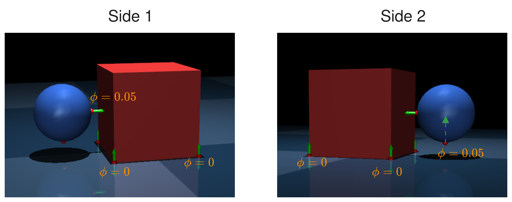
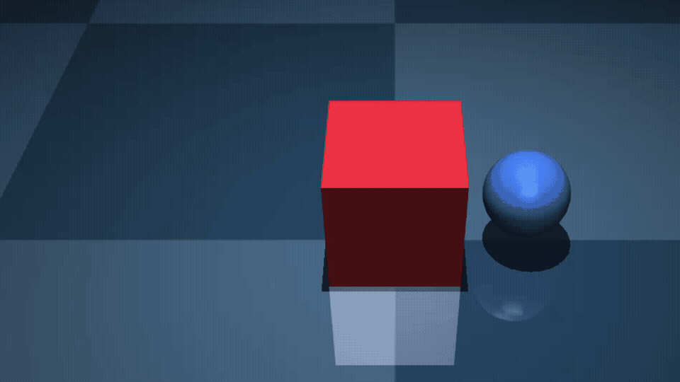
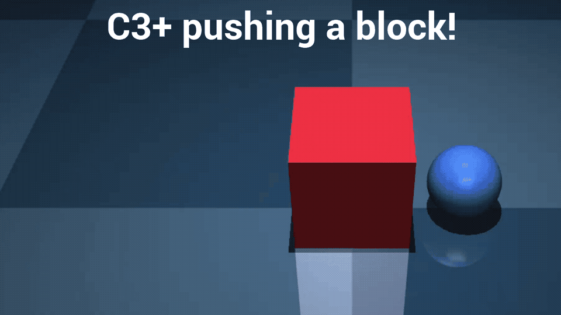
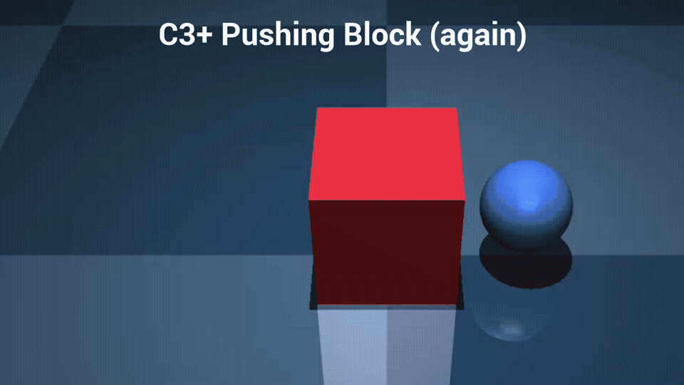
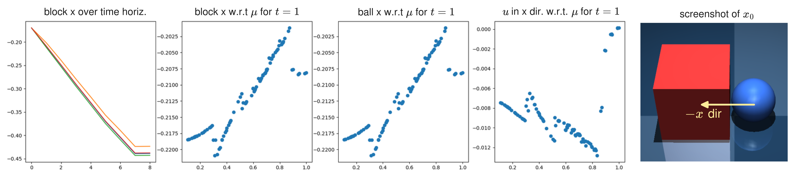
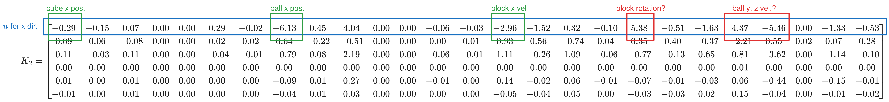
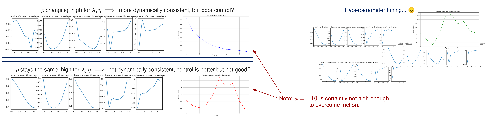
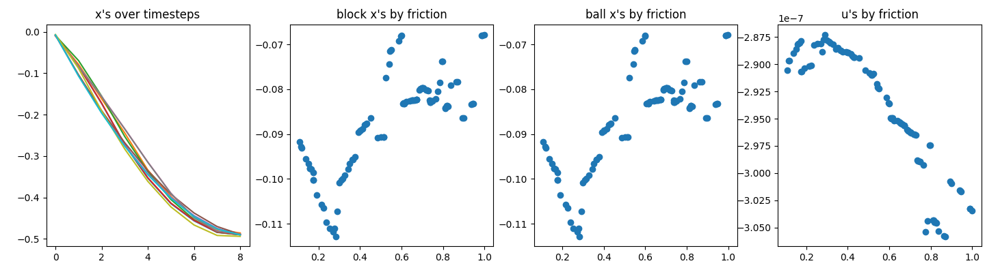
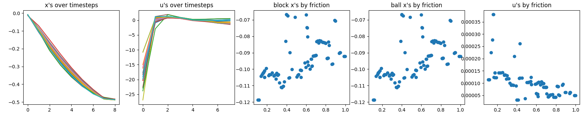
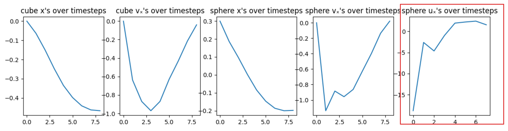

## 1 Last Time

Last time, we mostly talked about how to introduce the RC3+ method we have been discussing. This time, I worked to get pushing a cube in Mujoco working for C3+. I also try to get RC3+ to push the cube as well.

**Note:** §3 in this write-up is probably impossible to decipher unless I just explain it, so don't waste too much time trying to fully understand the graphs if you read this before meeting.

## 2 C3+ in Mujoco

Previously, my Mujoco stuff was not working at all. I decided to take things into my own hands and fully write the collision detection for the system. I simply want the 4 corners of the cube closes to the ground, the closest point for the sphere to the ground and the closest point from the sphere to the cube. Here is a visualization of the resulting contact set:

After the collision detection stuff was done, it was time to debug the full LCS to make sure it was reasonable. After making sure all my normals, etc were facing the right way, it seemed like my LCS looked reasonable. Here is the LCS (using Anitescu formulation):

{width=50%}

I should note that I hard-coded the $u$'s for the above GIF. Once that was done, I could move on to the full C3+ algorithm. After toiling for hours with hyperparameters, I finally got C3+ to push a block in Mujoco:

{width=49%}
{width=49%}

The difference between the two is a slight change in hyperparameters and, more importantly, decreasing the block's $\mu$, while increasing its mass. It almost looks like it is running into something like the Painlevè paradox in the first one. I used the following hyperparameters to get this to work:

| Parameter                     | Value               |
| ----------------------------- | ------------------- |
| $T$                           | $8$                 |
| $\Delta t$                    | $0.1$               |
| iterations                    | $5$                 |
| $R$                           | $0.05 \times I$     |
| $Q^{q_\text{block}}$          | $10^4 \times I$     |
| $Q^{q_\text{ball}}$           | $10 \times I$       |
| $Q^{v}$                       | $100 \times I$      |
| $\rho_0^\lambda, \rho_0^\eta$ | $2^{-5} \times 100$ |
| $\rho_0^\text{otherwise}$     | $2^{-5}$            |
| $\rho$ mult.                  | $2$                 |

## 3 Adventures with RC3+ in Mujoco (hyperparameter tuning sucks)

I am struggling to get RC3+ to find intelligent $K, v$. I generated the following figure to help debug, but the figure shows what I want to be seeing:

Here is the corresponding $K$ matrix, however:

The u's that ended up being executed was `-3.2286420e+00` for $t'=0$ and `9.9949634e-01` for $t' = 1$, which is not what we want. Then I noticed that maybe this is because the C3+ full $u$ trajectory looked a little sus, so I tried to go back and hyperparameter tune so it was nicely behaved, but instead I am just frustrating myself:

It is very hard to get the hyperparameters tuned for even this simple example. I threw the best that I could get on RC3+, using $\mu \sim \text{Unif}(0.1, 0.5)$, then rolled it out on the edges of this distribution:

I should note that I am only rolling out the first $u$ here because the other $u$'s are kind of garbage, and the complementarity constraints are not completely satisfied by the end of the optimization. Here are those debug plots corresponding to these settings:

Which looks decent, until you notice that the $u$'s are on the scale of `1e-7` so basically zero, which means that this is kind of pointless...

**Basically:** it pushes the block, but I am unsure if the $K$'s are getting us much... but maybe I'm just trash at hyperparameter tuning.

The thing is, because C3+ doesn't generate the control throughout the horizon that I want, it is difficult to think that RC3+ will be much better...

**Question:** How can I do better at tuning this? It seems like the hyperparameters that are relevant are the cost matrices $Q, Q_f, R$ and the $\rho$ parameters.

Also here are the hyperparameters I am using:

| Parameter                     | Value             |
| ----------------------------- | ----------------- |
| $T$                           | $8$               |
| $\Delta t$                    | $0.1$             |
| iterations                    | $10$              |
| $R$                           | $0.0005 \times I$ |
| $Q^{q_\text{block}}$          | $200 \times I$    |
| $Q^{q_\text{ball}}$           | $0.1 \times I$    |
| $Q^{v}$                       | $10 \times I$     |
| $Q_f$                         | $100 \times Q$    |
| $\rho_t^\lambda, \rho_t^\eta$ | $1$               |
| $\rho_t^u$                    | $0.0001$          |
| $\rho_t^\text{otherwise}$     | $0.01$            |
| $\rho$ mult.                  | $1$               |

(I changed some of them and generated the following plot)

The thing to note is that the u's are really only relevant at $t=0$. This is what happens with C3+:

## 4 Other Stuff

### 4.1 Mini Lit Review

We have discussed [@shirai2023covariance] before, where they claim to be the first to show covariance steering with chance constraints for complementarity systems. They are the inspiration for using the $K_t, v_t$ to steer the distribution. In their work, they additionally add a gain on contact forces $\lambda$, however replicating this would require another trick with the problem formulation. There is also a similar paper, [@shirai2023chance], by the same first author where the problem is phrased as a MIQP. An earlier paper that deals with stochasticity and complementarity constraints in robotics is [@drnach2021robust], where they cite [@luo2013properties], which defines the stochastic complementarity problem as:
$$ \text{find } x^* \text{ s.t. } 0 \leq x^* \perp F(x^*, \omega) \geq 0 \text{ where } \omega \in \Omega \text{a.s.}$$
where $\omega$ is a random variable. If $F$ is affine, this is called a *stochastic linear complementarity problem* (SLCP). However, this doesn't feel like what we actually want for uncertainty propogating through a complementarity constraint, because it constrains that the whole distribution "shares" the $x^*$. Another older robotics paper that uses SLCP to smooth contact [@tassa2010stochastic]. In the case of both [@drnach2021robust] and [@tassa2010stochastic], they use expected residual minimization:
$$ r_\text{ERM} (x) = \mathbb E [\| \psi (x, \omega) \|] $$
Which really just feels like a totally different problem than what we are trying to model. There is apparently some cool theory around it though about finding a solution robust to variations in [@chen2009robust], but alas I didn't read it. In [@drnach2022mediating], they use a ERM above with a chance constraint.

We have also discussed [@jankowski2025robust] before, where only look at pose uncertainty and make a restrictive quasistatic assumption—which means they cannot reason/model things like a grasp where the robot may be applying opposing forces. They use a sampling-based strategy [@jankowski2023vp] instead of contact-implicit optimization like C3+ [@bui2025push]. They are also the paper that points to *domain randomization* (DR) [@muratore2022robot] as motivation for robust MPC.

On a fairly separate note, I thought the problem in [@guzman2022bayesian] was interesting, where they do a hyperparameter optimization BO type of thing to find the system parameters instead of using sysID. In other words, they chose system parameters to maximize the policies performance on the true dynamics instead of simply trying to match the true dynamics.

### 4.2 Violating Markov's Principle

I talked with Ethan, he seemed a bit hung up on the feedback stuff. The justification is that we are linearizing a policy:

$$ \pi (x) \approx K_t x + v_t $$

However, because $K_t, v_t$ are completely separate at each timestep there is no consistency and we might not be representing $\pi$ at all.

### 4.3 Logistical Stuff

- My lab slides are available at this link: [Lab Meeting Presentation](https://docs.google.com/presentation/d/1ViBG_jvQvzFDr0zi8uiuuqMS9ZAq8PxpIOW3YRYq9Iw/edit?usp=sharing) 
- I have requested permission for/been put on the waitlist for the CIS 7000 class that Dinesh is teaching (on Robot Learning). I am not signed up for any other classes currently.

## References

