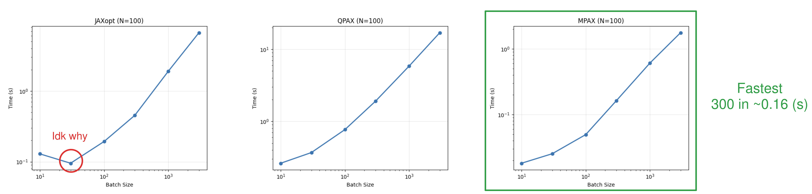
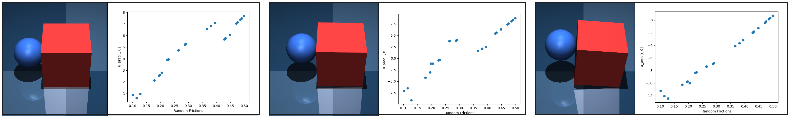
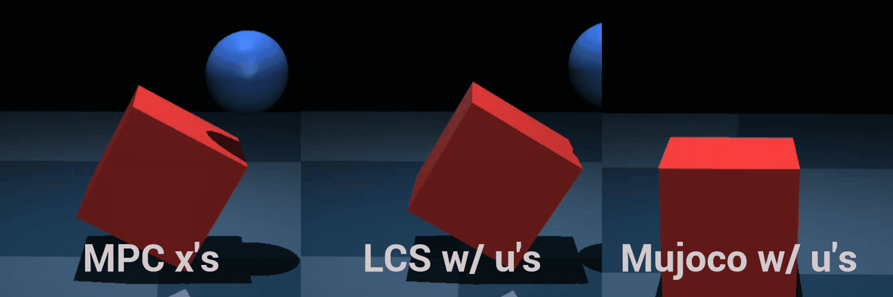

## 1. Last Time

Last meeting was all the way back in mid-December, where I had a suite of fairly simple experimental setups for the project. We spent the meeting mostly discussing a few things such as (a) reweighting samples for sysID; (b) The fact that $u$ w.r.t. $\mu$ has the wrong relationship in the first few iterations of ADMM; (c) potentially doing a lag thing where we allow $x_0$ to be varied (or alternatively $x_1$ is varied, $u_0$ is fixed). In this write-up, I want to have a brief reminder of what the project is and some updates on it.

The cliff notes version of this write-up is:

- You can combine optimizing $K$ and $K$ being a PD controller—simply regularize $K$ towards a PD controller ([§3](#pd-controller-and-k))
- We can use a simpler version of violation-based LCS loss for reweighting, but QP timing might be an issue ([§4](#reweighting-the-samples))
- I have implemented the delayed/lagged version of RC3+ ([§5.1](#changes-to-the-algo))
- Anitescu friction causes poor C3+ plans on the block pivoting task and I am struggling to get C3+ working for it ([§5.2](#trying-to-get-cube-pivoting-to-work))

## 2. Recall the Project

### 2.1. The Pitch

Here is a quick overview of the pitch for the project:

- **Potential Title:** *Efficient ADMM-based Robust Contact-Implicit Control*
- **Motivation:** Current contact-implicit MPC approaches ignore uncertainty—which is all too common in real world scenarios—whereas, on the other hand, most robust control approaches cannot handle complementarity constraints. Thus, there is room for an efficient method that performs contact-implicit robust control in a way that can handle general uncertainties. 
- **Method:** We would introduce a method for contact-implicit robust control that uses GPU parallelization to generate distributionally robust feedback plans. Our method would use samples to solve an expectation based loss with that becomes basic matrix operations and some linear solves with the ADMM algorithm. We would also include a reweighting for system identification.
- **Experiments:** Our experiments would aim to show that (i) there are circumstances where a robust approach outperforms C3+ w/ a PD controller; (ii) Both the reweighting and sampling/steering improve performance with the method; (iii) It can work real-time in the real world. Here is an image from last time of some potential experiments:

### 2.2. Some Related Works

This section is just a paragraph mentioning the papers that I think are most relevant. Obviously, this idea could be seen as an extension of C3+ [@bui2025push], which itself is an extension of C3 [@aydinoglu2024consensus] to the robust control setting. Robust control with complementarity constraints has not been widely studied. The most relevant work is Shirai et al [@shirai2023covariance], where they also use a sampling-based approach to formulate a large NLP and solve. They also use a cost on the expected value instead of the expected value of the cost, then control the variance of the distribution via a chance constraint. This approach is incredibly inefficient as it requires many samples for even toy problems and requires solving a very large NLP. There are also other potentially relevant papers from the same author [@shirai2023chance; @shirai2024robust; @shirai2025linear]. It should be noted that covariance steering has been studied [@bakolas2016optimal; @liu2024optimal], but usually only in the case of linearized dynamics and Gaussians. I have also mentioned the robust pushing paper by Jankowski et al [@jankowski2025robust], where they focus soley on pose uncertainty and rely on a quasistatic model of contact dynamics. Another related paper is Drnach and Zhao [@drnach2021robust], where they use expected residual minimization (ERM) [@chen2005expected] to basically raise the complementarity constraint into the objective in an effort to solve for more robust locomotion plans under terrain uncertainty. While ERM has showed up in more than one robotics papers (i.e. [@tassa2010stochastic]), it is a related, yet fundamentally different problem. On another note, as mentioned in [@jankowski2025robust], I think the modern reinforcement learning (RL) practice of domain randomization [@tobin2017domain] offers good motivation for robust control in our case. There is some evidence that simply system identification is not enough for a good policy [@lambert2020objective]. Actually, speaking of [@lambert2020objective], I have some minor concerns with the paper, and if there is extra time, might want to discuss it.

### 2.3. Other Thoughts

**Contributions:** In order for this work to be a solid paper, it needs to have a few clear contributions. I am thinking the contributions could be packaged like this: 

1. A novel, highly-efficient, GPU-accelerated method for contact-implicit robust control with steering capable of running at real-time rates
2. An efficient method for probabilistic system identification for linear complementarity systems
3. Experiments showing the efficiency and effectiveness of the method. 

Part of me wonders if there is a way to break contribution 1. into a couple different contributions, perhaps by emphasizing the steering/feedback in some way. I also feel that contribution 2. is the most tentative and subject to change.

**Motivating Robustness:** In order for this to become a paper, it needs to convince reviewers of the importance of caring about robust control. I have mentioned using domain randomization in RL as motivation. In that case, it is motivated as an approach to overcome the *reality gap*—or overcome mismatches between the model and the real system behavior, because often there will always be a mismatch, no matter how good your system identification is. On the other hand, the way robust control is usually motivated is by recognizing that there exists uncertainty in whatever you are doing. I think that these two justifications are similar but are definitely different.

**Venue:** Previously, it was floated that IROS might be a good spot for this paper. If we aim for IROS, the deadline is **March 1st**, which is about 7 weeks away.

## 3. PD Controller and $K$

We have discussed having $K$ simply be a PD controller, and I talked to Hien about C3+ [@bui2025push], who mentioned the importance of having a PD controller that also tracks the predicted state/velocity of the EE, instead of just using the $u$'s from C3+. This made me think a bit, and I figured there is an easy way to get the best of both worlds: we can simply regularize $K$ toward a PD controller instead of $0$. We would simply replace the $\alpha \| K \|^2$ with $\alpha \|K - \tilde K\|^2$ where:
$$ \tilde K = [0, -K_p, 0, -K_d] $$
is a PD controller. This doesn't at all change the complexity of the ADMM step as you can simply apply an offset to the data:
$$ \tilde u^{(i)} = u^{(i)} - \tilde K x^{(i)} $$
Then we can solve for $\bar K^*, v^*$ via ridge regression like before and let $K = \bar K + \tilde K$.

This has the effect of having $K$ be biased towards a PD controller which is probably better than $K$ being biased towards $K=0$.

**Question:** *What do we think about this idea?*

## 4. Reweighting the Samples

One thing we discussed was that we could weight the samples according to a loss similar to ContactNets [@pfrommer2021contactnets] for a linear complementarity system (LCS), like was introduced in Jin et al [@jin2022learning] and inspired the residual learning in Huang et al [@huang2024adaptive]. That loss would basically reweight our different LCS samples based on how likely the past observations are. Of course, I think before reaching for heavy machinery like solving a bunch of quadratic programs (QPs), we could just run Mujoco's [@todorov2012mujoco] underlying step functions and compare which one best matches the result. Basically, we are interested in solving our MPC problem with respect to a posterior distribution. By Bayes rule:
$$ \mathbb E_{\xi \sim P(\xi | D)} \left[ C(\pi) \right] \propto \mathbb E_{\xi \sim P(\xi)} \left[P(D | \xi) C(\pi) \right] $$
Thus, we sample from our prior and reweight according to our likelihood. But what should this likelihood, $P(D | \xi)$, be in practice?

Well, in the *Learning Linear Complementarity Systems* paper [@jin2022learning], based on a strongly-convex quadratic program equivalent to an LCP, the following loss was proposed:
$$ L(\texttt{LCS}) = \sum_t \min_{\lambda, \phi} \| A x_t + B u_t + C \lambda + d - x_{t+1} \|^2 + \frac{1}{\epsilon} \left(\lambda^\top \phi + \frac{1}{2\gamma}\| F \lambda + q_t - \phi  \|^2\right) $$
In this loss, an additional decision variable, $\phi$, is introduced to capture $F \lambda + q_t$. In the paper, this was justified by saying that (a) avoids numerical instability during differentiation, and (b) smooths the loss a bit aiding first order optimizers. However, neither of these matter much in our reweighting case, because we are not differentiating through our likelihood. Thus, we are free to use an alternate loss formulation, which features half the number of decision variables.

**Proposed likelihood:** I propose we use the following likelihood formulation, based on the original QP formulation of LCPs when $(1/2)(F + F^\top) \succ 0$:

$$ - \ln P(\xi | D) = \sum_t \min_{\lambda \in \mathcal C_t^\xi} \left\{\| A^\xi x_t + B^\xi u_t + D^\xi \lambda + d^\xi - x_{t+1} \|^2 + \frac{1}{2} \lambda^\top (F^\xi + {F^\xi}^\top) \lambda + {q_t^\xi}^\top \lambda\right\} $$
Where $\mathcal C_t^\xi = \{\lambda: \lambda \geq 0 \text{ and } F^\xi \lambda + q_t^\xi \geq 0\}$ is the constraint set for the QP nested within the loss.

I decided to see if it would be feasible to run this at real-time rates by timing different JAX methods for solving random QPs. I decided to look at [JAXopt](https://jaxopt.github.io/stable/) (no longer in development), [QPAX](https://github.com/kevin-tracy/qpax), and [MPAX](https://github.com/MIT-Lu-Lab/MPAX). I basically setup problems of the form $\min_\lambda \|D \lambda + d \|^2 + (1/\epsilon) ((1/2)\lambda^\top (F + F^\top) \lambda + q^\top \lambda)$ subject to $\lambda \geq 0, F \lambda + q \geq 0$. Here are the results:

As you can see, MPAX was the best, but I still feel like the results were borderline. If we really want to speed it up, one option is to try to implement OSQP [@stellato2020osqp] in JAX myself (though that is what JAXopt is supposed to be doing). I didn't really do a dive, but there is also ProxQP [@bambade2022prox]. We could also try to do more approximate things or other tricks.

**Finally,** I mentioned I might want to discuss Lambert et al [@lambert2020objective] previously in [§2.2](#some-related-works); this would be the relevant section for that. 

## 5. Towards Cube Pivoting

### 5.1. Implementing the "Lag" Version

I have implemented the "lag" version of the method, where $x_0$ is allowed to vary. In practice/for now, I do this by first running each parallel Mujoco simulation forward with each value and then generating the LCS's at the predicted states. In reality, if I am solving a bunch of QPs for reweighting, it might make more sense to simply solve a QP for the next states. I could also literally alter the QP/ADMM algorithm to have a $u_0$ equality constraint. Here is a video of block pushing on this lagged version: 

It seems to push the block but I'm not sure what is up with the whole tip-then-recover part (maybe related to Anitescu friction?). I also wanted to visualize the predicted $u$'s at the beginning—remember those can vary now—with respect to the $\mu$ values. Here is that figure at a few different, but sequential timesteps:

We see the right trend, but it is a bit weird at times (i.e. predicting negative $u$'s in some places). Anyways I don't think this version of pushing is all that impressive, so I decided to somewhat move on.

### 5.2. Trying to get Cube Pivoting to Work

I am finally moving on to trying to get the cube pivoting task to work. I'm starting by trying to simply get C3+ to complete the task with the correct model. For my first try, I adjusted the desired position from the pushing one and placed the sphere at a different place. When I ran C3+, it didn't work. In order to investigate, I decided to make sure that the plan generated made sense. Here is a GIF of what I saw:

As you can see, the LCS thinks the cube is being tipped, but it is clearly not. In the GIF you can see that there is clearly a gap between the ball and the cube when frictional forces are applied. This seems to be clearly due to the Anitescu friction approximation [@anitescu2006optimization]. I think this is an interesting consequence to think about—perhaps could be twisted as motivation for having distributional robustness. The most intuitive fix would be to simply "shrink" the cube in the LCS. So I tried that, but C3+ still wasn't really working:

My best guess is that the problem is hyperparameters, but I haven't really gone ham trying to tune/figure it out.

**Question:** *What is the right way to hyperparameter tune / think about this problem?*

## References

