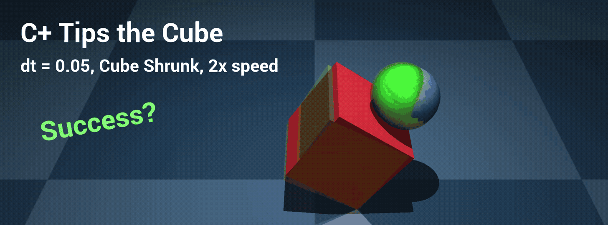
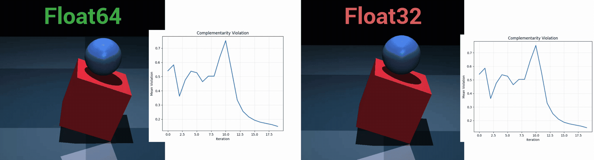
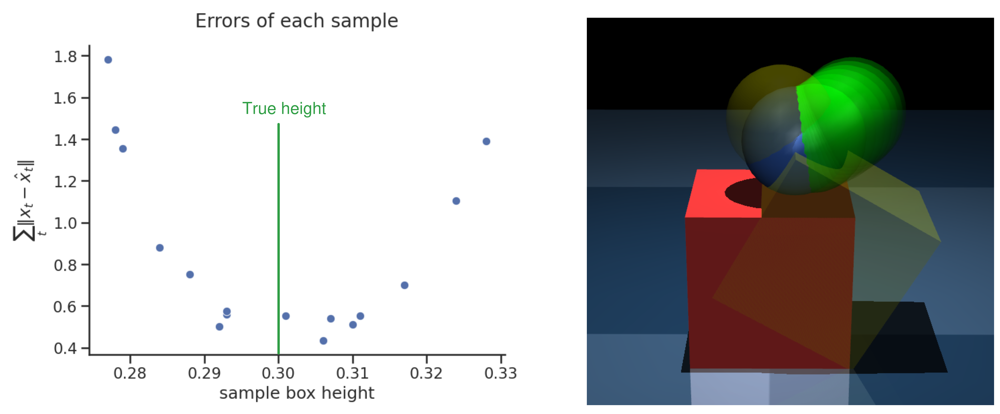

## 1. Last Time

Last time was a while ago, but I remember I was still struggling to get things working and the suggestion was to play around with $\rho$ to see if I could get better convergence, I did a little bit of that and even did a slight bit of research on an adaptive rho (§2.2). That was two weeks ago, and I have kind of been all over the place in the meantime, so hopefully this write-up is somewhat coherent.

The main takeaways from this write-up:

- NaNs are/were the bane of my existence (§2.1, §3.1, and §3.2)
- It seems like, after much hyperparameter tuning, $\Delta t = 0.05$ might be necessary for the cube tipping task (§2.1)
- I now have a fairly hacky equality-constrained QP solving method (§3.2)
- Weighting the samples seems like it could be successful (§3.3)
- *The robust approach is very promising, and it was able to tip the cube if feedback was included* (§4)

## 2. Towards Better C3+ Convergence

### 2.1. Getting it "Working"

**Equilibration:** The first thing I did was try to add some equilibration to help the Shur complement matrix not be so degenerate during the KKT solve part of the ADMM algorithm. I was seeing condition numbers like $10^15-10^16$—which was the whole reason I switched to float64s in the first place. Relatedly, OSQP [@stellato2020osqp] uses a variant of *Ruiz equilibration* [@ruiz2001scaling] to equilibrate the KKT matrix during the ADMM algorithm for solving a QP. Ruiz equilibration tries to minimize the $\infty$-norms of the rows/columns of a matrix, which is a cheaper proxy to directly reducing the condition number of a matrix. In the case of my problem, the matrix we are trying to equilibrate is not necessarily the KKT matrix itself to be better conditioned, but the Shur complement matrix of $B A^{-1} B^\top$. I have played around with different ways of conditioning, and the method I finally landed on is explained in §3.2 of this write-up. The reason the condition number was/is so bad is due to both the cost matrices and the $\rho$ parameters/schedule.

**Fixing a Bug:** I realized that I had a minor bug in my linearization code, where I would not take the new state into account everywhere that I should have (i.e. I was still linearizing part of the LCS around $x=0$ even when $x \neq 0$). This wouldn't have made a difference on the first MPC solve, but would on subsequent solves, and it would be especially pronounced once the end effector was around the edge of box. Regardless, I have fixed the bug, but it still didn't cause things to magically work all of a sudden.

Finally, I could move on to hyperparameter tuning. As I went about hyperparameter tuning, I noticed that there were four different types of *failure modes* that would occur with certain hyperparameter selections. At $\Delta t = 0.1$, it was very difficult (I wasn't able to do it) to find a hyperparameter selection that avoided all of these and had the desired behavior. Here they are:

**Failure Mode 1:** *C3+ uses high-velocity sliding friction to tip the block.* This creates a problem because the ball pretty quickly gets past the edge of the cube, which then causes the linearization to be poor. It also often involves high velocity, which might not be desired for actual robotic motions

**Failure Mode 2:** *C3+ tries to go backwards first, before tipping the block.* This is a problem because we only execute the first action from the MPC solve. This means that the ball just kind of shuffles backwards until it goes around the edge and pushes from the wrong side.

**Failure Mode 3:** *C3+ "whacks" the block, then breaks contact.* This is a problem because C3+ doesn't actually stabilize the block around the tipped position. Once the block is "whacked", contact is broken, and when the block starts to fall back, linearization often starts to fail (i.e. linearizes too far around the edge).

**Failure Mode 4:** *C3+ doesn't want to move at all.* This is a problem because the objective is never satisfied. This is usually due to either (a) too high of a cost on the ball $x$'s or $u$'s, *or* too lax of complementarity constraints such that they don't get satisfied at all (block moves but ball doesn't). Usually, there is a combination of the two.

**Success (or Close Enough):** I was able to get something that resembles success:

In this next video I had $Q_{q\text{ box}} = 2 \times 10^5$, $Q_{q\text{ EE}} = 0$, $Q_v = 5 \times 10^2$, $Q_f = 2 Q$, and the cube was shrunk to side lengths $l=0.29$. Furthermore, $\Delta t = 0.05$. Here is the result:

**Note:** *The success in the above video critically hinges on the cube being "shrunk" to sides of 0.29 in the LCS. If you change this, it fails (as seen in §4 of this write-up).*

### 2.2. Other Ideas

**Adaptive rho:** One other thing that I considered was the way that $\rho$ is scheduled. In the original C3 paper [@aydinoglu2024consensus], and subsequent versions, $\rho$ follows a geometric schedule where it is always increased by a constant factor at each iteration. In ADMM [@neal2011distributed], most convergence proofs assume the problem is convex and step sized is *fixed*. The CI-MPC problem, however, is decidedly non-convex. In [@neal2011distributed], the authors also explain that there is a heuristic commonly used for having an *adaptive* $\rho$ parameter based on the primal and dual residuals. The problem is, with the version of ADMM I am using the robust formulation, the dual residual is not as they have derived, due to the bilinear constraint. There are many different proposed ADMM adaptive $\rho$ strategies, but perhaps the most appealing to me is not even proposed for ADMM. It is the simple heuristic:
$$ \rho_{k+1} = \begin{cases} \beta \rho_k, & |r_k| \geq \gamma | r_{k-1} | \\ \rho_k, & \text{otherwise} \end{cases} $$
which comes from §2.2.5 of [@bertsekas2014constrained] on augmented Lagrangian methods. 

## 3. More Stuff

### 3.1. Float32?

I noticed that there was a problem when I moved to Float32. Even though there were no NaNs, the solution would have large numerical error in certain $x$ dimensions, as visualized below:

I was able to fix it, though:

**FIX:** *I simply added an extra "projection" step after solving the KKT matrix that projects the solution back into the constraints, taking the average absolute violation of the constraints from about $2\times 10^{-2}$ to about $1 \times 10^{-4}$*

### 3.2. My Current Equality-Constrained QP Solve Method

Given an equality constrained QP of the form:

$$ \min_x x^\top Q x + c^\top x \;\;\text{ s.t. } A x = b, $$

my current method is the following:

1. Scale constraints $A, b$ by $1/({\|A_i\|_2} + \epsilon)$ 
2. Scale primal variables in $Q, A, c$ by doing a single Ruiz Equilibration [@ruiz2001scaling] iteration on $Q$, and applying the corresponding scale, $1 / (\sqrt{\|Q_i\|_\infty} + \epsilon)$, to $A, c$
3. Doing Cholesky solves to calculate the quantities $Q^{-1} A^\top$ and $Q^{-1} c$
4. Calculate the negative Shur complement: $-S = A Q^{-1} A^\top$
5. Symmetrize $S$ by setting $S \gets (S + S^\top)/2$
6. Scale $S$ by doing a single Ruiz Equilibration iteration
7. Add a ridge to $S$ for numerical stability (about $10^{-4}$)
8. Cholesky solve and scale to recover the Lagrange multiplier $y^* = -S^{-1} (b - A Q^{-1} c)$
9. Calculate and scale the primal solution $x^* = -Q^{-1} c - Q^{-1} A^\top y^*$
10. Project $x^*$ onto the constraint $A x = b$
11. Return $x^*$

I found this to tentatively work best as it avoided the many NaNs I ran into in the last couple of weeks. That being said, if you choose bad hyperparameters, you still end up with a bunch of NaNs. For example:

- Setting $\rho$ to get too big results in NaNs
- Decreasing $\alpha$ too much results in NaNs (off diagonal terms cause numerical errors after so many matrix operations, which is step 6 exists above)

For reference, after this process, I am able to get condition numbers down to $<10^6$ for $S$, which avoids NaNs in the Cholesky solve.

### 3.3. Scoring/Weighting the Samples

One thing I noticed is that if we have an LCP of the form:
$$ \text{find } \lambda \;\;\text{ s.t. } 0 \leq \lambda \perp F \lambda + q \geq 0, $$
and we know that $F$ is both *symmetric* and positive semi-definite, which is the case in the Anitescu formulation [@anitescu2006optimization] because $F \propto J_c M^{-1} J_c^\top$ (the Delassus operator?), then, there are actually two distinct QPs that encode this LCP. The first one is the one I brought up previously:
$$ \min_\lambda \lambda^\top F \lambda + q^\top \lambda \;\;\text{ s.t. } \lambda \geq 0 \text{ and } F \lambda + q \geq 0 $$
But the simpler one, which skipped my mind up until now, is the following:
$$ \min_\lambda \frac{1}{2}\lambda^\top F \lambda + q^\top \lambda \;\;\text{ s.t. } \lambda \geq 0 $$
This QP drops the expensive $F \lambda + q \geq 0$ constraint. I figured that if we use this for forward sim, we can simply measure $\sum_t \| x_t - \hat x_t \|^2$ and weight accordingly. I implemented the scoring to see what would come of it, and I got the following:

I feel like that looks good.

## 4. Robust Approach Shows Signs of Life

After fighting hyperparameters and the all-too-frequent NaNs, I was able to get the robust approach to pivot the cube, but it required having feedback, which is good for our argument. Here is a promising GIF of the result:

Quantitatively, I have also graphed the error after two seconds in simulation of the above videos:

Here are the hyperparameters I used for the robust version of the above proof-of-concept:

| Parameter             | Value                     |
| --------------------- | ------------------------- |
| $\Delta t$            | 0.05                      |
| $T$                   | 7                         |
| $n_\text{samples}$    | 16                        |
| $\alpha$              | 0.001                     |
| $Q_{q\text{ box}}$    | $2 \times 10^5$           |
| $Q_{q\text{ EE}}$     | $1 \times 10^1$           |
| $Q_v$                 | $5 \times 10^2$           |
| $Q_\text{final}$      | $2 Q$                     |
| $R$                   | $0.01$                    |
| $l$ dist.             | $\text{Unif}[0.27, 0.33]$ |
| precision             | `Float32`                 |
| $n_\text{iters}$ init | 10                        |
| $n_\text{iters}$ full | 10                        |
| $\rho_x$              | $1$                       |
| $\rho_u$              | $0.1$                     |
| $\rho_\eta$           | $50 \times 2^i$           |
| $\rho_\lambda$        | $50 \times 2^i$           |

With these hyperparameters, I noticed that each solve took about $0.06$ seconds, including building the LCS. Hopefully, this could be pushed a bit down with some optimization as $\Delta t$ was $0.05$.

**What is missing from the above:**

- Reweighting samples
- Regularizing $K$ towards a PD controller
  - And any sort of low-level PD controller
- Adaptive $\rho$

## References
