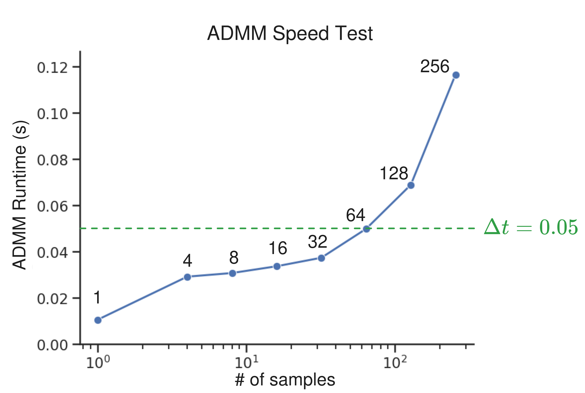
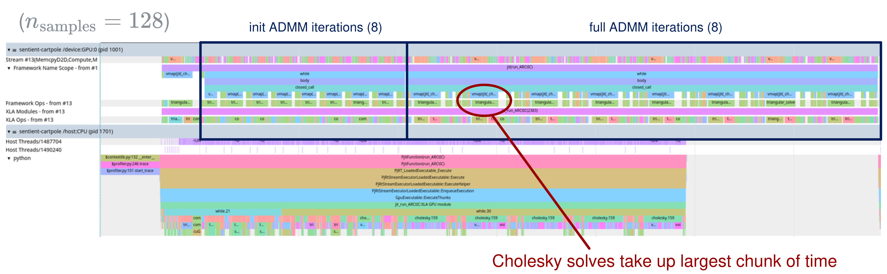

## 1. Last Time

Last time, there was some promising signs from the robust contact-implicit MPC method I have been working on. It was decided that pushing for IROS may be in the books. The main things I took away to do this week were to (a) profile the code, (b) think about and move towards a couple new experiments.

The main takeaways in this write-up are:

- The ADMM algorithm perf. saturates on GPU around 64 samples, likely due to memory bandwidth (§2)
- I have updated to use a QP for the initial LCS forward step, and pushing is... okay, but still has some issues (§3)
- I have some thoughts for experiments, but I think multi-object pushing and object reorientation are the way to go (§4)

## 2. Profiling the ADMM steps

The first thing I did was to profile the ADMM part and try to better understand its parallelization. The first graph I have here is a speed test of the ADMM algo, using pretty much the [same hyperparameters as last time](../2026-01-30/#robust-approach-shows-signs-of-life), except I used $n_\text{iters} = 8$ for both init and full ADMM loops and varied $n_\text{samples}$. Here is the graph of the average ADMM runtime depending on the number of samples:

The first thing to notice is that there is a sweet-spot of parallelization, then it starts to saturate at about $n_\text{samples} = 64$. The second thing to notice is that before then, we are well below the $\Delta t$ line—which we want to be because I am timing *just* the ADMM part and not LCS/matrix creation or any other overhead. One might question, however, *why* we are saturating so soon. I mean at 64 samples, we are still under a GB as far as memory is concerned. My best guess is that the bottleneck is coming from some sort of moving memory around on the GPU. For context, here is the trace view from the profiler for $n_\text{samples} = 128$:

Clearly, the algorithm is parallelized and on the GPU, and the thing that takes up the largest portion of the time is the cholesky solves (`cho_solve`), and particularly the `triangular-solve` operation. Because this is a library call, I am not sure there is too much that can be done to optimize it.

## 3. Towards a Pushing Experiment (Sim)

**Updating Forward Sim:** The first thing I did is change how I was doing the first forward sim step. Previously, I was using `mjx.step` to forward simulate each sample, then I was creating the LCS's and running ADMM. I changed this to first construct the LCS's for each sample, then forward simulate the LCS by solving the QPs I mentioned in the last writeup to forward simulate:
$$ \min_\lambda \frac{1}{2}\lambda^\top F \lambda + q^\top \lambda \;\;\text{ s.t. } \lambda \geq 0 $$ 
I used MPAX [@lu2024mpax] with pretty lax parameter settings to favor speed to solve the QPs. After this change, I made sure the algorithm still works and is fast (shrunk sphere just to test robustness):

As you can see, the algorithm is capable of running at 20 Hz and can tip the cube. I should note that there is some steady-state error and the controller actually *overshoots* the desired rotation.

**Basic Pushing:** The next thing I did is return to pushing, because there will probably be a pushing experiment—either toy or multiple-object planar pushing. I noticed that, similar to the cube tipping task, there is considerable steady-state error, but pushing does occur. Here is a GIF of that:

Previously I also had the thought that it would be cool if the robust approach could learn where to push based on some sort of uncertainty, but I am worried that this is not really feasible. I wonder if there is something about the LCS that makes finding *where* to contact kind of difficult. For example, here is two different coefficients of friction for this tall-block pushing task:

The $\mu = 0.5$ one clearly gets stuck, even though it is given the range $\hat \mu \sim \text{Unif}[0.3, 0.7]$. Again I am not sure how to get around this or even if it is worth doing one of these sorts of experiments.

**Hyperparameters:** For both of the following pushing experiments, the hyperparameters were similar to the following table:

| Parameter             | Value                     |
| --------------------- | ------------------------- |
| $\Delta t$            | 0.05                      |
| $T$                   | 7                         |
| $n_\text{samples}$    | 32                        |
| $\alpha$              | 0.01                      |
| $Q_{q\text{ box}}$    | $5 \times 10^5$           |
| $Q_{q\text{ EE}}$     | $1 \times 10^1$           |
| $Q_v$                 | $1 \times 10^4$           |
| $Q_\text{final}$      | $2 Q$                     |
| $R$                   | $0.01$                    |
| $\mu$ uncertainty     | $\text{Unif}[0.3, 0.7]$ |
| precision             | `Float32`                 |
| $n_\text{iters}$ init | 8                         |
| $n_\text{iters}$ full | 10                        |
| $\rho_x$              | $1$                       |
| $\rho_u$              | $0.1$                     |
| $\rho_\eta$           | $50 \times 2^i$           |
| $\rho_\lambda$        | $50 \times 2^i$           |

## 4. Brainstorming

### 4.1. Experiments

If we are aiming for IROS, we better get what experiments we are going to do settled. As food for thought, here are some experiments from recent papers that focus on contact dynamics in some way:

My current thoughts is that we should consider the following experiments:

- Multi-object pushing (in sim or real)
- Pushing in a circle (in sim or real)
- Planar rotation, perhaps with the trifinger (in sim)
- The tip cube toy task (sim)

The idea is that we would want to showcase (a) real world transfer; (b) multiple end-effectors; (c) multiple objects. The focus could be on shape uncertainty, but we can also include other uncertainties. If there is time, I think it might look better to do the sim pushing stuff by having the reduced model of just xyz force control of the end-effector, but actually use inverse kinematics and a Franka model to have a robot in the actual experiment/figures.

For baselines, I think it would be best to compare with:

- A deterministic version (similar to C3+ [@bui2025push])
- A sampling-based MPC approach (like MPPI+randomization similar to [@pezzato2025sampling; @abraham2020model]; I should probably sit down and do a close read of one or both of these)
- A robust version of the method but without steering

### 4.2. Towards the Paper

Recall the paper "pitch" from a previous write-up:

> - **Potential Title:** *Efficient ADMM-based Robust Contact-Implicit Control*
> - **Motivation:** Current contact-implicit MPC approaches ignore uncertainty—which is all too common in real world scenarios—whereas, on the other hand, most robust control approaches cannot handle complementarity constraints. Thus, there is room for an efficient method that performs contact-implicit robust control in a way that can handle general uncertainties. 
> - **Method:** We would introduce a method for contact-implicit robust control that uses GPU parallelization to generate distributionally robust feedback plans. Our method would use samples to solve an expectation based loss with that becomes basic matrix operations and some linear solves with the ADMM algorithm. We would also include a reweighting for system identification.
> - **Experiments:** Our experiments would aim to show that (i) there are circumstances where a robust approach outperforms C3+ w/ a PD controller; (ii) Both the reweighting and sampling/steering improve performance with the method; (iii) It can work real-time in the real world. Here is an image from last time of some potential experiments

I think that one clear point to emphasize in an eventual paper is the ability to handle general uncertainties in real-time. To exemplify what I mean, here is a comparison with other robust approaches to contact-rich manipulation:

| Method                           | Opposing Contacts? | Shape Uncertainty?      | Real-time?               |
| --------------------- | ------------------ | ----------------------- | ------------------------ |
| BS-VP-STO [@jankowski2025robust] | N                  | N                       | Y ($M = 6$ @ 5 Hz)       |
| CS4UCS [@shirai2023covariance]   | Y                  | Y (in theory, untested) | N                        |
| **Ours**                         | **Y**              | **Y**                   | **Y ($M = 32$ @ 20 Hz)** |

## References
