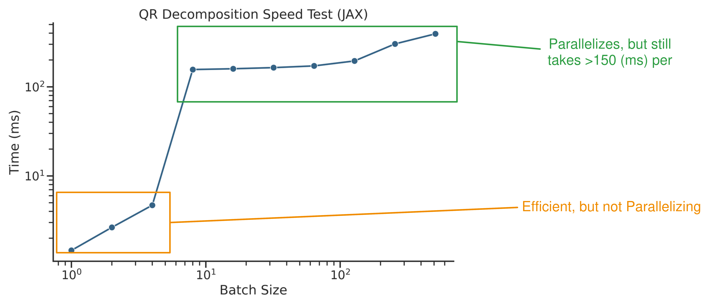

## 1. Last Time

Last time, I tried to implement the constraint to not go outside of the cube, but it didn't work so well. I basically came to the conclusion that numerical issues were the culprit. After this week, I am not so sure.

## 2. Trying to Fix The Float32 Gap

### 2.1. Null Space Idea

My first idea is that perhaps it might be possible to solve the equality constrained QP via reparameterizing the QP into an unconstrained problem with the null space of the constraint matrix. My thought was that, because the constraint matrix actually stays the same over each iterations, we could simply compute the QR decomposition of it off the bat, then just continually use that. I tried to implement it and it was painfully slow, so I decided to simply speed test the QR decomposition speed, and it turned out this idea is not viable because the QR decomposition parallelizes incredibly poorly: 

Remember that for this idea, this would only have to run once; unfortunately, even with this, it is about 4x too slow at minimum.

### 2.2. Other (Untested) Ideas

Here are some other ideas I considered:

- Doing a refinement step after solving the KKT matrix with the Shur complement. I decided not to really test this because it didn't seem promising. My best guess is that just by constructing the $S$ matrix, you are losing the relevant precision/accuracy.

### 2.3. A Miracle?

I don't exactly know what changed, but when I went back to running on Float32 after undoing a bunch of code, things started working pretty well. In fact, I did a test with **200 trials** for different settings for the method and these were the results (I am reporting different tolerances):

| Method          | <0.2 (rad) | <0.25 (rad) | <0.3 (rad) |
| --------------- | ---------- | ----------- | ---------- |
| Deterministic   | 0.560      | 0.895       | 0.965      |
| No steering     | 0.440      | 0.940       | **1.000**  |
| No re-weighting | **0.650**  | **1.000**   | **1.000**  |
| Full method     | **0.650**  | **1.000**   | **1.000**  |

It should be noted that I was slightly varying the starting rotation and size of the block around the z-axis and the starting xyz position of the ball. The starting position of the ball was drawn from a uniform distribution with extents of ±0.05 (m). The next experiment I ran was to increase this to ±0.1 (m), so there is **more variation** and do **500 trials** (*note:* the block size ranges from 0.28 (m) to 0.32 (m), so the new distribution of starting position of the ball takes up about 2/3 of the block in any direction). Here were the results from that (I also add a Float64 comparison):

| Method                | <0.2 (rad) | <0.25 (rad) | <0.3 (rad) |
| --------------------- | ---------- | ----------- | ---------- |
| Deterministic         | 0.522      | 0.772       | 0.826      |
| No steering           | 0.444      | 0.854       | **0.902**  |
| No re-weighting       | 0.634      | **0.900**   | **0.902**  |
| Full method           | 0.610      | 0.884       | 0.884      |
| Full method (Float64) | **0.646**  | 0.884       | 0.886      |

I think the takeaway is that the re-weighting really doesn't seem to be helping, but the steering does seem to be helping at least a little bit. Also, it seems fairly clear that the deterministic version performs worse.

*Obviously,* it's a bit weird that things just were working all of a sudden, and it suggests there was a bug somewhere going on—either before or after. In order to verify that things are reasonable, here is a video of a few back-to-back trials for both Float32 and Float64 precisions: 

## 3. Implementing a Baseline: Predictive Sampling

I wanted to try out a basic baseline to compare against. I figured the easiest would be to use *predictive sampling* as done in MJPC [@howell2022predictive]. This can be seen as a variant of MPPI [@williams2016aggressive] in the limit of infinite temperature. Basically, you randomly sample perturbations to a nominal $u$ trajectory and evaluate each of the trajectories costs, then apply the best scoring one:

![Predictive sampling from [@howell2022predictive].](image-1.png)

I implemented basically this, and made the design decision to use **cubic splines** with a number of knot points to make the trajectory. I didn't hyperparameter tune aggressively, but made sure it could kinda work. I used pretty much the same cost matrices from running C3-like algorithms to calculate the cost, multiplied by a constant factor and evaluated along the rollout at a higher frequency than the control rate. I made two different sets of hyperparameters: a "beefy" one that doesn't run in real time, and a normal set of hyperparameters that does run in real time. Here are those hyperparameters:

| Parameter             | Normal | Beefy       |
| --------------------- | ------ | ----------- |
| # of knot points      | 4      | 5           |
| # of samples          | 64     | 256         |
| noise $\sigma$        | 3.0    | 3.0         |
| controller $\Delta t$ | 0.05   | 0.05        |
| rollout $\Delta t$    | 0.01   | 0.01        |
| horizon (s)           | 0.35   | 0.5         |
| real-time?            | yes    | 3-4x slower |

I tested these two settings for MJPC on the problem. I gave my implementation of MJPC access to the average of the shape distribution (side lengths of 0.3), instead of the ground truth block size. For each method, I ran 300 trials each on both a low variance initialization (end effector $(x_0, y_0, z_0) \sim \text{Unif}[-0.05, 0.05]$) and a high variance initialization (end effector $(x_0, y_0, z_0) \sim \text{Unif}[-0.1, 0.1]$). Here are the results:

As you can see, the beefier MJPC version is much more successful, but the real-time one struggles. My best guess is that this is due to the horizon being increased from 0.35 (what our R-CI-MPC method uses) to 0.50. Unfortunately (or fortunately), I was unable to increase the horizon *and* stay at a real-time rate (20 Hz). I also tried running the predictive sampling controller at 10 Hz, but that also didn't work as well. A common failure mode for MJPC was that it would just sit there and never find a trajectory that gave it enough reward to overcome the cost of moving from the initial configuration.

*Also,* another thing to note is that MJPC had much lower levels of actual error when successful. If you were to measure success with a strict tolerance, say 0.1 (rad), then MJPC would significantly outperform our robust contact-implicit control method. This is because our method constantly overshoots and reaches an equilibrium with significant bias (usually around 0.2 (rad)).

The next thing I did was see if increasing the object *shape distribution* would highlight the utility of doing a robust approach. So, I increased the width, length, and height distributions from $\text{Unif}[0.28, 0.32]$ to $\text{Unif}[0.25, 0.35]$, and tested both our method without re-weighting (same distribution for uncertainty as used to generate boxes) and two versions of the beefy version of MJPC—one with access to the ground truth block size, and one with the average block size (like before). Here is table of the results for **100 runs**:

| Method                  | <0.2 (rad) | <0.25 (rad) | <0.3 (rad) |
| ----------------------- | ---------- | ----------- | ---------- |
| Beefy MJPC (mean)       | 0.79       | 0.81        | 0.82       |
| Beefy MJPC (g.t. shape) | **0.93**   | 0.94        | 0.94       |
| Ours, no Reweighting    | 0.82       | **0.97**    | **0.97**   |

Don't ask me why, with a wider distribution, the R-CI-MPC method did better. But regardless, it seems like our method does better with the shape distribution.

## 4. Additional Thoughts

I think that if we make the decision to forgo the re-weighting, it might be a good idea to think about what the paper would have to really make it feel full. I was hoping to have more time to brainstorm some ideas here, but I did not. I mean right now, our contributions could be enumerated as:

1. GPU parallelizing ADMM-based CI-MPC
2. Efficient addition of steering/feedback into sampling-based CI-MPC problem via bilinear ADMM
3. Overall, an efficient and effective *robust* CI-MPC algorithm 

## References

