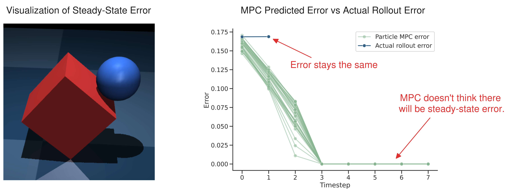
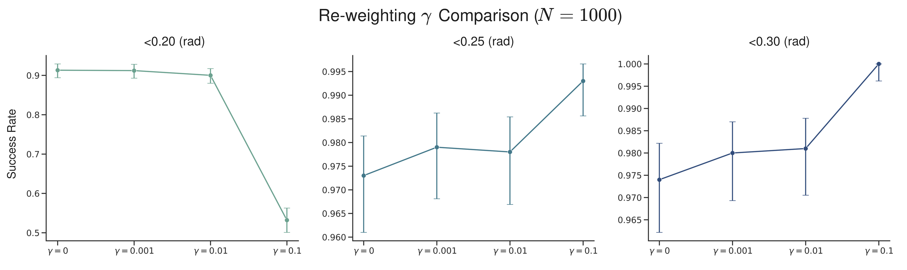
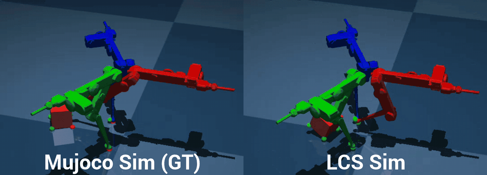
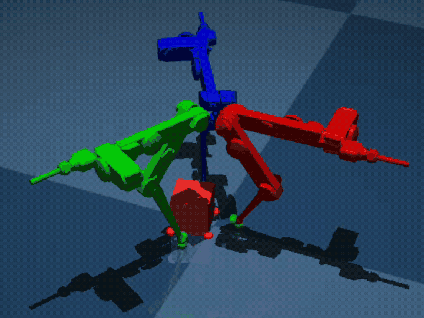

## 1. Last Time

Last time, we discussed how the Float32 issues kind of just went away. The things we decided to do moving forward were (a) not give up on reweighting; (b) Update baselines/implementation; and (c) move towards the other two experiments (trifinger reorientation). There was also a brief discussion of finger gaiting.

## 2. Revisiting Re-weighting

I wanted to re-test re-weighting but crank up parameters to really tease out the effect. I decided to run **1000 trials each** and use the **high variance** initialization settings from last time (ball position $x, y, z \sim \text{Unif}[-0.1, 0.1]$; box side lengths $w, l, h \sim \text{Unif}[0.25, 0.35]$; block rotation $\theta \sim \text{Unif}[-0.1, 0.1]$ (rad); Controller given true block size distribution). Here is a table with the results:

| Method                           | <0.2 (rad) | <0.25 (rad) | <0.3 (rad) |
| -------------------------------- | ---------- | ----------- | ---------- |
| Beefy MJPC                       | 0.827      | 0.841       | 0.858      |
| No steering                      | 0.581      | 0.758       | 0.897      |
| No re-weighting                  | **0.913**  | 0.973       | 0.974      |
| **Full method** ($\gamma = 0.1$) | 0.532      | **0.993**   | **1.000**  |

I think these results are fairly interesting. It should be noted that because $N$ is so high, these are pretty much all significant. The full method (including re-weighting) achieves 100% success if the tolerance is very loose, but at the high tolerance, it is outshined by all other versions, including *No re-weighting*, which maintains a success rate of over 90%. I also include a comparison with the "beefy" MJPC version from last week, where both the full method and *No re-weighting* outperform it on 0.25 and 0.3 radians tolerances.

**Question:** *Does MPC think there will be steady state error?*

No. Here is a figure graphing what the various particles look like after the MPC solve, and what actually happens at that timestep:

Likely, the issue is some sort of convergence, this could also be evidenced by the fact that the $x_0$'s are all a bit different from the actual $x_0$ error.

The next thing I did was to do an analysis on the $\gamma$ hyperparameter. I decided to try two different $\gamma$ settings in addition to $\gamma=0$ (*No re-weighting* above) and $\gamma = 0.1$ (*Full method* above). I originally planned to include $\gamma = 1.0$, but this performed poorly (<0.5 success rate with high tolerance) and occasionally resulted in NaNs. Here is a graph displaying the results from using the different tolerances (same setup as before):

It kind of seems like the re-weighting **slightly helps** as far as tipping the block, but **hurts** the steady-state error of the controller.

## 3. Updates to Baselines

Last time, I had my own implementation of predictive sampling in MJPC [@howell2022predictive]. The actual baselines we should compare against ought to be (a) the actual implementation of MJPC predictive sampling and (b) A *robust* version, perhaps similar to E-MPPI [@abraham2020model]. I wanted to try to do some of this this week, but didn't end up having time.

## 4. Towards Trifinger Reorientation

### 4.1. Creating the LCS

I was able to get an LCS kind of working for the trifinger. I did this by modeling the fingertips as a sphere and reusing my sphere-box collision code. Here is me testing the LCS vs the actual sim, where both use dt=0.01:

**Note:** *the small green/red spheres are the contact points and when it is red, it means that the signed distance for the contact point is within epsilon (in the actual simulation, not LCS linearization)*

However, I am worried that the LCS is either not good enough or there is a bug somewhere, because when I crank up the dt to 0.05, I get the following behavior (same u input):

### 4.2. Trying to Run MPC

The next thing I did was run CI-MPC on the trifinger LCS that I had. I used **dt=0.05**, and was able to get this after some minor cost tuning:

Clearly, it is not quite there yet, but you can see sparks of it doing the rotation. There were also some other concerns I have. For one, the timing for the above was about **0.12 (s)** for **32 particles**, and about **0.09 (s)** for **16 particles**, which is too slow for the 20 Hz that it takes to use dt=0.05. I tried to use dt=0.1, but it didn't quite work at all. I also ran into some NaNs at many hyperparameter settings, which is nothing new; likely the solution to this is to decrease the number of ADMM iterations . I want to do some hyperparameter tuning next, and get some better visualizations on what the MPC controller thinks is going to happen, and constraint satisfaction over algorithm iterations.

## References

