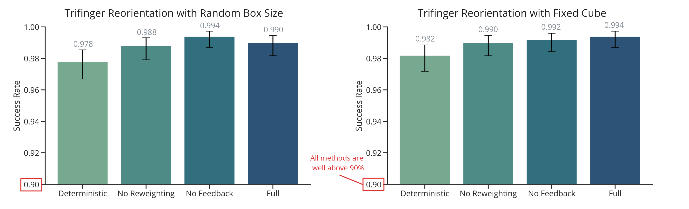
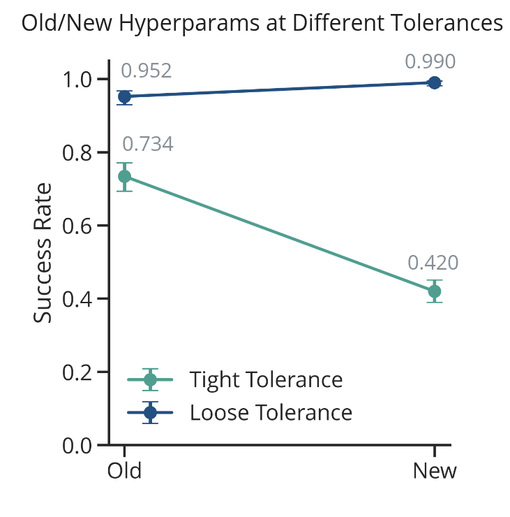

## 1. Last Time

Last time I gave my lab meeting. People had some suggestions, etc. They seemed to agree that adding sampling would increase the complexity of the project, and that what it needed was real-world experiments. People mentioned friction and center of mass as candidates for uncertainty in the push anything example—apparently it was kind of necessary to have a high friction surface, or the objects would slide, and push anything really strugged pushing a jug that had water in it. 

I also wanted to ask: *What should we do with the re-weighting?*

## 2. Revisiting the Trifinger

The first thing to note is that I seem to have hyperparameter tuned away my results from lab meeting. After more hyperparameter tuning and evaluation, I was able to get every method to have >95% success:

I wonder if there is a similar sort of thing happening here where the hyperparameter tuning is helping C3+/Deterministic variant find a robust solution, even with a deterministic model. I did notice that for the Full version, there were no examples where the final positional tolerance was > 0.03 (m), but there were a few for all other methods. This perhaps suggests that the Full method has less *catastrophic* failures. It should also be noted that, once again, removing feedback didn't seem to have too much of an effect on the performance of the task.

Another thing there was curiousity about was making the tolerance stricter for what counts as a success. So I decided to go take the tolerance from 0.02 (m) and 0.2 (rad) to a stricter 0.01 (m) and 0.1 (rad). Interestingly, I found that switching to the new hyperparameters, which significantly improved the original tolerance, actual resulted in *significantly worse* performance at the tighter tolerance:

I'm not completely sure what to make of that. Perhaps I just need to hyperparameter tune even more?

**Note:** *The success rate under the tighter tolerance for Deterministic in the Random Box Size above is 0.725.*

Thus, I think the way to go is to try to make the problem more difficult. I am thinking there are a few things I could do:

- Make the tighter tolerance the goal and hyperparameter tune even more for it
- Increase the distribution for starting location such that the object (and perhaps the Trifinger joints) have a wider range for their initialization
- Try to experiment with frictional uncertainty
- Try to experiment with center of mass uncertainty
- Update how the shape uncertainty is structured to be not just cubes, but polytopes with 6 sides; this could be done by perturbing the corners of the cube.
- Try to have uncertainty about the initial pose—though this might require changing how I do the goals as now each particle would have a different goal, which is dependent on the initial pose. There is also maybe some philosophical questions about assuming state feedback but having an uncertain pose.

I tried experimenting a bit with these, but was unable to get anything looking good yet, and didn't have time to run any Optuna hyperparameter tuning sessions.

I also tried a harder version where the cube would have to get lifted by the Trifinger (off of the ground). I was not able to get this working, and didn't spend enough time to dig into exactly why. I feel like if I could get Trifinger reorientation in 3D working, that would be very impressive, but Optuna was wholly unable to figure out how to do this from the limited amount of trials I ran on it. Of course, perhaps there is a way to try to slowly build up to it or something...

**Question:** *what do you think I should do next?*

## 3. Connecting to Push Anything

I met with both Hien and Stephen, and got push anything working locally after a few minor inconveniences with dependencies:

We also discussed what it might take to get my code plugged into the pipeline. Basically, I think it would be easiest to do an LCM bridge that calls my code and then takes the $u$ from my code and passes that to the OSC. I would still need to be able to create the LCS's on my end and do all the other stuff. The other thing Stephen proposed was to also do the sampling on my end and basically take over the whole sampling C3 part of the push anything setup.

## 4. Other Stuff

I am also debating next Monday in Dinesh's class, so I have been spending some time on that, as we need to have an opening statement, etc. prepared. Similarly, I will have to do a class project in the class at some point. I also started writing an overleaf document for this project (robust C3).

