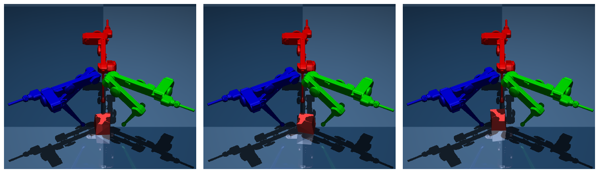
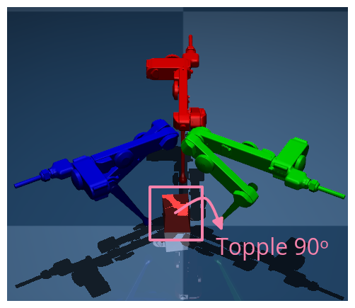
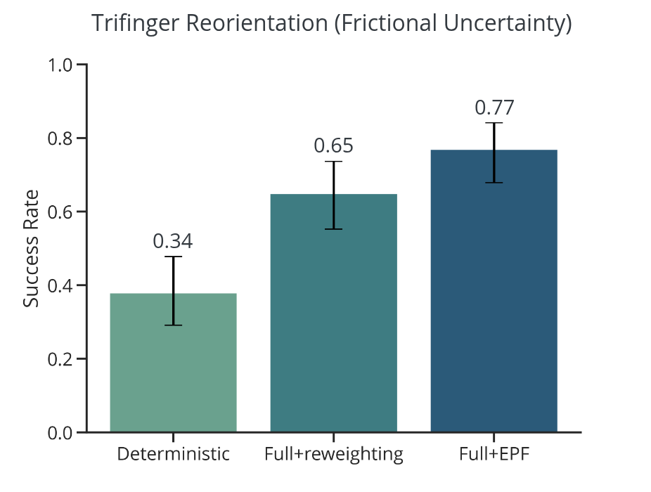

## 1. Last Time

Last time, I seemed to have hyperparameter tuned my results from the lab presentation away. We also discussed why re-weighting seemed to be not working well, and I hypothesized because it wasn't able to propogate through the ADMM very well. This time, I introduce a new algorithm for *resampling* instead of re-weighting, then look into uncertainty over friction for the Trifinger task, which seems to matter more.

## 2. Evolutionary Particle Filter

In order to investigate if *resampling* is more effective than *reweighting* for the controller, I implemented an evolutionary particle filter that performs the sampling. Here is an outline of the procedure:

1. Draw N samples from prior: $\xi^{(1)}, ..., \xi^{(N)} \sim P(\xi)$
2. Repeat for each observation $x_t$
   1. Calculate weights $w(i) = P (x_t | \xi^{(i)}),\; \forall i$
   2. Resample $\bar \xi^{(1)}, ..., \bar \xi^{(N)}$ from $\{\xi^{(i)}\}$ according to weights $w(i)$
   3. For each $i$, replace $\bar \xi^{(i)}$ with random sample from the prior $P(\xi)$ with probability $\beta$
   4. Update set of samples $\xi^{(i)} \gets \bar \xi^{(i)}$

One of the main benefits of this algorithm is that it only has 2 requirements: (1) being able to sample from the prior $P(\xi)$ and (2) being able to evaluate the likelihood $P(x_t | \xi)$. In, say a regularized particle filter, There would be extra things needed, such as a kernel in the uncertainty space. But in this setting, we really make no assumptions about the space uncertainty, just the ability to sample from it. In section 3.2, we see evidence that this approach outperforms the re-weighting procedure.

## 3. Trifinger Explorations

### 3.1. Shape Uncertainty

I added in the new shape uncertainty with the mesh/perturbing vertices. Here are some examples of what that randomization looks like:

The way it works is that I offset each vertex of the cube by a Gaussian, but constrain the bottom four to always lie on the ground plane. This also required a new `contact_fn`, that wasn't just operating on sphere/box contacts, but sphere/mesh ones.

Unfortunately, uncertainty with respect to geometry didn't seem to help the Trifinger reorientation task. Similar to how you mentioned it might not, it seems that it is just too easy to adopt a sort of *caging* strategy that kind of eliminates the need to reason much about geometry.

One idea I had is that shape uncertainty would matter much more for a *toppling* task. My thought was that the trifinger would have to do a 90 degree reorientation that requires toppling the block. Here is a figure of what I am talking about:

I wasn't able to get anything reasonable from some limited hyperparameter tuning.

### 3.2. Frictional Uncertainty

I found that frictional uncertainty really did matter for the task. I lowered the friction for the fingertips and made the friction uncertain $\mu \sim \text{Unif}[0.05, 0.15]$. I compared both the new resampling and the re-weighting approach. Here were the results:

As you can see this is promising, but I may want to do hyperparameter tuning because I actually just borrowed hyperparameters from the Trifinger task with shape uncertainty. Basically, the next steps here would be to run more extensive experiments.

## 4. On Push Anything

- Claude Opus suggests using LCM instead of pybind, as pybind would require embedding a python interpreter in the C++ code, and LCM is highly modular
- Haven't had too much time to actually implement anything

