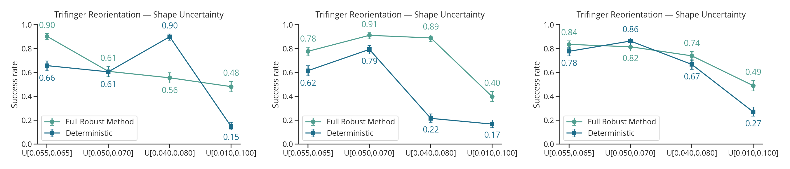
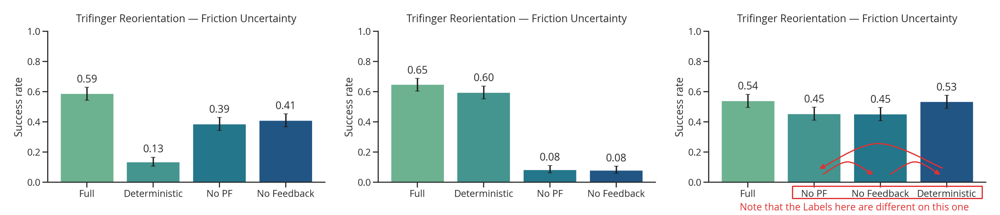
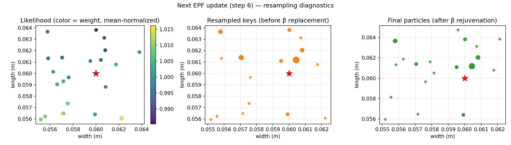
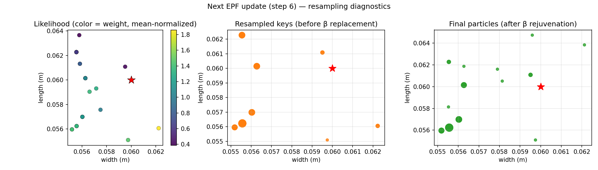
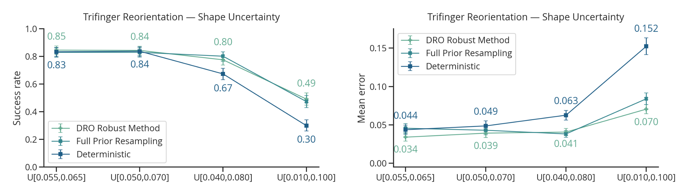
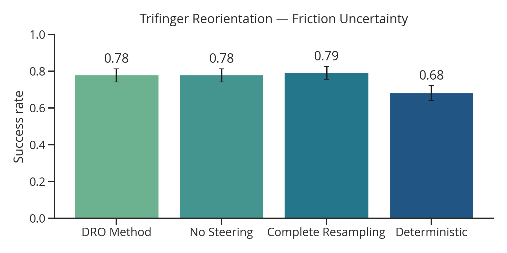
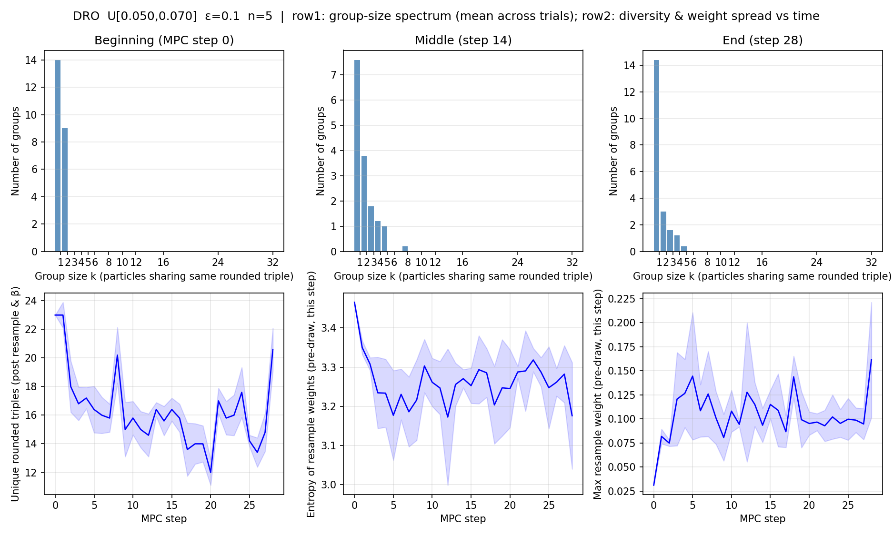

## 1. Last Time

Last time, we talked about my struggles with getting results that looked good. It was decided that I should investigate shape uncertainty on the Trifinger task some more. There was also an idea floated to have $\mu$ be a decision variable. I also introduced a pretty heuristic resampling method.

## 2. Trifinger Reorientation

### 2.1. Shape Uncertainty Task

**Insight 1:** *There is high sensitivity to hyperparameters, and optimal hyperparameters are not consistently found by optuna*

I think there is a thought that if I did a super large-scale experiment where I ran many different runs of this setup, I could get statistically significant/reliable results, however that would be computationally expensive.

### 2.2. Friction Uncertainty Task

The friction uncertainty task also exhibits the same high-variance with respect to different runs/hyperparameters:

### 2.3. Exploring Likelihood

After our discussion last time, I wanted to actually investigate if our likelihood was capturing what we want. In short, I found that the scales were pretty small, and the models inaccurate enough that the likelihood didn't really work that well. Here is a cursor-generated plot with the best of the diagnostic results that I could get:

Note that the difference between high probability and low probability points is pretty small. If $\gamma$ is increased to try to widen this gap, we get the following:

Which is no where near the true value.

## 3. New Robust Reweighting Idea

### 3.1. The Method

I had a thought to, instead of using reweighting/resampling to do sys ID, what if you used it to convert the problem into a true min-max robust control problem. Here is the mathematical justification I came up with. 

Let's start by defining a distributionally robust optimization problem [@rahimian2019distributionally] over policies and a KL-divergence $\epsilon$-ball around a prior as the ambiguity set:
$$ \min_\pi \max_{q \in \mathcal Q} \mathbb E_{\xi \sim q(\xi)} [C(\pi; \xi)] $$
$$ \mathcal Q := \{ q \in \Delta^\Xi : KL(q \| p) \leq \epsilon \} $$
Where $p: \Xi \rightarrow \mathbb R_{+}$ is the prior probability density function. This problem has the same min-max setup as classic robust control, but now, we are taking a max with respect to distributions. The basic approach I am going to propose is to do the following at each MPC re-solve in the closed loop execution of the controller:

1. Calculate an approximate solution $q^*$ using the previous MPC costs from last solve 
2. Calculate a new control policy from $x_t$ based on the distribution $q^*$.

Once we have $q^*$, step 2 is just using our original expectation-based C3 solve. So, here, I will explain how to do step 1. 

We consider the inner problem for a defined $\pi$ (we use the previous solve):
$$ \max_{q \in \mathcal Q} \mathbb E_{\xi \sim q(\xi)} [C(\pi; \xi)] $$
The first thing we will do is construct the lagrangian with respect to the KL-divergence constraint:
$$ \bar {\mathcal L}(q, \tau) = \mathbb E_{\xi \sim q(\xi)} [C(\pi; \xi)] - \tau KL(q \| p) + \tau \epsilon $$
Our process for approximately solving for $q^*$ will be to determine a suitable Lagrange multiplier $\tau^* > 0$, then analytically solve $\max_{q \in \Delta^\Xi} \bar{\mathcal L} (q, \tau^*)$. It turns out that solving this Lagrangian is easy, as you can apply Donsker and Varadhan's lemma:

> **Lemma.** *(Donsker-Varadhan)* For measureable function $h: \Xi \rightarrow \mathbb R$ and any probability distribution $p \in \Delta^\Xi$, we have:
> $$ \ln \mathbb E_{\xi \sim p} [\exp(h(\xi))] = \sup_{q \in \Delta^\Xi} \left\{ \mathbb E_{\xi \sim q} [h(\xi)] - KL(q \| p) \right\} $$
> The suprema is obtained with the following probability density function:
> $$ q^*(\xi) = p(\xi) \exp(h(\xi)) / Z, $$
> where $Z = \mathbb E_{\xi' \sim p}[\exp(h(\xi'))]$ is a normalization constant. This distribution is known as the Gibbs or Boltzmann distribution.

This lemma can be found in page 159 of [@catoni2004statistical] and also as lemma 1.1.3 in [@catoni2007pac]. Applying it gets us to:
$$ \max_{q \in \Delta^\Xi} \bar{\mathcal L} (q, \tau) = q^*(\xi) = p(\xi) \exp\left(\frac{C(\pi; \xi)}{\tau} \right) / Z $$
If we have a collection of previous MPC samples from a previous $q'$, we can approximately re-weight them according to this distribution:
$$ q(\xi^{(i)}) \propto w(\xi^{(i)}) = \frac{p(\xi) \exp(C(\pi; \xi^{(i)})/ \tau^*)}{q'(\xi^{(i)})} $$
I propose resampling according to these weights, and estimating $q'(\xi^{(i)})$ with the number of samples that are identical to $\xi^{(i)}$. Then, this fits nicely into the resampling technique I proposed last time. Also similar to last time, it would be very prudent to have a rejuvenation step that resamples from the prior with probability $\beta$ for each particle. Finally, I use the following to set $\tau$:
$$ \tau^* = \sqrt{\frac{\mathbf{Var}_p (C(\pi; \xi^{(i)}))}{\epsilon}}, $$
where $\mathbf{Var}_p(C)$ in practice looks like the empirical variance of the particles costs, while also doing the re-weighting for $q'$ via counting identical particles. There is mathematical justification for this setting of $\tau$, but I haven't really gone through it completely.

Altogether, I assume $p$ is a uniform distribution and the full robust sampling looks like this:

> **Given:** previous MPC particles $\xi^{(1)}, ..., \xi^{(N)}$ and corresponding costs $C^{(1)}, ..., C^{(N)}$ with mean $\bar C = \sum_i C^{(i)}$ and identical counts $\tilde q'(\xi^{(i)})$:
>
> 1. Determine $\tau^* \gets \sqrt{\sum_i \frac{(C^{(i)} - \bar C)^2}{\tilde q'(\xi^{(i)}) \epsilon (N - 1)}}$
> 2. Solve for weights $w^{(i)} = \frac{\exp(C^{(i)} / \tau^*)}{\tilde q'(\xi^{(i)})}$
> 3. Resample $\xi^{(1)}, ..., \xi^{(N)}$ according to weights $w^{(i)}$
> 4. For each particle, replace with random $\xi \sim p(\xi)$ with probability $\beta$.

There is a nice intuition that this is performing something similar to boosting in machine learning—samples where the controller had high cost get up-weighted to reduce risk.

### 3.2. Results

The first thing I do is design an experiment where I first hyperparameter tune extensively for the deterministic method on the nominal distribution (cube with sides of 6 cm), then I take share those hyperparameters between all methods, and include $\alpha=100, \beta\in \{0.3, 1.0\}, \epsilon=0.1$ as parameters for the other controllers. Here are the results across various shape distributions:

As you can see, the DRO method and full resampling method ($\beta=1.0$) have similar performance. Both distributional controllers are more robust to the deterministic controller as the distribution changes—with very statistically significant results. However, there doesn't seem to be much of a benefit of the DRO resampling vs just resampling everything.

The next test is on frictional uncertainty; I only vary the fingertip friction coefficent, and use a distribution $\mu \in \text{Unif}[0.2, 1.8]$, separately per finger. Results for frictional uncertainty:

My take away from this experiment is that having the distributional aspect is really the most important, and feedback/robust resampling don't matter that much.

**Some Diagnostics:** I had Cursor generate a plot to visualize the distribution of the samples at various times in the trifinger rollout. Here is that graph:

## References

