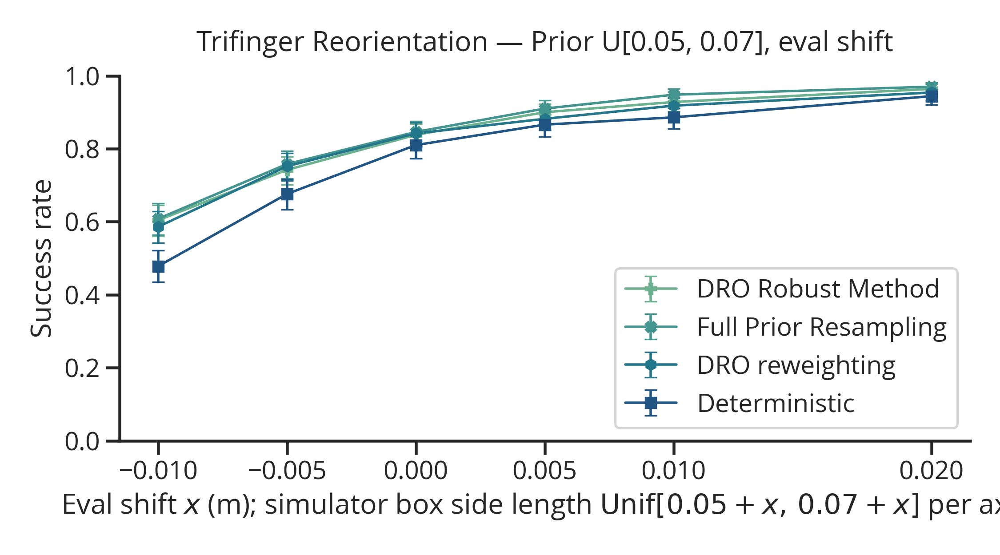
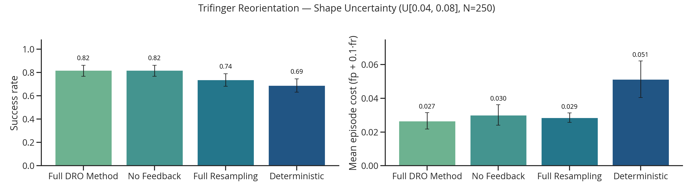
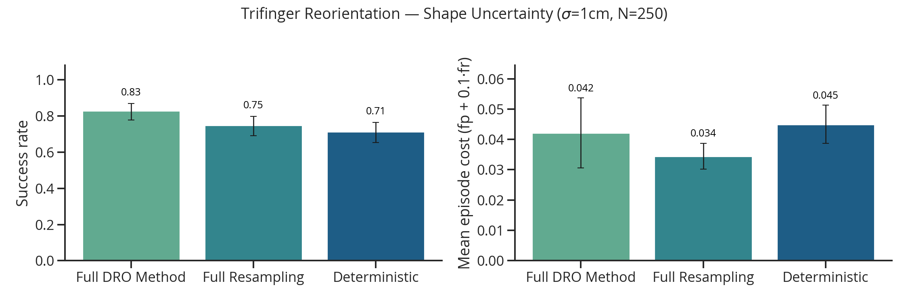
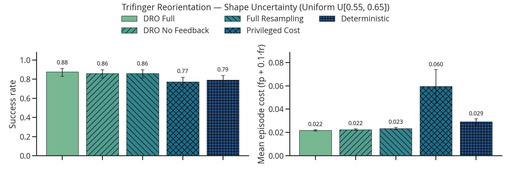
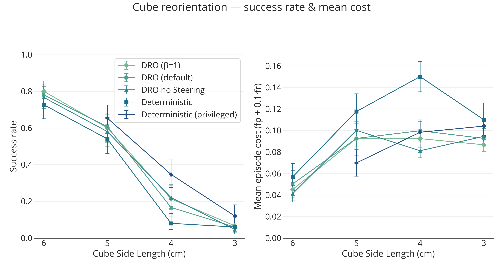

## This Week

This week, I just have a collection of figures. I spent most of my time running experiments.

**Insight 1:** *The smaller the box,the harder the task is. Model mismatch has a assymetric affect on the Trifinger reorientation task.*

As you can see in the above figure, the left-hand side (negative numbers) are where performance degrades; having a bigger object actually makes the task *easier*, even if the model is incorrect.

**Insight 2:** *Different hyperparameters can change ablation experiment results. I changed hyperparameters for deterministic version (still shared across), and changed $\epsilon, \beta$.*

In the above figure, we see that the Full DRO method now outperforms the full resampling, where previously (and in the image, 2 below), this was not the case. It should be noted that in the above and the following figures, I use "Full DRO Method" to refer to the *reweighting* version of what I introduced last week. This differs from the first figure in this write-up.

**Insight 3:** *Similar results can also be observed in a different distribution.*

In the above figure, I use a gaussian distribution with a standard deviation of 1 cm. We observe a similar effect as two figures above, highlighting  that it is dependent on hyperparameters.

**Insight 4:** *I implemented the privileged deterministic version, but I think it might have a bug, as the robust methods seem to outperform it.*

The final plot kind of reiterates the findings above—specifically, that the smaller the cube, the harder. It is also pretty clear that it is hard to get no steering to be better than the DRO version.

