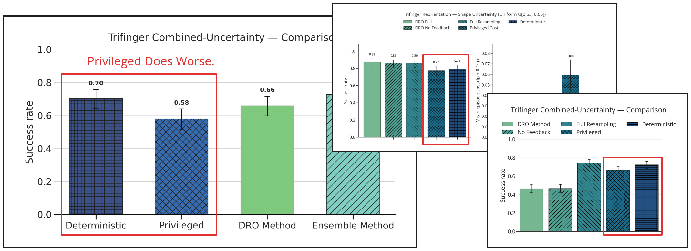
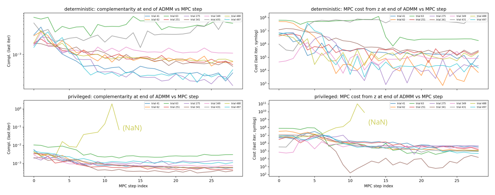
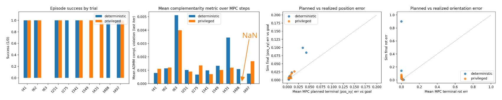
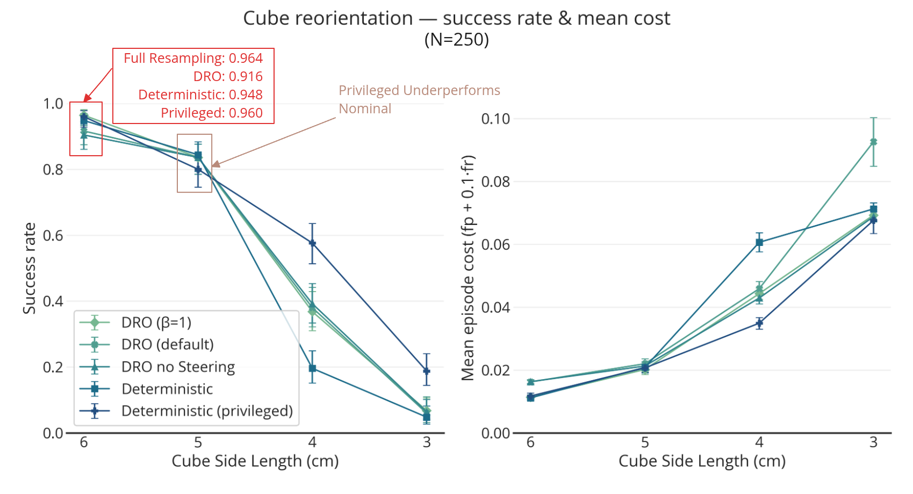
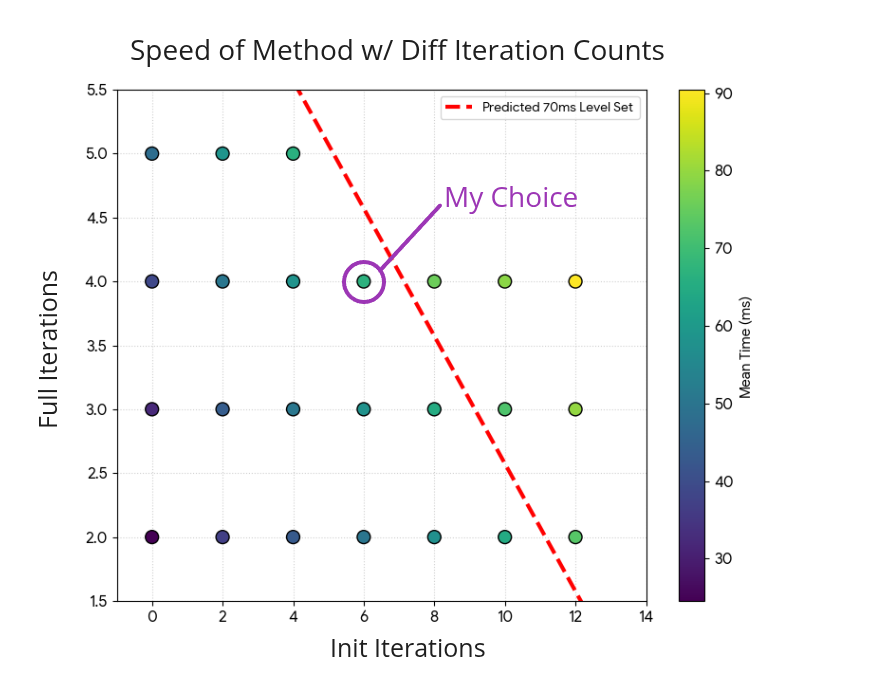
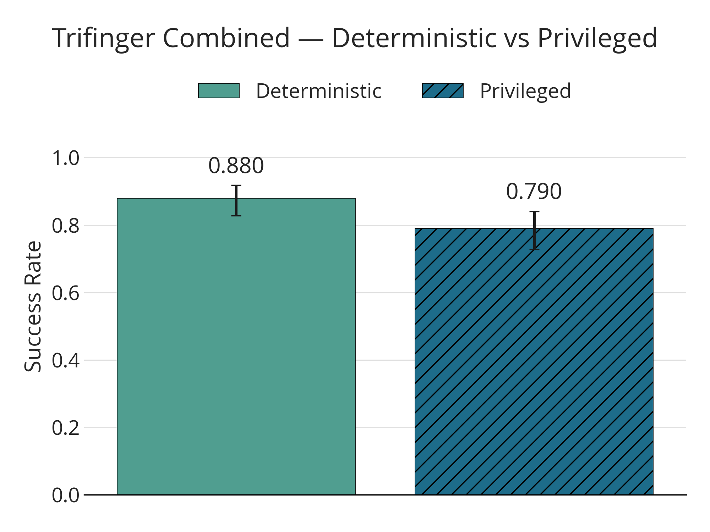
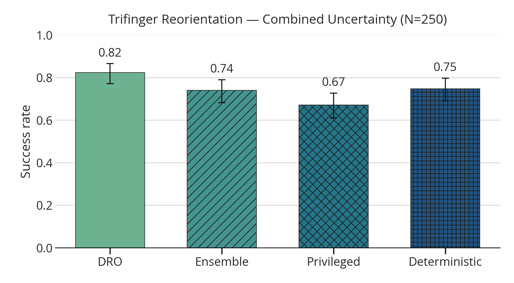

## 1. Last Time

Last time, I had a series of graphs with a couple insights that I took away from them. Among these were: (a) smaller cubes are harder than larger cubes on the Trifinger reorientation task; (b) there is extreme sensitivity to hyperparameters; (c) the privileged version is not necessarily that good. We kind of came to the conclusion that continuing to mess around with things might bring diminishing returns, and that it might be worth doing a *combined uncertainty* task, where many different forms of uncertainty are used. This week, I wanted to take one more crack at investigating the Trifinger reorientation task, then move on towards experiments/results that could actually go in the paper for this project.

## 2. Investigating the Privileged Version

The first thing I wanted to do was investigate the privileged version. Last time, there were some hints that it might not really be able to outperform the deterministic controller, and a similar result kept showing up—it was even measurably worse in some cases. Here is a few of those plots:

When I would tune *for* the privileged version on the distribution, it seemed to still not be able to do better than the deterministic tuned for the nominal (Though if both shared hyperparameters tuned on the privileged version, the privileged version would do best). This made me want to investigate a little further what was happening. I decided to take both the deterministic and privileged controllers and run some diagnostics over some sampled cases. The first graph shows the residuals (MPC cost and complementarity violation) at the end of ADMM at each timestep during the trial:

There was one run where the privileged version resulted in a NaN and failed the run. For reference, here is a plot that shows the results on those specific trials:

Here is the video of that run that had the NaN:

I don't know if I have a burning insight from all of this, but it does seem like the privileged version doesn't automatically do better than the deterministic (wrong model) version. I really feel like this is most likely due to ease of optimization—after all, the hyperparameters were tuned with the nominal.

I figured I would also add this in here—it's the results of varying the cube scale using the hyperparameters from the above diagnostics (The distribution given to robust methods is a normal distribution around cube scale, centered at 6 (cm) with a standard deviation of 0.5 (cm))

These hyperparameters are from the deterministic version aggressively tuned for the nominal via hand-crafted cases, which results in ~96% success rate on the nominal. 

## 3. Towards Paper Experiments

### 3.1. Trifinger Speed

In order to move towards paper-ready experiments, I figured it would be best to have the Trifinger controllers actually be fast enough to potentially run in real time. Since I am using `dt=0.07` for the model, I needed to find a settings for the amount of iterations that would be under 70 (ms). Recall that I have some *initialization* iterations that don't change $\rho$ or incorporate $K$, then full iterations. Here is a comparison of the speed for various numbers of iterations: 

I made the decision to do `n_init_iter=6` and `n_full_iter=4` because it was just under the 70 (ms) mark and felt right.

### 3.2. Combined Experiment

Frustratingly, the privileged version (ground truth model) seems to nearly consistently perform *worse* than the deterministic version given the wrong model. Here is an image of that happening fairly clearly on this combined uncertainty distribution:

To me, this suggests that success for a given LCS/model is *highly* sensitive to hyperparameters, so much so that a model that you know how to solve might be more beneficial than actually being given the true model, because any model other than the one used for tuning might give ADMM trouble. With these hyperparameters, I was unable to get the robust versions to significantly outperform the deterministic (wrong model baseline).

Because of this, I decided to revisit the approach of tuning for the distribution, as that is likely what previous work has done [@abraham2020model]. Speaking of that work, they have this figure:

![Figure from [@abraham2020model]](image-5.png)

Which clearly shows that the perfect model upper-bounds performance—completely opposite of what we are dealing with here.

The next thing I did was try to tune each method separately on the hard-coded cases for 500 optuna trials. This was the result on the combined experiment:

To be honest, I don't have that much trust in these results. Also, here are the random per-task parameters that I used (ultimately the uncertainty was 8-dim):

| Category    | Quantity               | Distribution            | Range / value       |
| ----------- | ---------------------- | ----------------------- | ------------------- | 
| Uncertainty | Box side lengths       | i.i.d. uniform per axis | [5, 7] (cm)         |
| Uncertainty | Fingertip friction     | Uniform                 | [0.5, 1.5]          |
| Uncertainty | Ground & cube friction | Uniform                 | [0.05, 0.2]         |
| Uncertainty | Cube COM offset (3D)   | Gaussian                | σ = 0.01 m per axis |
| Task        | Target position        | i.i.d. uniform          | [-0.06, 0.06] m     |
| Task        | Target rotation        | Uniform                 | [-0.5, 0.5] rad     |
| Task        | Start position         | i.i.d. uniform          | [-0.001, 0.001] m   |
| Task        | Start rotation         | Uniform                 | [-0.01, 0.01] rad   |

## References
