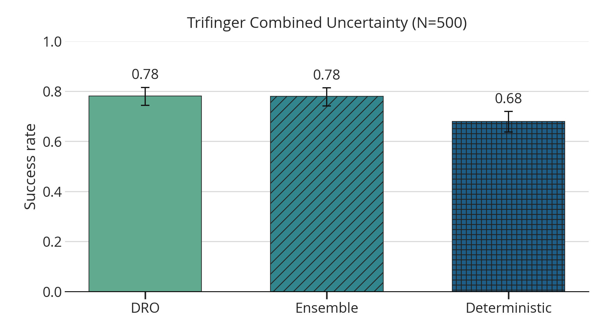
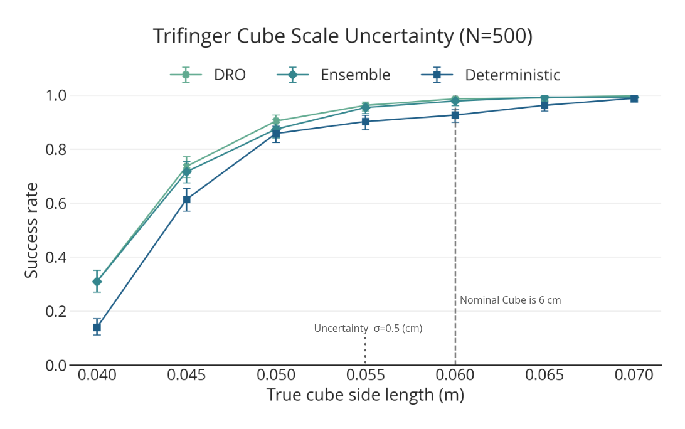
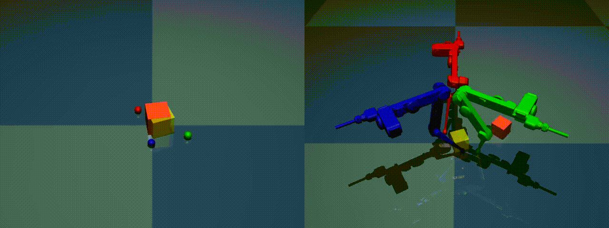
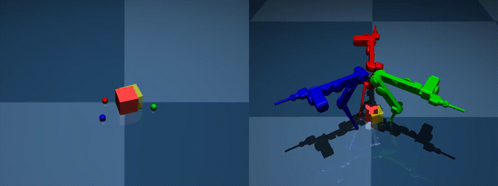
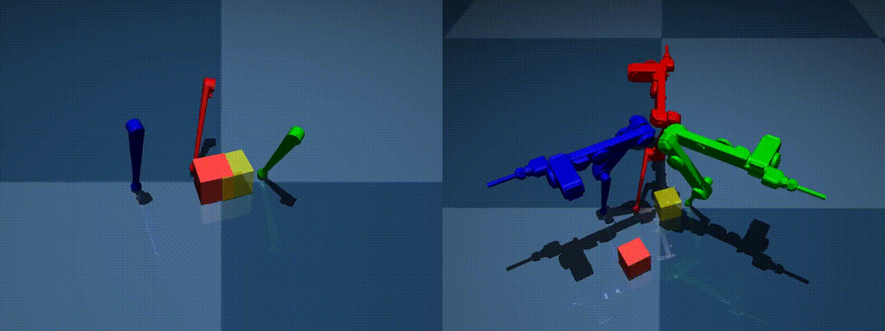
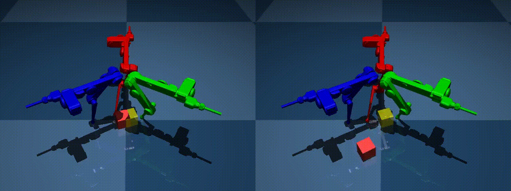

## 1. Last Time

Last time we decided I should just move towards experiments that might appear in the eventual paper. This week, I make progress towards that.

## 2. Towards Paper Results

### 2.1. Trifinger — Combined Uncertainty

I did a ton of hyperparameter tuning on the same fixed cases for all methods and tried a bunch of hyperparameters between each method, then I ran the combined uncertainty test on the *best* hyperparameters found. Here are the results:

As you see there is about a 10% gain from the distributional methods. I think this would continue to be the case at higher $N$'s, and would like to run this experiment with $N=1000$. I also want to add other baselines to this experiment.

### 2.2. Trifinger — Cube Size

Then, using the best hyperparameters found (different from 2.1 but best for this task), I ran the cube size experiment and got these results:

Clearly, there is assymetric difficulty to the problem, and the robust approaches help a little bit.

### 2.3. Trying to get MPPI to Work

I am trying to get EMPPI [@abraham2020model] working as a baseline, but I am struggling just to get plain MPPI to torque control the normal cube. Because the full trifinger model is too complicated to run efficiently, I made a simplified model, but infuriatingly, it is not accurate enough to the full model:

Here is another one:

 
This is a bit puzzling because the simplified model used for the second figure is basically the one used to create the LCS. I have tried playing around with contact solvers, etc, and I even printed off the signed distances between the finger tip and the cube leading up to when contact was made and it was not very illuminating, except that there were clear differences:

| step | t_s    | d_lite_mm | d_full_mm | delta_mm |
| ---- | ------ | --------- | --------- | -------- |
| 0    | 0.0050 | 56.8861   | 56.8381   | 0.0480   |
| 1    | 0.0100 | 56.3325   | 0.0000    | 56.3325  |
| 2    | 0.0150 | 55.5149   | 56.5638   | -1.0489  |
| 3    | 0.0200 | 54.4354   | 56.3345   | -1.8991  |
| 4    | 0.0250 | 53.0966   | 55.8405   | -2.7438  |
| 5    | 0.0300 | 51.5021   | 0.0000    | 51.5021  |
| 6    | 0.0350 | 49.6557   | 54.0658   | -4.4101  |
| 7    | 0.0400 | 47.5624   | 0.0000    | 47.5624  |
| 8    | 0.0450 | 45.2276   | 51.2625   | -6.0349  |
| 9    | 0.0500 | 42.6575   | 49.4854   | -6.8279  |
| 10   | 0.0550 | 39.9956   | 47.6059   | -7.6104  |
| 11   | 0.0600 | 37.2450   | 45.6254   | -8.3805  |
| 12   | 0.0650 | 34.4089   | 43.5141   | -9.1052  |
| 13   | 0.0700 | 31.4906   | 41.3069   | -9.8163  |
| 14   | 0.0750 | 28.4935   | 39.0064   | -10.5129 |
| 15   | 0.0800 | 25.4211   | 36.6152   | -11.1941 |
| 16   | 0.0850 | 22.2767   | 34.1360   | -11.8593 |
| 17   | 0.0900 | 19.0640   | 31.5715   | -12.5075 |
| 18   | 0.0950 | 15.7866   | 28.9247   | -13.1381 |
| 19   | 0.1000 | 12.4481   | 26.1984   | -13.7504 |
| 20   | 0.1050 | 9.4311    | 23.8103   | -14.3792 |
| 21   | 0.1100 | 6.7288    | 21.7550   | -15.0262 |
| 22   | 0.1150 | 4.3378    | 20.0310   | -15.6932 |
| 23   | 0.1200 | 2.2589    | 0.0000    | 2.2589   |
| 24   | 0.1250 | 0.4969    | 17.5924   | -17.0955 |

Like the sphere seems to be placed at the right spot initially as the signed distance discrepancy is small, but integrating forward creates problems I guess; I don't really know. I have also tried to replace it with geometry closer to the full model and it runs into the same sort of problems:

{width=49.5%}
{width=49.5%}

My best guess is that the MJX version just behaves significantly different from the CPU version.

## 2.4. Cube Tipping

I am still working on reproducing the results I previously had with the box tipping experiment. However, I do think I will clearly be able to show improvement with the feedback.

## 3. Other Stuff

I think for baselines I could do:

1. MJPC (deterministic) [@howell2022predictive]
2. EMPPI [@abraham2020model]
3. PETS-MJX (A variant of PETS, where MJX ensemble is used instead of neural ensemble of models; so basically CEM w/ ensemble) [@chua2018deep]

If I feel ambitious, I could also try to implement [@shirai2023covariance], but I think it would be way to slow. Another idea is to implement some form of the complementarity-free
dynamics [@jin2024complementarity].

## References

