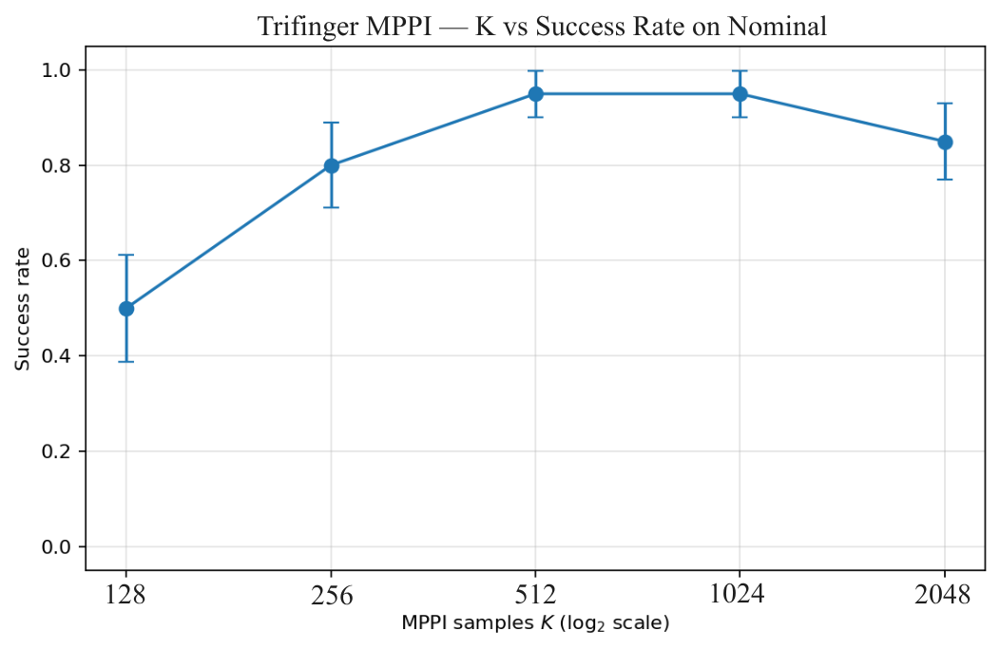
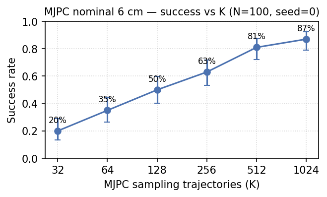

## Sampling-based MPC Rollout Ablations

**Note:** MJPC with 128 samples is about 15 Hz, and the ARCtIC controller runs at ~13 Hz, so I used a bit beefier versions for EMPPI in the write-up ($K=256$). 

## Current Results

Cube Scale:

| True cube side (cm) | EMPPI success rate      | ARCtIC Ensemble |
| :------------------ | :---------------------- | :-------------- |
| 4.5                 | 74.2%                   | 76.8%           |
| 5.0                 | 92.0%                   | 92.2%           |
| 5.5                 | *in progress*, but ~97% | 97.8%           |

**Note:** For the above table, I used $N=16, K=256$, which is not even close to real time (about 5-10x too slow)

## Towards Multi-Object Pushing

I am trying to tune the deterministic version of my method on some push anything cases:

