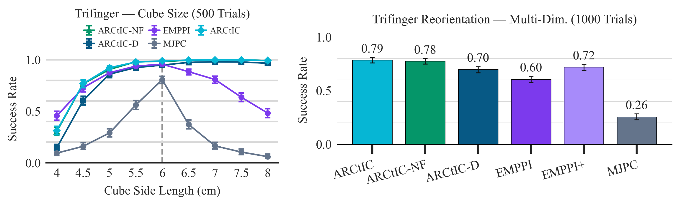
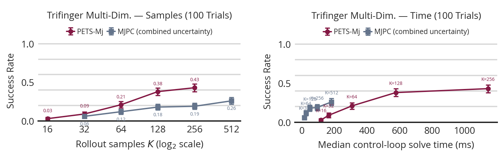

## 1. Some Figures

These were in the poster, so you already saw them, but here are the latest results:

I have been trying to get the PETS-Mj baseline working, but it seems to be far too slow:

## 2. Push Anything Tuning

I have also been trying to tune for push anything, but that has proven difficult. Here is a video of the MPC returned trajectories:

However, I think I discovered a bug because I was trying to copy the dairlib push anything parameters, I think I copied `n_friction_directions=2` from dairlib, but in my code it really should be 4 because I count friction directions differently.

## 3. Printed Poster

I printed out the poster for ICRA:

