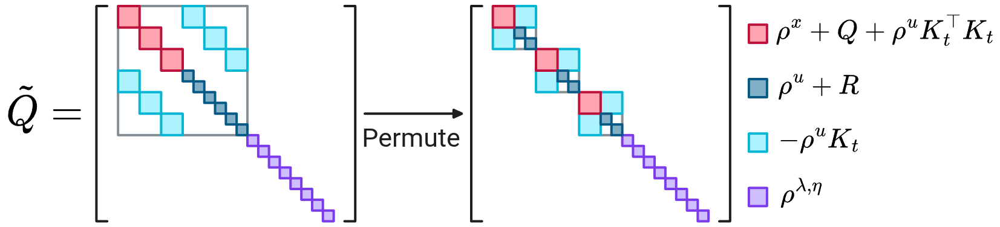
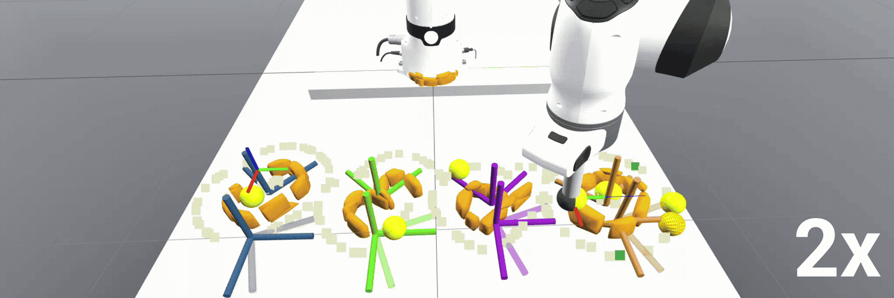
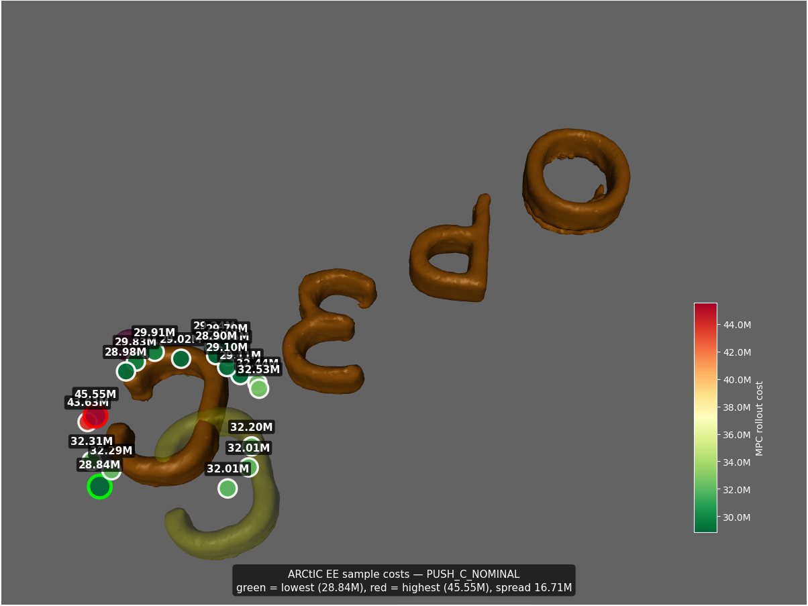
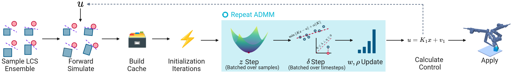

## 1. Algorithmic Changes

1. I started using projected FISTA [@beck2009fast] to solve QPs for forward simulating the LCS.
2. I did some precomputing/caching and hoisting of some things that I was not doing.
3. I did a matrix shuffle thing to make the cholesky decomp. of $\tilde Q$ even faster (I don't know if I mentioned this last time, but see image below)

## 2. Push Anything + ARCtIC

I tried to get ARCtIC wired up with the push anything demo via LCM. Right now, there is a sample cost problem with my implementation—which I am trying to implement on the ARCtIC/JAX side. 

Here is a GIF of what happens when you run the example:

It might be a hyperparameter thing or something else, but I'm still looking into it—to be fair I made heavy use of Cursor and vibe-coding to wire things together, which is probably a task at the edge of what the base models are capable of even with some human assistance. 

Here are some diagnostic images I have produced trying to get it to work:

As you can see, it doesn't quite look right. I think I still have some hyperparameter tuning to do, but also I should probably debug all parts of the cost generating process—I did implement a projected FISTA [@beck2009fast] solver for the LCP stepping to bring the speed down (This brought what would've been a like 20 ms call for stepping 64 LCS's for T=7 steps to about 5 ms with only minor accuracy loss). 

For reference, here are the open-loop LCS rollouts:

Another problem I am trying to fix is that my LCS creation is too slow, which means that my whole ARCtIC stack is taking like 90 ms to do a control loop which is far too slow for the 75 ms timestep.

## 3. Method Figure?

I made a new version of the method figure, but idk what to think about it still (I think it's better, but definitely not amazing):

## References