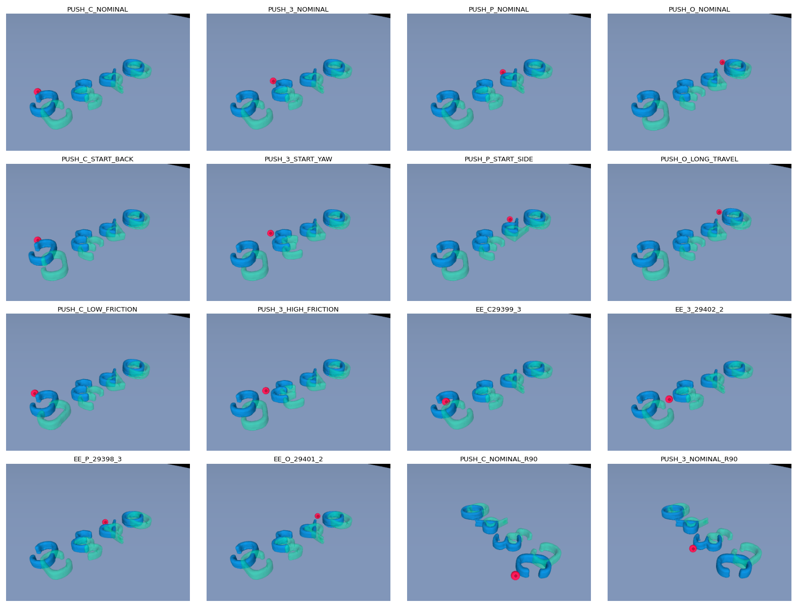
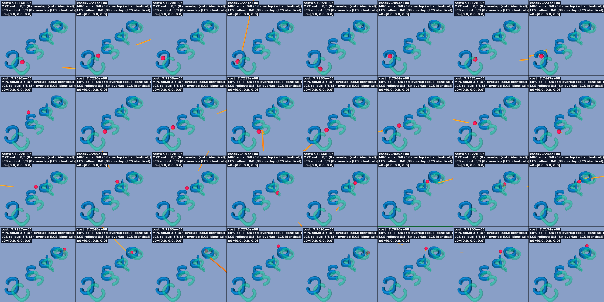
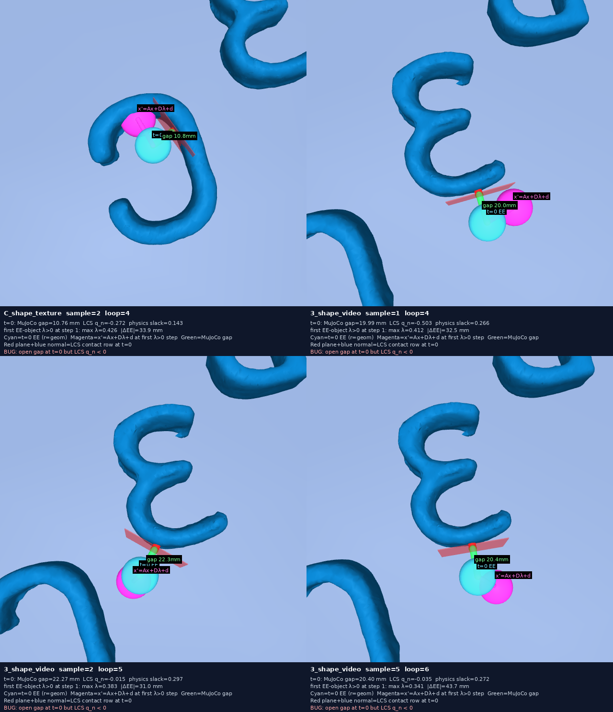
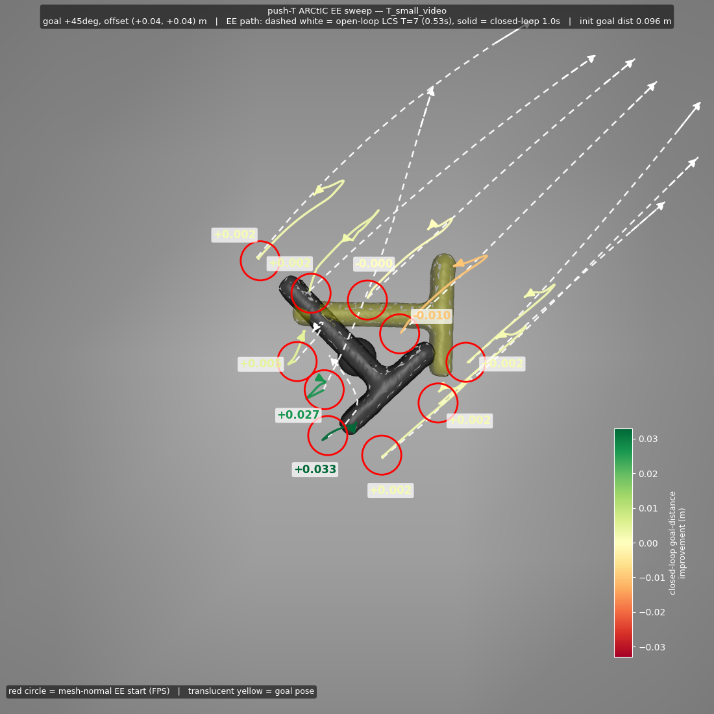
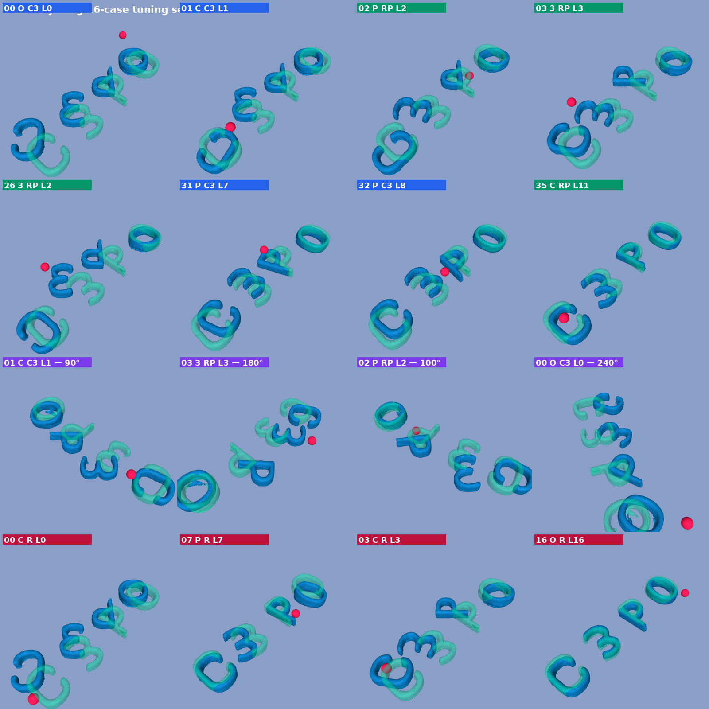

## Hyperparameter Tuning Struggles

I am trying to hyperparameter tune my method. Here are the cases I am using:

However, I can't seem to find a great controller.

Here is me trying to visualize open-loop rollouts on random EE samples:

I can't seem to clearly find a bug in the LCS, but maybe I just need to take a bit of time and regroup:

I was able to get the speed to be pretty much real-time by moving to 3 initialization iterations and 2 full iterations.

I also have this push "T" image I am trying to use for debugging purposes:

**Next:** I concluded that my current cases are not that good, and have collected a set of real examples of (mostly good) EE samples from running push anything with C3:

I want to use these for hyperparameter tuning.
