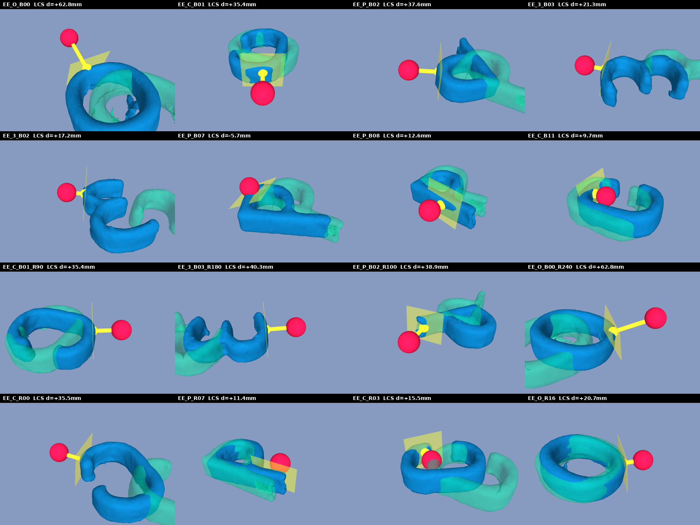
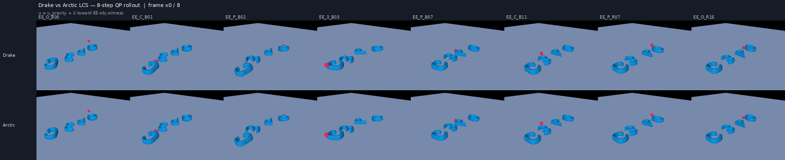
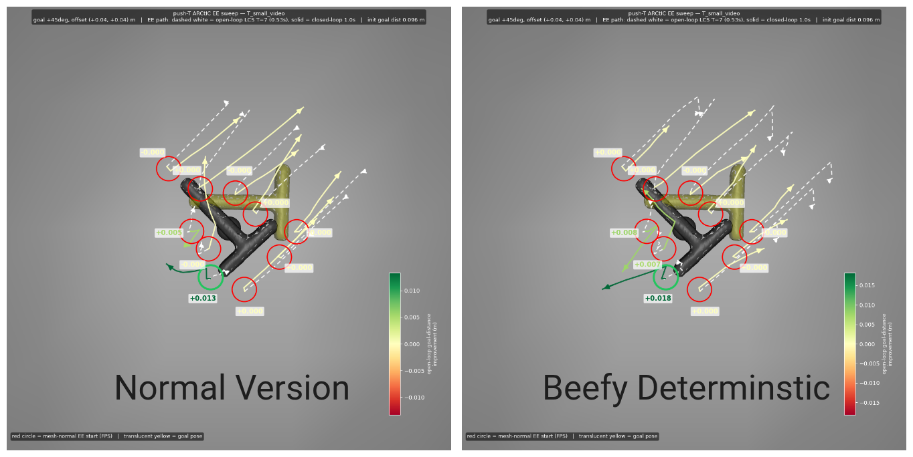
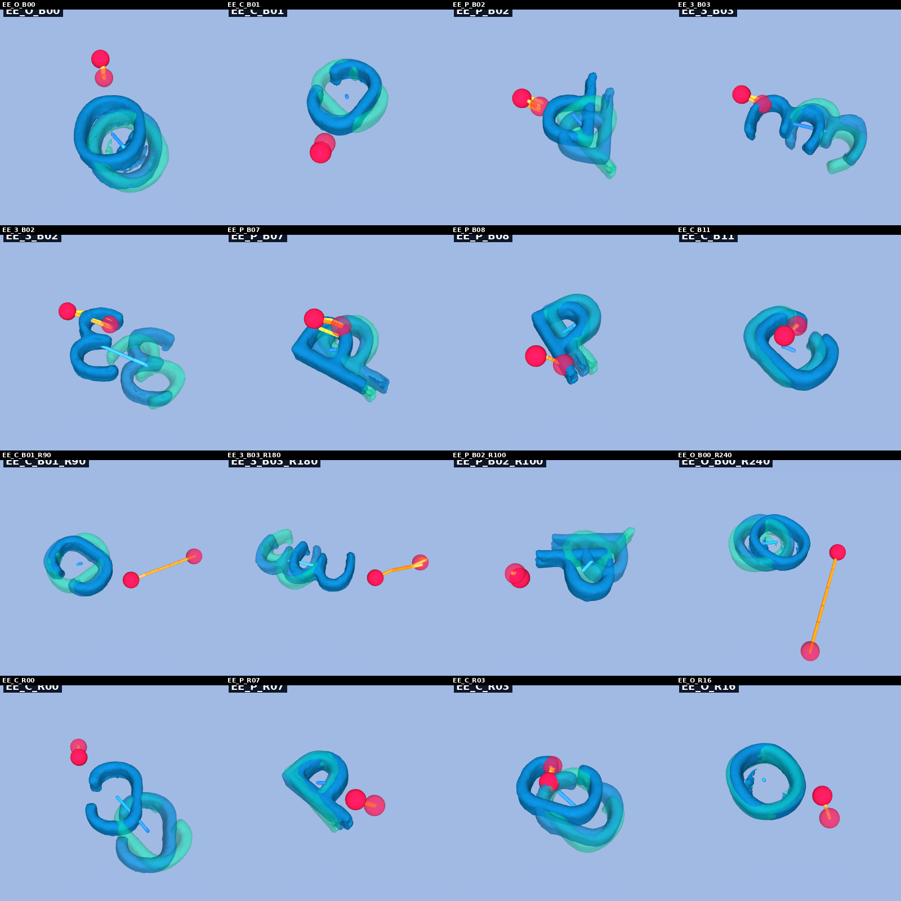
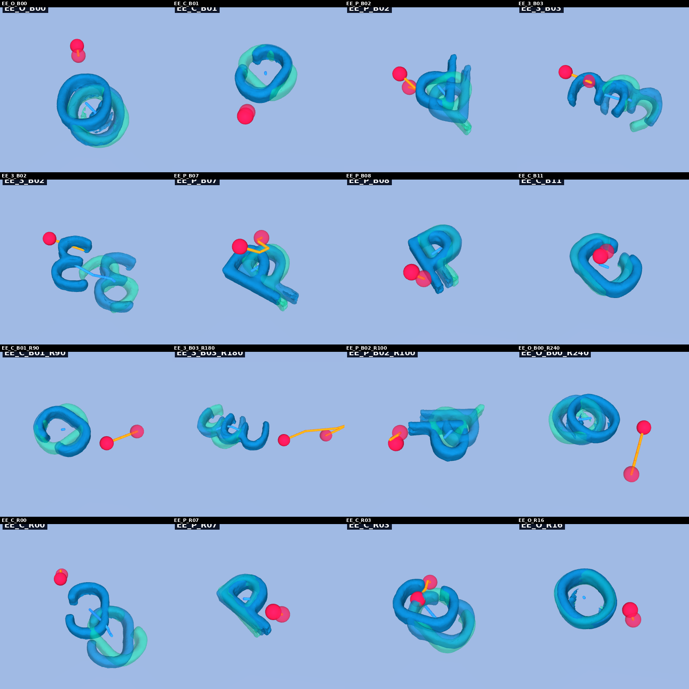

## 1. Checking the LCS

First off, I am pretty confident that my LCS is good. Here is an image of the contact linearizations that are chosen during LCS creation for push anything: 

Similarly, here are some rollouts going throught the LCS (compared to drake):

As you can, see the LCS seems to be good. Note that it definitely doesn't match the drake LCS exactly as the collision detection is a bit different and drake does the 1 kg thing (I wonder if that is actually something to give more thought to).

## 2. PD Controller?

The "insight" (in scare quotes) that I had this week was that C3 kind of *required* the PD controller to work effectively. Here is a video that demonstrates what I am talking about:

I then implemented a PD controller for my robust method—around the mean end effector $x$ trajectory—and did some hyperparameter tuning. Specifically, I hyperparameter tuned a beefed up super-version of my method and the normal version, and included the PD gains as hyperparameters. Here is a video of the closed loop rollouts on the tuning cases for both versions:

**Note:** *The optuna costs evaluated between the video above and the C3 pd video are different, and thus not comparable. They are, however, comparable within a video.*

Here is the push "T" visualization:

As you can see, there is a bit of a difference, but overall they both do okay. Not amazing, but perhaps servicable. There is some wobbly/instability in certain cases, and notably, there is still the "EE flies away" problem on the opposite side of the "T". 

**Takeaway:** *Because both hyperparameters were comparable enough, I don't think the problem is just the number of iterations or a slight boost in numerical accuracy. I think there must be something else going on.*

One problem might be that the MPC finds pretty infeasible trajectories in its solution. For example, here is a visualization of the `sol.x` in the beefed up version:

Here is a static image of the $x$ solution for both sets of hyperparameters:

Clearly, complementarity is not exact. Here is a visual of how it progresses through the ADMM algorithm:

**Note:** *perhaps this throws everything into question, but there is definitely a bug as the last frame for each case in the above mp4 does not match the png above. I am currently in the process of debugging this.*

