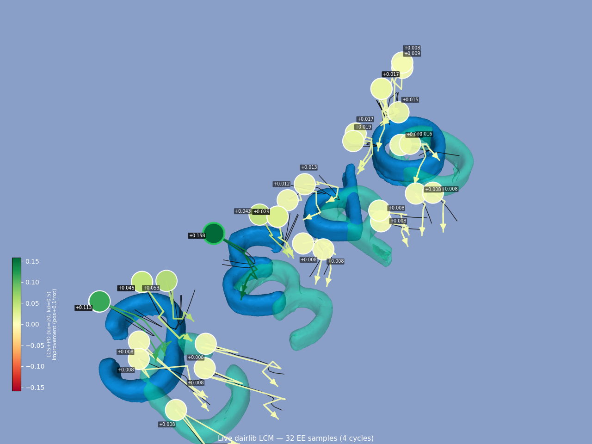
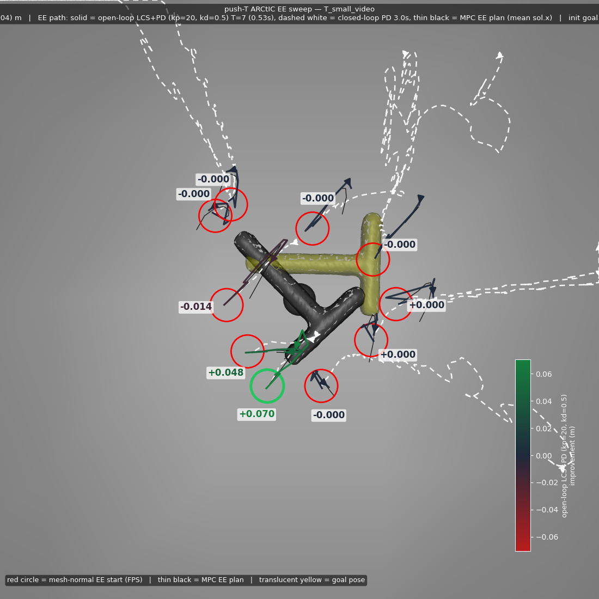

## Some Figures

I found a bug with the JIT compiling the LCS creation which was totally messing things up, and tuned some new hyperparameters:

Here is a visualization of cost calculation:

Notably, I changed cost calculation to be an "improvement metric". One thing to note about the above image is that even EE samples that shouldn't improve the scene do, by a constant 8 mm. This is because the objects actually start 8 mm sunk into the floor and "pop" up—this is due to the spheres being the contact points in the LCS, but the actual object geometry being used in the simulator. Actually, I think this same mismatch is present in current C3 push anything example.

Here is the push T version:

Interestingly, the closed loop 3 s rollouts diverge much more than the T=7 LCS rollouts.

Unfortunately, I don't think these parameters really

Right now I am working on a visualizer that can help me see how the rollouts differ in the actual full stack (which goes through drake) vs the tuning cases in mujoco. Here is what I have now:

Clearly there are multiple bugs right now. Hoping to figure those out. Especially because judging by the previous videos/pngs, it really seems like I should at least get *something* that looks somewhat okay when running these hyperparameters.

Another clear problem: the solving speed is way too slow (~120 ms) I don't know what made that slow down happen, but it was like ~85 ms before.