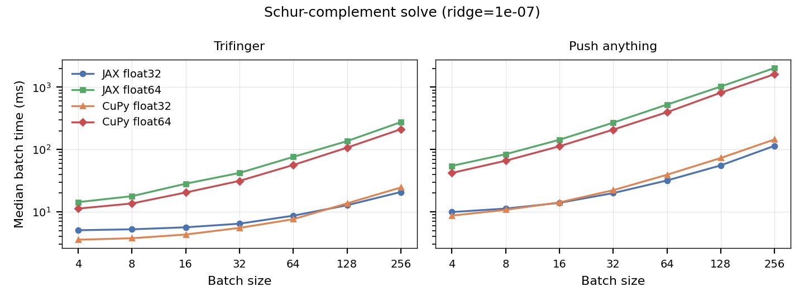
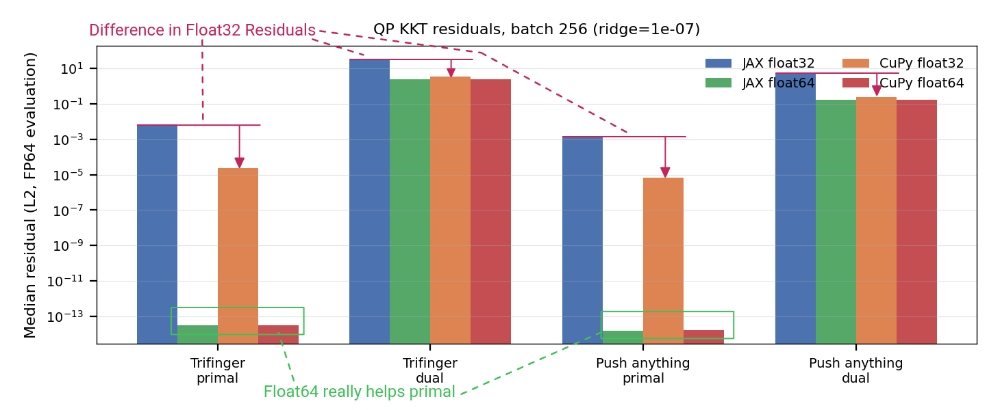
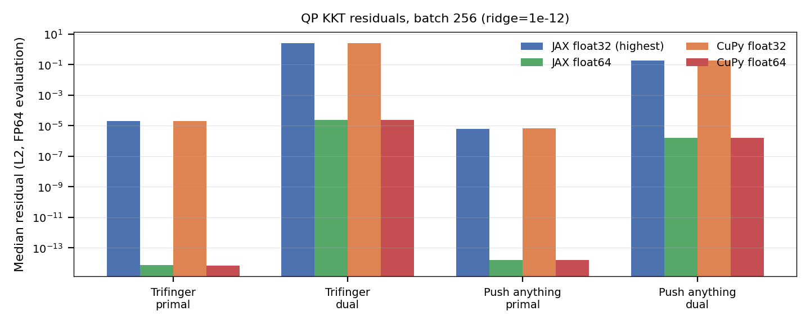
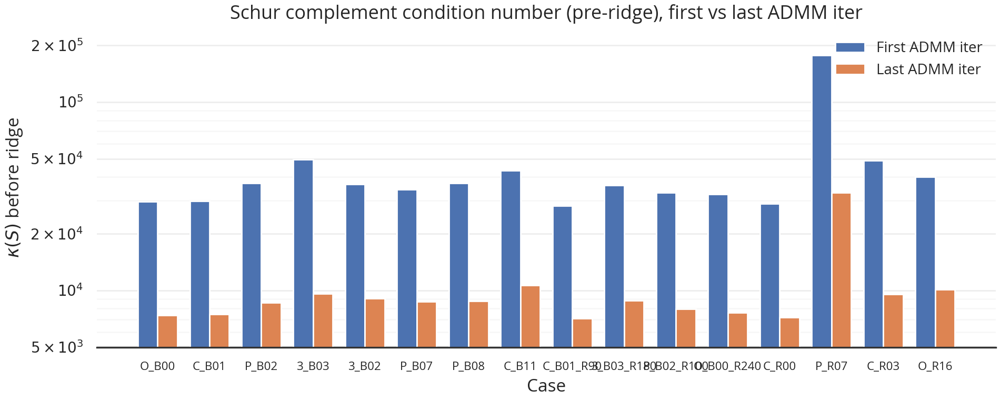
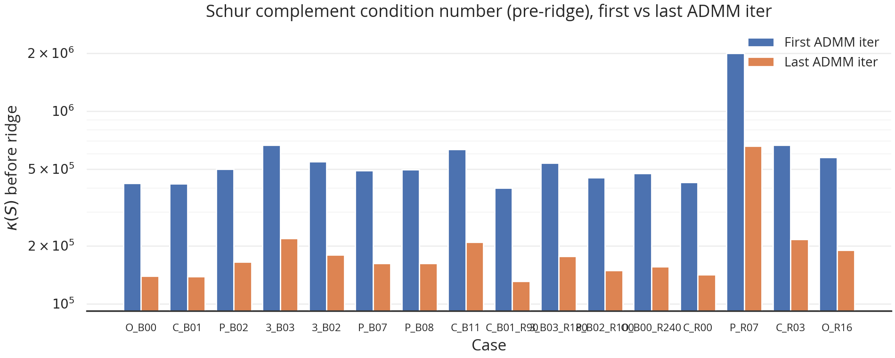
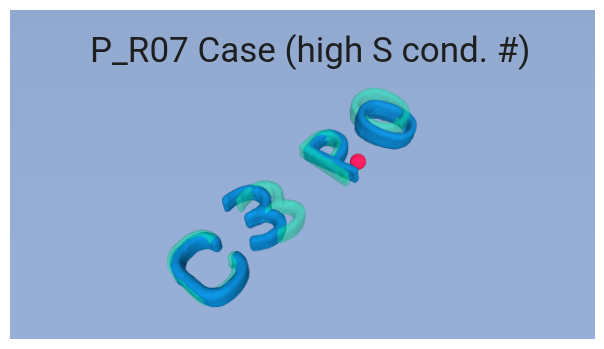
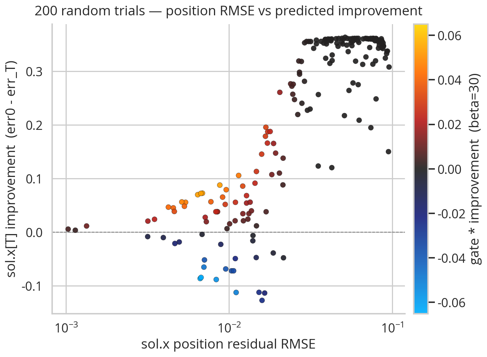

## 1. Last Meeting

Last meeting we talked about how things seem to be kind of spinning in circles the last few weeks, and talked about what the next steps should be.

This time, I tried to explore the numerical stability, EE weight, and the tuning in general. Unfortunately, I fear the same things happened this week as in previous weeks—stuff still isn't working, and there is probably bugs.

I did track down some issues I had previously with timing of the x targets for the PD controller.

## 2. On Numerical Stability

### 2.1. Comparing Speed and Accuracy of Different Cholesky Solvers

Here, I have some speed and accuracy plots for different solving methods using the previous matrices I had given you. Here is the speed plot:



As you can see, float32 methods perform about the same and float64 method perform about uniformly slower. Here are accuracy plots:



I guess matrix multiplication (the default version) in JAX is slightly less precise, but there is a flag to turn it to the more precise version. When that flag is flipped, you instead get:



Because of this, I didn't think there was a real reason to switch to cupy; I can just flip the flag as an env variable.

### 2.2. Hyperparameters can have Large Effects On $\kappa (S)$

It should be pretty obvious that different hyperparameters can result in different condition numbers. Here is an example where the two sets are somewhat similar:

| Parameter | Set 1 | Set 2 | Change |
|---|---:|---:|---|
| `q_obj_pos` | 100000 | 10000 | ×0.1 |
| `q_obj_ori` | 10000 | 1000 | ×0.1 |
| `q_obj_vel` | 100 | 10 | ×0.1 |
| `q_ee_pos` | 1 | 0 | → 0 |
| `q_ee_vel` | 1 | 10 | ×10 |
| `rho_mult` | 3 | 5 | ×1.67 |
| `rho_lambda` | 500 | 500 | — |
| `rho_eta` | 1 | 0.1 | ×0.1 |
| `rho_EE_last_iter_mult` | 10 | 10 | — |
| `rho_x` | 30 | 10 | ×0.33 |
| `rho_u` | 20 | 10 | ×0.5 |
| `R_val` | 2 | 2 | — |
| `alpha` | 1000 | 100000 | ×100 |
| `kp_ee` | 11.4 | 11.4 | — |
| `kd_ee` | 1.14 | 1.14 | — |
| `schur_ridge` | 1e-07 | 1e-07 | — |

Then, using these two sets, there is about an order of magnitude difference in the condition number of $S$ (pay attention to the y axis values):



As shown in the plot, the final shur complement $S$ is much better conditioned than the first one.



It is notable that one of the cases above seems to consistently result in a higher condition number than the other cases. Here is a visual of what that case looks like:



I guess the takeaway here is that having better numerical precision doesn't necessarily mean things will just work, but more that increasing numerical precision broadens/widens the set of hyperparameters where the algorithm can be reasonably run. How do we know what hyperparameters are the right ones that we want the set to encompass? We can only make educated guesses.

## 3. The EE Weight

I was using the end effector weight from dairlib / C3, which was 0.057 kg:

.png)

However, I decided to try to run some optuna trials with an EE weight of 2 kg to see if that would help, but it didn't seem to that much.

## 4. Is There a Bug in Tuning the Hyperparameters?

One thing that should be true of hyperparameters is that, for the ADMM solve, the method both (a) thinks that a solution has been found and (b) has low dynamics error (constraint satisfaction). I decided to make a plot to see if I could devise a metric to measure this:



What you are looking at is 100 different optuna trials from a tuning session, where I measured both success (improvement) and dynamic consistency. Then, I cooked up a function that aimed to measure consistency-weighted improvement that is the color in the plot above. I thought it maybe does a good job at capturing what we want during hyperparameter tuning, but I must've been mistaken, because when I ran optuna, it was not able to find very good hyperparameters, even when including this new metric as the dominant cost.

Perhaps I have an underlying bug somewhere; I decided to just run a sanity check with what I thought were reasonable hyperparameters:

```json
{
  "q_obj_pos": 100000,
  "q_obj_ori": 10000,
  "q_obj_vel": 0,
  "q_ee_pos": 0,
  "q_ee_vel": 100,
  "rho_mult": 3,
  "rho_lambda": 1000,
  "rho_eta": 1,
  "rho_EE_last_iter_mult": 10,
  "rho_x": 1,
  "rho_u": 10,
  "R_val": 10,
  "alpha": 1000,
  "kp_ee": 11.4,
  "kd_ee": 1.14,
  "schur_ridge": 1e-07
}
```

The "sanity check" did not actually seem that sane. In fact, there is the closed loop rollouts from these hyperparameters:


I think this either suggests a bug or some sort of instability in the method. Specifically, in the video there is this giant oscillation where the predicted MPC trajectories start *increasingly* further from the EE. Either this is due to a crazy LCS forward simulation at t=0→1 (remember my method does an LCS sim step *before* ADMM), or there is some bug. I haven't had much time to really get to the bottom of this.

P.S. Here is those hyperparameters with the ADMM mp4:


## 5. Conclusion

Overall, I think that there is likely something wrong with the method/implementation—either numerical stability, a bug, or something else. One of the things that makes it hard, is that there is a bit of a chicken-and-the-egg problem: In order to find decent hyperparameters, I kind of need to have the implementation be bug-free and working, but in order to debug effectively, I kind of need decent hyperparameters. Without either, it feels like I am half-way shooting in the dark.

That being said, I think I want to take my "reasonable" hyperparameters and see if I can debug as much as possible. Right now they seem to be breaking my Mujoco code and I want to try to understand why. Hopefully it is not just that the hyperparameters are unreasonable, but that it uncovers a critical bug or something that I can fix.
