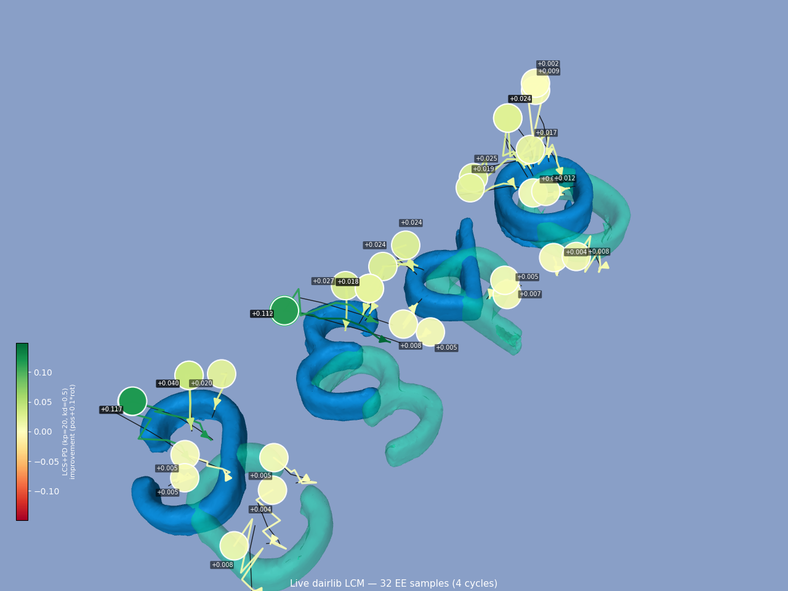
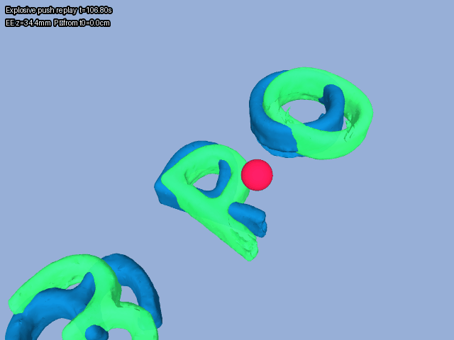

## 1. Last Time


## 2. New Hyperparameters

I landed on some new hyperparameters to use:

```json
{
  "q_obj_pos": 5000,
  "q_obj_ori": 500,
  "q_obj_vel": 0,
  "q_ee_pos": 0,
  "q_ee_vel": 10,
  "rho_mult": 3,
  "rho_lambda": 200,
  "rho_eta": 5,
  "rho_EE_last_iter_mult": 10,
  "rho_x": 20,
  "rho_u": 10,
  "R_val": 10,
  "alpha": 1000,
  "kp_ee": 11.4,
  "kd_ee": 1.14,
  "schur_ridge": 1e-09
}
```

And make some minor changes to how things execute/operate, including "zeroing" the LCS around the current position. Regardless, here are some visualizations:


As for the cost calculation, here is a visualization of it assigning costs to different EE samples to make sure that that works as well:




## 3. Transferring to the Push Anything Example

I also tried to transfer these hyperparameters to the actual dairlib push anything stack. This required fixing some bugs, then I eventually got the following:


As you can see, it ended in a clear failure. I generated a GIF that zooms in and slows down on that push so you can see what the behavior was leading up and during the push: 


As you can, see there was some weird behavior, but it is not immediately obvious to me what happened. It turns out that this occassional "explosive" push happens sometimes with my setup, so I need to debug it. Here is another example that I found programmatically:



### 3.2. Update

I have fixed what I think was the bug (it still seems like there might be something wrong, but I have mitigated at least). And now I have this performance on push anything:


