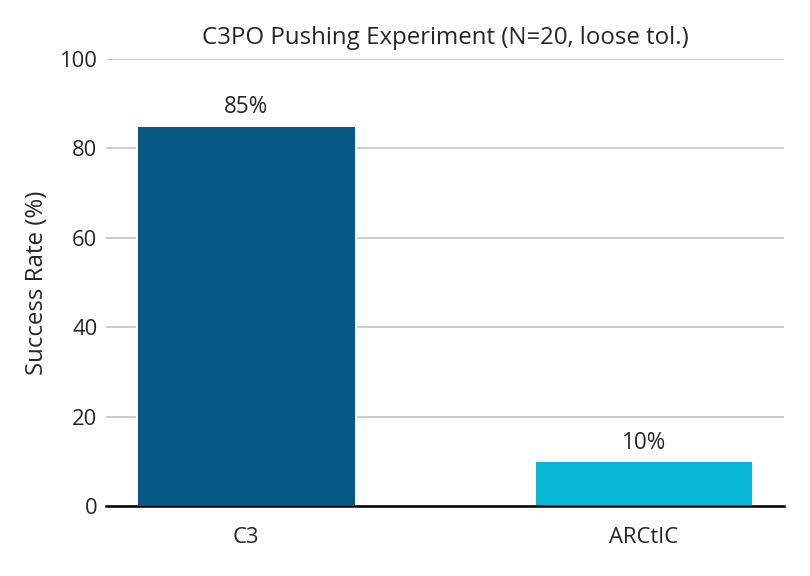
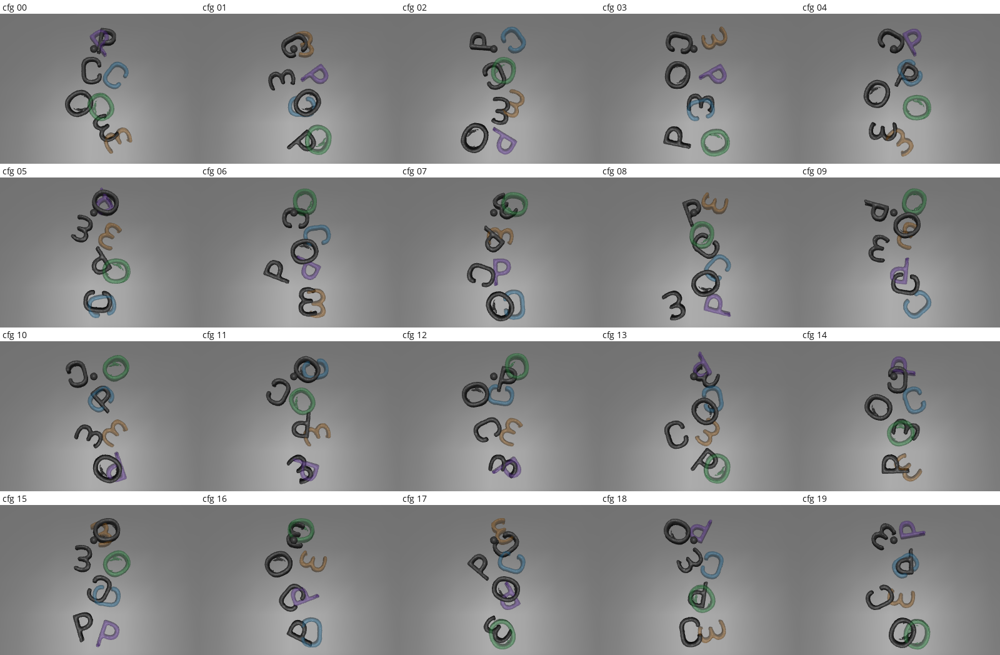
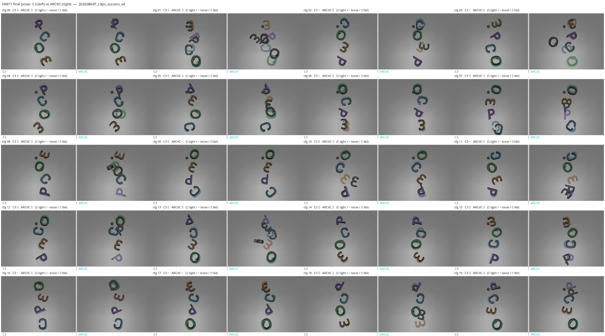
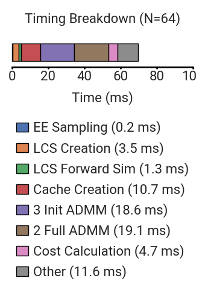

## 1. Intro

This update is pretty short, as I spent a lot of time this week trying to debug a couple bugs. One turned out to be an error in the subgoal computation for the sampling C3 controller, where the subgoals would be non-planar, and the other bug was that the EE would sometimes not push the object (I'm not convinced this one is completely fixed, so idk). Anyways, here is my (brief) update:

## 2. Pushing Experiment

I tried to do a simulation pushing experiment with my method vs C3, but found that there are still some issues with my method. Here is the success rate (at loose tolerance) between the two:

In case you were wondering, here are the intializations/goals I used:

Here is a comparison of the final poses:

Clearly, I still need to debug some things as the "P" sometimes gets put vertical. I wonder if this is caused by my method wanted to move the EE very quickly in some instances. This is because my method has no EE velocity limit. Thus, I am currently running a hyperparameter script to try to recover the right EE_vel parameter.

## 3. Timing

Originally, my sampling C3 controller was running too slow, taking ~90 ms per control loop (the budget is 75 ms). However, with some minor changes I was able to get it down to a good amount. Here is a timing breakdown I generated:

## 4. Conclusion

Mostly, I think it just comes down to tuning and hyperparameter optimization. I am currently running a big optuna loop to try to find some decent hyperparameters. Hopefully that turns out successful.