## 1. Last Time

Last time was a while ago, but I was still struggling to get my method to work well in the push anything stack. In the past few weeks I have made significant progress. I detail the last week and a half or so here.

## 2. C3 vs ARCtIC in Simulation I

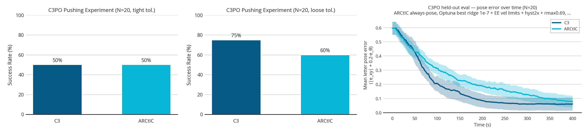

Here are the results from this run:

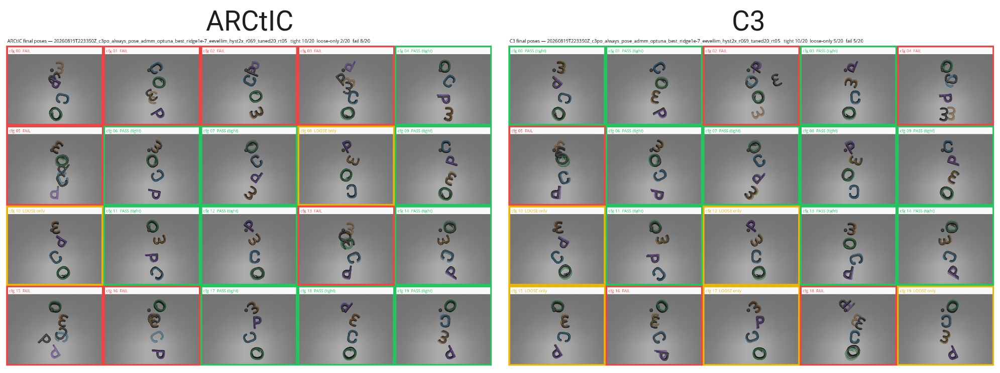

I was able to identify a few problems from looking at the diagnostics. Overally, ARCtIC tended to leave pushes too early. I changed the hysteresis parameters and also updated the logic for continuing a push past 16 MPC iterations:

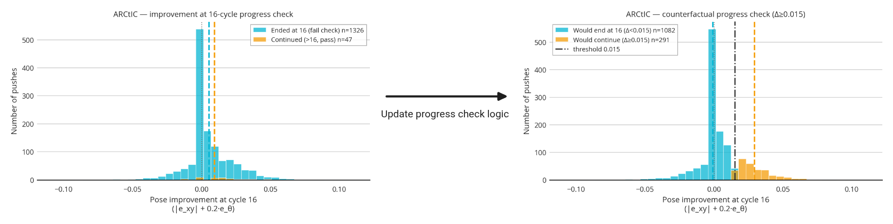

## 3. C3 vs ARCtIC in Simulation II

After debugging and making some fixes, I decided to do a larger, 50-config experiment between the two of them. These were the 50 configs I used, in one big collage:

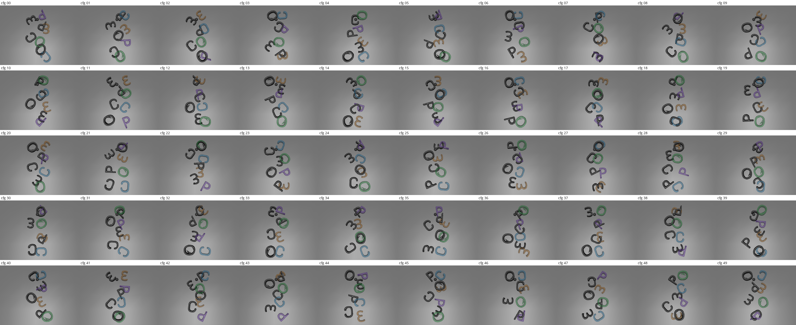

Then, here are the results:

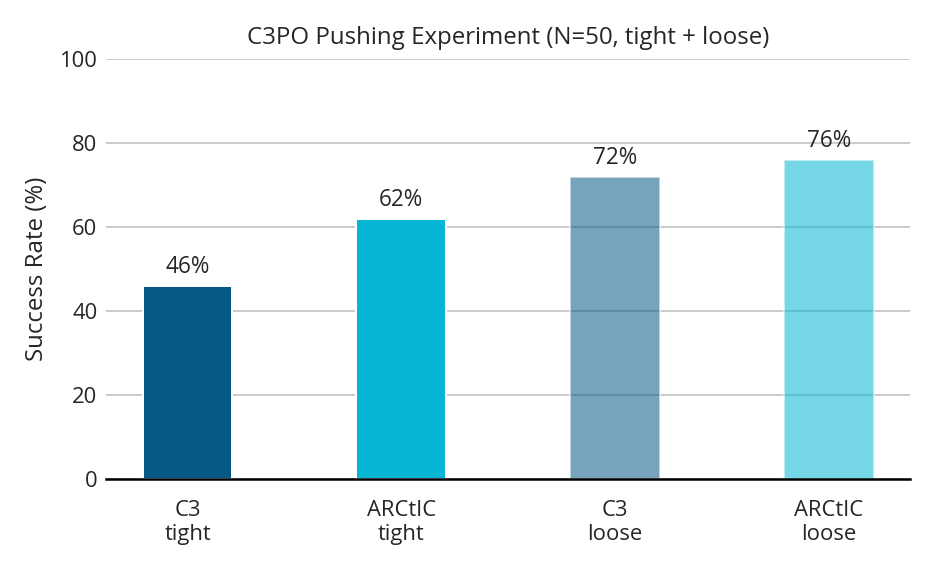

As you can see, my method actually does better than C3 here. That's good news! You can even plot the average letter pose error over time between the methods and get this:

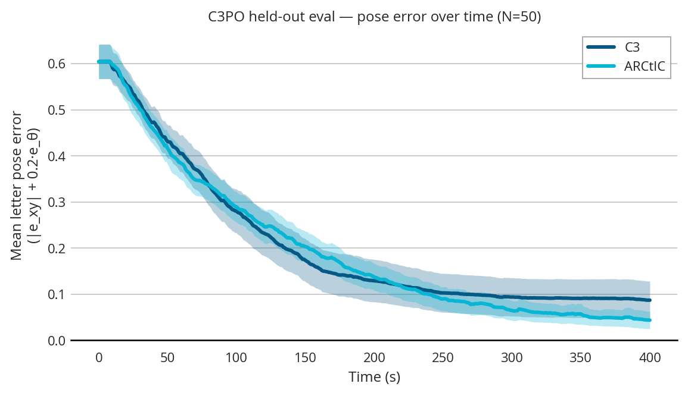

For completeness sake, I figured I should also show the actual experiments. Here is a video of the first third of the trials; sped up to like 50x speed:

However, it is not all good news. Despite having a lower success rate compared to ARCtIC at each tolerance, C3 did seem to be faster when it came to time-to-goal among configs where both methods were successful:

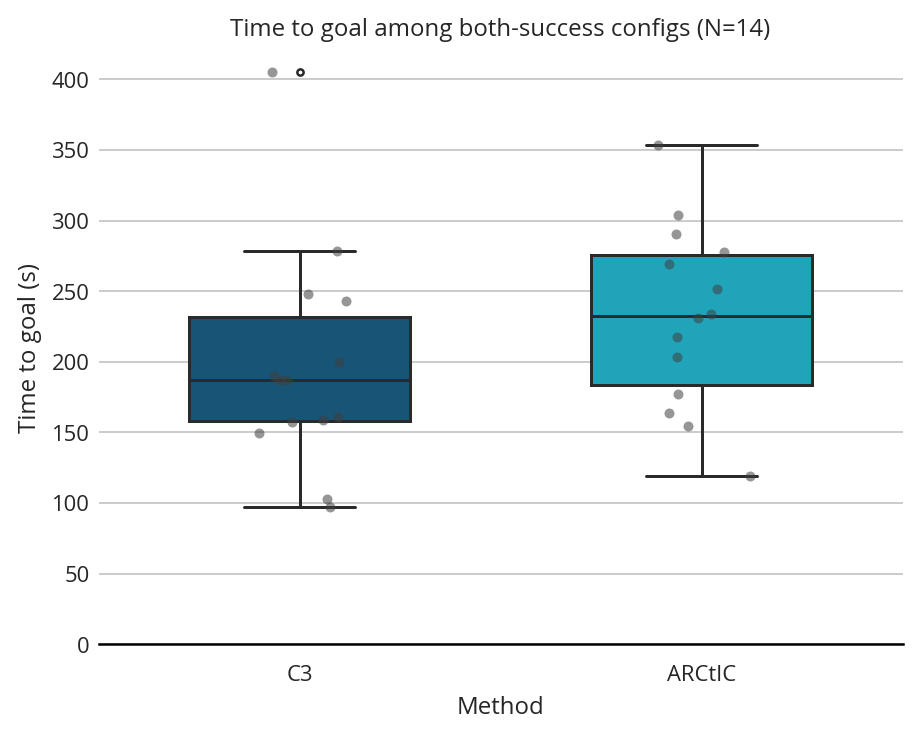

Here are some other differences between the runs:

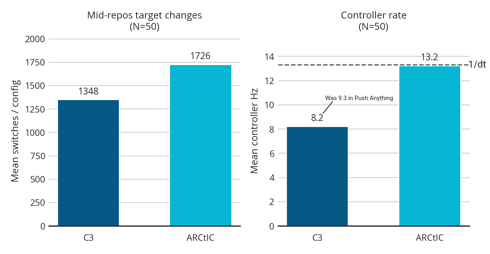

It did seem like ARCtIC resulted in shorter pushes, but during the seconds of the push, performed better than C3:

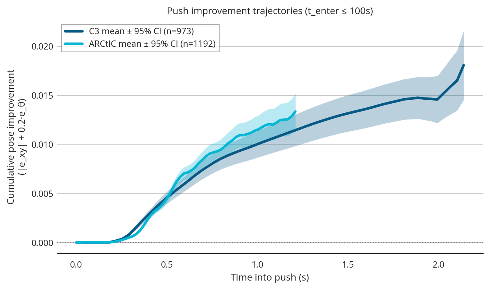

The main reason for the shorter pushes is that the sampling C3 controller first potentially aborts due to no progress after 16 MPC iterations, not a specific amount of elapsed time. Because C3 runs at a slower rate, it takes longer to get through those 16 MPC iterations. The pushes are actually quite widely distributed; here is a plot of just 100 pushes per method, so you can see the spread:

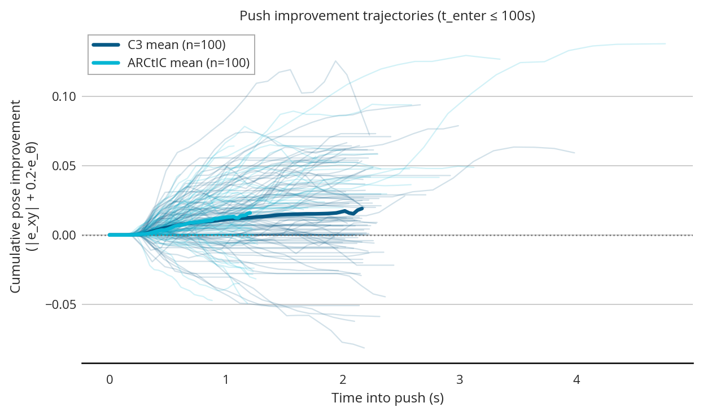

## 4. Towards Understanding Uncertainty

I wanted to start doing a bit of looking into the effect of uncertainty. I grabbed 200 random pushes from a previous experiment and tracked the improvement on them as a metric. The first thing I did was to try to optimize for the right $\alpha$ and uncertainty distribution. Here is a plot of some different values:

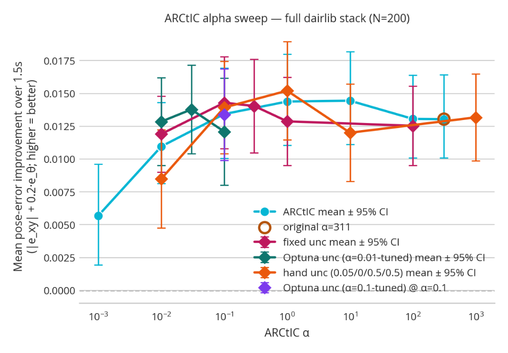

Once I settled on a value, I tried varying the drake model object-ground friction parameter, and got this:

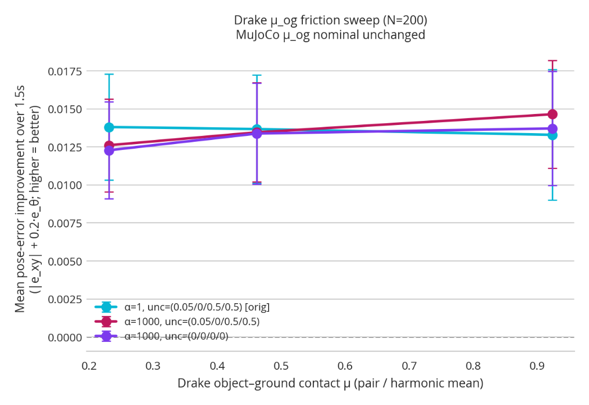

Not that strong of results here, but it is all quite preliminary.

I decided to run a quick 20-config experiment using C3, my method, no feedback, and no uncertainty. Here are the results:

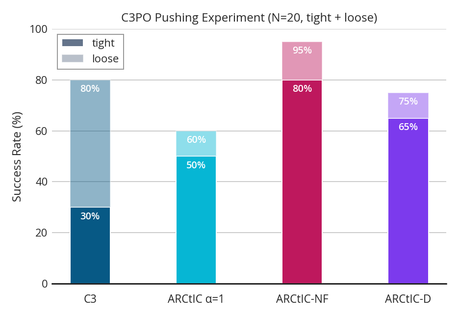