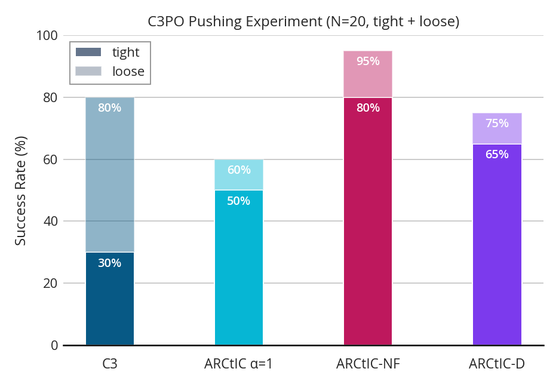
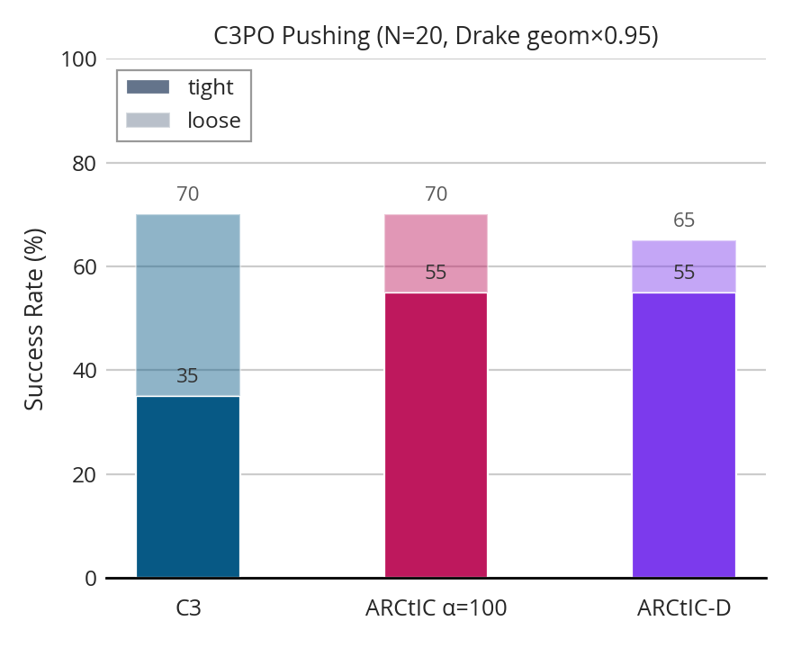
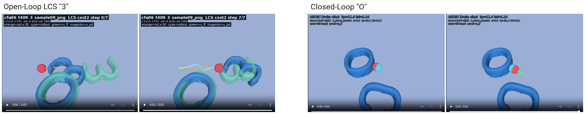
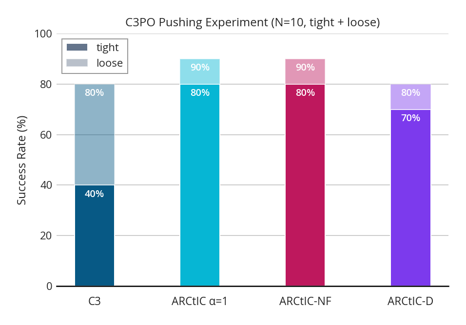
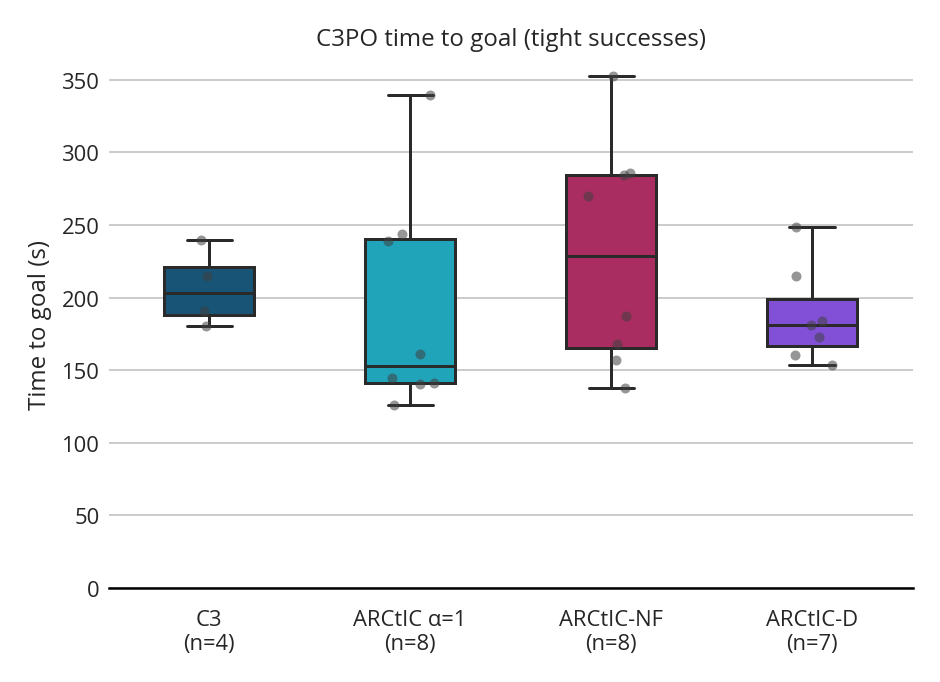
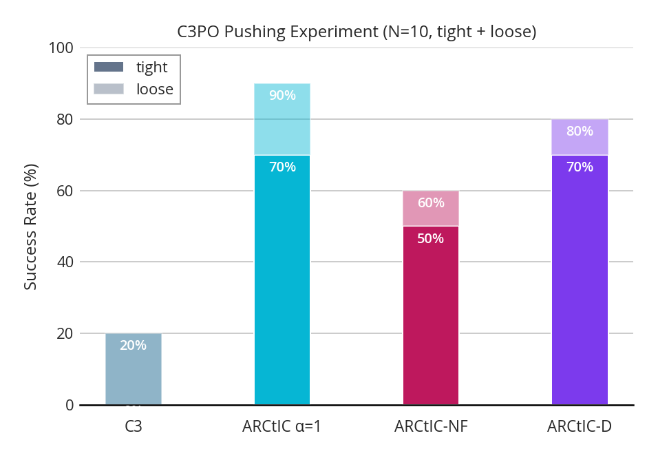
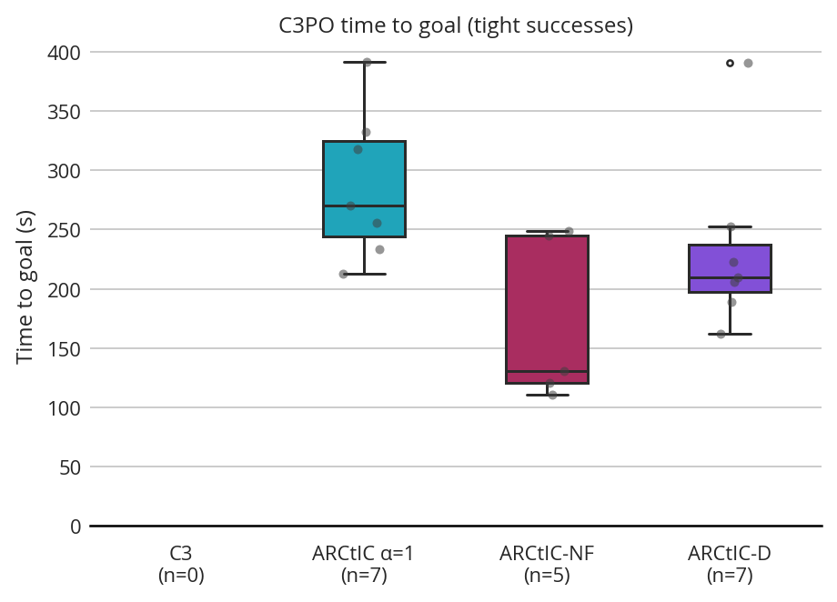

## 1. Last Time

Last time, I had run this experiment:

Where $\alpha=1$ had unfortunately underperformed. We resolved that I should try to test what happens under changes to the drake model.

## 2. First Shape Change Experiment

I tried to do an experiment where I change the drake shape to be 0.95x the size and got these results:

where it actually looks like the determinsitic method is *more* robust to shape change despite struggling more on the nominal. This is surprising and combined with the fact that $\alpha=1$ was so bad in last week's experiment, I decided I needed to hit the drawing board and make some changes.

## 3. Made Some Changes

After gathering some stats, etc, I noticed a tradeoff between aggressive hyperparameters and conservative hyperparameters. The aggressive ones could get high success rates, but would sometimes trip up on cost calculation because they would strike objects through the LCS. However, the conservative hyperparameters failed to push hard enough to get objects to tight tolerance reliably from loose tolerance. I decide to add some bounds and use aggressive parameters to prevent this. I changed the cost calculation to adjust the EE targets to obey velocity limits and placed limits on the size of $u$ for executed controls. This made things behave much better.

> Side Note: one experiment I did was to find a push where the aggressive controller struggled to generate improvement throught the open loop LCS, and a push where there was little error, but the object was outside of tight tolerance. I couldn't find hyperparameters that could improve both without structural changes. Here are those scenarios:
>
> 

With these changes, I decided to run the nominal experiment again (this time $N=10$). Here is what I got for results:

Then, here are the time-to-goal results:

These look much better to me.

## 4. Shape Shift Experiment

I decided to do a shape-change experiment with these values

One interesting source of confusion is the time to goal:

The whole experiment is once again a bit confusing, because the ARCtIC-D actually *improves* (though probably an artifact of statistical noise), where ARCtIC stays roughly the same and ARCtIC-NF and C3 worsen. My current hypothesis is:

**Hypothesis:** *An aggressive controller is actually quite robust to smaller shape, even without taking the uncertainty into account, because it just pushes harder.*

I don't think explains the fall-off of ARCtIC-NF, though, but it could be that in this setting, the uncertainty range is actually *hurting* a bit, because it also includes larger shapes and might pull the mean signed distance to be *inflated* objects instead of deflated ones.

Here is an mp4 of the experiment:

## 5. Future Plans

Because ICRA is so close, I think it might make sense to just take a stab at real world experiments. I think I would be able to show that my method is more robust to C3 under shape change, then, I could evaluate the importance of feedback in simulation. I think those two plots might be enough—however, I am a bit wary about the fact that ARCtIC-D is so robust in my previous experiments and I would like to examine if that transfers to other scenarios.

One thing that is frustrating is that these 4-object push anything experiments take a long time in simulation (each run is like 400 s max, so it can take > 1 hr for 10 configs on one method.) 
