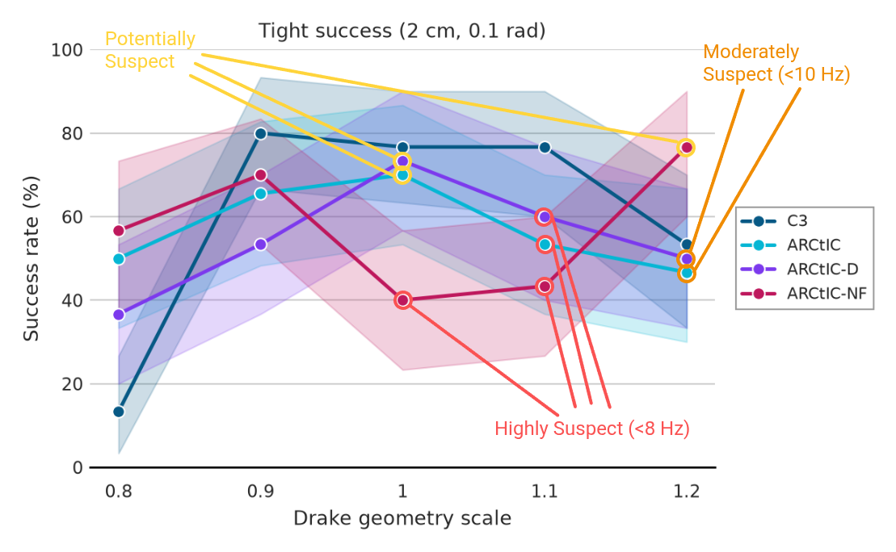
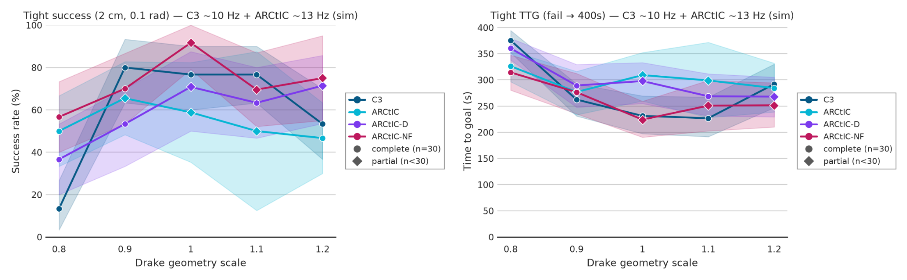
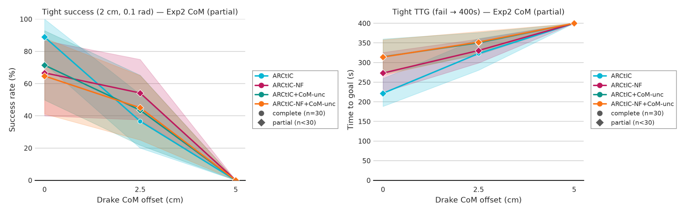

## 1. Last Time

Last time we talked about getting experiments running on PARCC. I spent most of the week getting that working. After a little back-and-forth, I was able to get all of the C3/dairlib dependencies resolved (gurobi, etc), and started running an experiment. 

## 2. Shape Scale

Here are the (suspect) results from my shape-scale experiment:

Well, actually, in the first iteration of the experiment, C3 totally failed because the CPU was extremely slow, so C3 was running at like 3 Hz despite the simulation being slowed down a little bit. In the above, C3 was run at ~10 Hz in simulation. The reason it is suspect is because control rates were not constant throughout, which substantially altered the results. I noted where there was issues in the above plot, and tried reruning a "sync" version of the experiment. Here are the partial results for that (it didn't finish running in time for the meeting):
 

One of the things that I can't make sense of is why ARCtIC alpha=1 at 1.0x size seems to do worse in this version, despite a higher control rate. Also the reason it didn't complete is that because when I run stuff on the cluster, the simulation does have to get slowed down to ~0.5x to ~0.3x in order to accomodate solve times. Also, the jobs remain queued for hours often. The first iteration of this experiment took about two straight days to finish (like ~40 Hours). I do think these experiments clearly show a few things.

**Insights:**

- *ARCtIC-NF outperforms ARCtIC-D pretty much everywhere*
- *C3 completely fails at 0.8x size*
- *Performance seriously degrades with control rates less than ~9 Hz*

## 3. Center of Mass

The next thing I tried to do is investigate center of mass. Here are the (partial) results for that:

It didn't finish in time again. I don't completely know if there is a lot we can get from these results, but ARCtIC-NF wihout CoM uncertainty seems to do decently, even slightly outperforming both versions with CoM uncertainty.

## 4. Conclusion

Overall, I do think PARCC is faster, but I hope it is not costing too much money—I am using many GPU hours to run these experiments as each config/method/model takes ~15-20 minutes to complete, so doing 30 is not an immediate amount of time. I still want to run friction experiments and sharpen up the shape experiments. I think the results do show that ARCtIC-NF is surprisingly good—even better than having an alpha. Of course, ARCtIC-NF is just ARCtIC with alpha=1000, not actually zero $K$ exactly.
