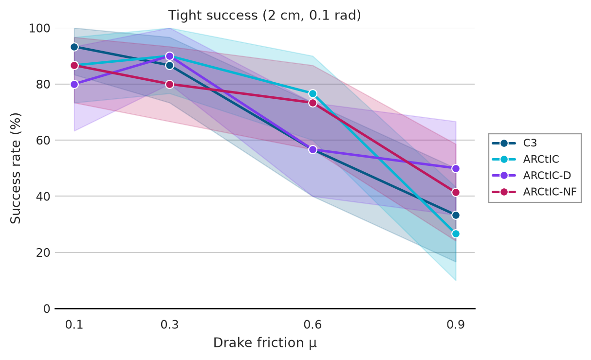
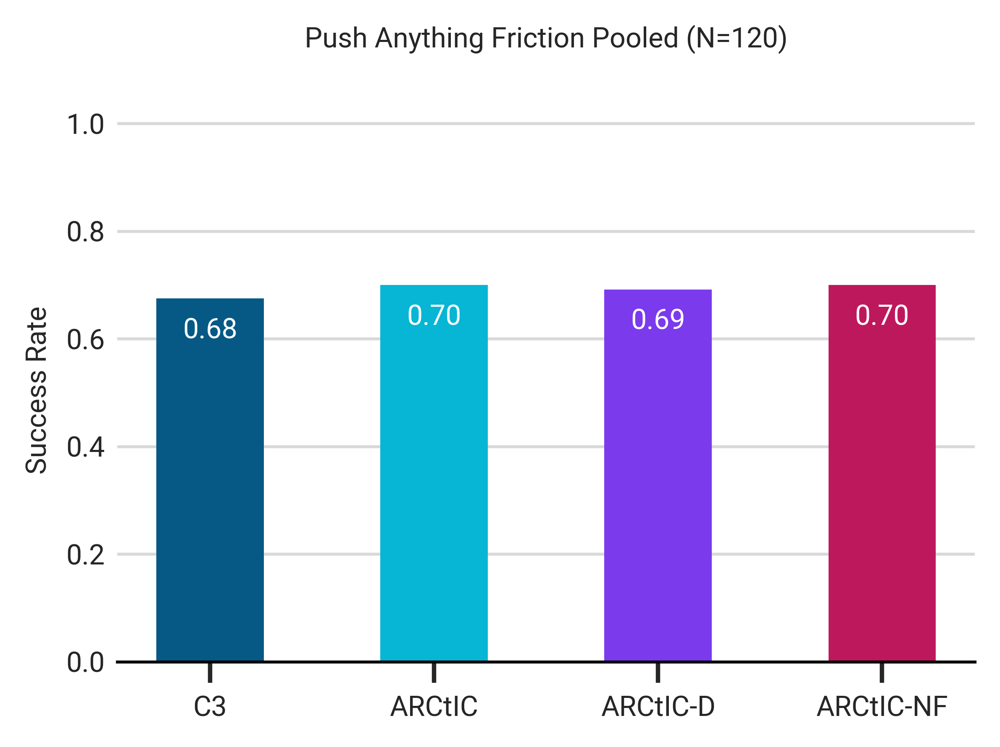
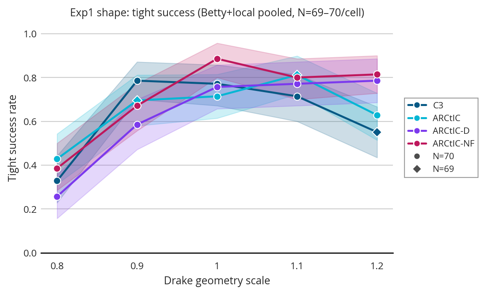
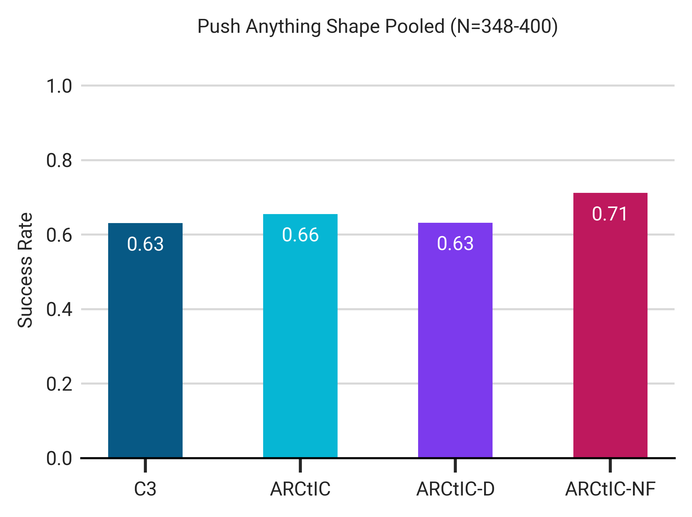
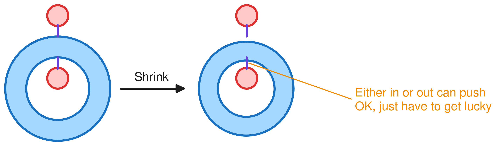
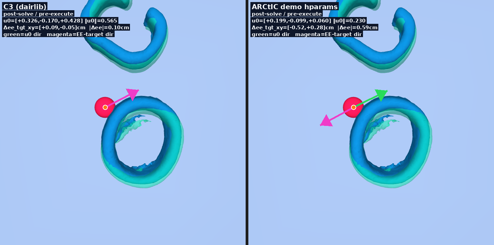

## 1. Last Time

Last time, I got stuff up and running on PARCC, and we decided to run some more experiments. We discussed finishing the CoM experiment, running a friction experiment, then doing a large shape experiment. This time, I discuss the (lackluster) results from these.

## 2. Experiments I Ran

### 2.1. Friction Experiment

I ran the friction experiment we discussed last time:

Which looks like just noise and no significance. In fact, if you pool across frictions:

### 2.2. Bigger Shape Experiment

I ran some more shape experiments locally, adding 40 new datapoints per method per scale. Here are the results:

Notably, these results are not significant after adjusting for the amount of pairwise comparisons. If you then pool across scales:

### 2.3. A Note on PARCC

I am becoming less convinced that PARCC is the way to go. Whenever I try to run a bunch of jobs in parallel, it can slow the actual experiment rate down to ~1/8th its usual rate, which can make PARCC only marginally better than running it locally. 

## 3. My Hypothesis

I want to think more deeply about when and why things fail and when I should expect them to fail. I think we should aim to have experiments that we think will work. For example, I think we will mostly see push-resulting failure from "getting stuck" near the goal. However, shrinking objects might not be the worst for that: 

Additionally, There may be some C3-ARCtIC discrepancies that cause issues:

